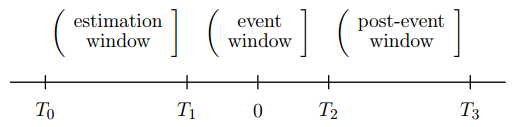

.. _事件测试:

事件测试
========

**事件测试步骤**:
    1. 事件定义(Event Definition): 确定并刻画所要研究的事件, 确定事件窗.
    2. 取样标准(Selection Criteria): 归纳出一些样本特征(如公司市场资本化, 行业代表, 事件发布的时间分布等)并注明通过选样可能导致的任何偏差.
    3. 正常收益率(Normal Return)与异常收益率(Abnormal Return)的定义与估计: 正常收益率是假定没有该事件发生情况下证券的正常收益率; 异常收益率是事件期间内该证券事前或事后实际收益与同期正常收益之差.
    4. 异常收益率的统计检验
    5. 对结果分析


事件测试模型
------------

符号说明
````````

用变量 :math:`i,1\le i\le N` 标识证券, :math:`t` 表示时间. :math:`R_{it}`: :math:`[t-1,t]` 时段证券 :math:`i` 的收益率.

假设 0 日为事件日, 对事件日前后的时间做出如下区间划分



其中 :math:`(T_0, T_1]` 为参数估计窗口(Estimation Window), 用于正常收益率模型的参数估计, :math:`L_1=T_1-T_0` 是参数估计窗口的长度. :math:`(T_1, T_2]` 为事件窗口(Event Window), 考虑到事件信息有可能会提前泄漏导致证券价格提前反应, 事件窗口应包括公告日前的时间, :math:`L_2=T_2-T_1` 是事件窗口的长度. 参数估计窗口和事件窗口不能重叠, 否则估计出来的参数会受到事件效应影响, 计算得到的正常收益里面会包含事件效应的异常收益.

通常将事件窗口里的某一个时间段 :math:`[\tau_1,\tau_2],\ T_1<\tau_1\leq\tau_2\leq T_2` 作为考察区间, 检验事件引起的累积异常收益的显著性. :math:`L=\tau_2-\tau_1+1` 表示考察区间的长度. 

假设选定了一个正常收益模型, 则证券 i 在考察区间内的异常收益和平均异常收益为:

    .. math::
        
        \begin{aligned}
            & AR_{it}=R_{it}-\mathbb{E}[R_{it}|\mathbf{X}_t]\\
            & \overline{AR}_{t}=\frac{1}{N}\sum_\limits{i=1}^{N}AR_{it}
        \end{aligned}

其中, :math:`\mathbf{X}_t` 是截止 t 时刻在正常收益模型中所考虑的所有市场信息.

考察区间内的累积异常收益和平均累积异常收益为:

    .. math::
        
        \begin{aligned}
            & CAR_{i}(\tau_1,\tau_2)=\sum_\limits{t=\tau_1}^{\tau_2}AR_{it}\\
            & \overline{CAR}(\tau_1,\tau_2)=\frac{1}{N}\sum_\limits{i=1}^{N}CAR_i(\tau_1,\tau_2)
        \end{aligned}

标准化的累积异常收益率为:

    .. math::
        
        SCAR_{i}(\tau_1, \tau_2)=\frac{CAR_{i}(\tau_1,\tau_2)}{\sigma_{CAR_i}(\tau_1,\tau_2)}

其中, :math:`\sigma_{CAR_i}(\tau_1,\tau_2)` 为累积异常收益的标准差. 平均标准化异常收益率为:

    .. math::
        
        \overline{SCAR}(\tau_1,\tau_2)=\frac{1}{N}\sum_\limits{i=1}^{N}SCAR_{i}(\tau_1,\tau_2)


正常收益率模型
``````````````

以下内容主要参考 [Campbell-1996]_ .

**常数均值模型(Constant Mean Return Model)**

假定某一证券的平均收益不随时间的改变而改变, 总是围绕一个常数值做上下波动, 即计算证券在参数估计窗口内的平均收益作为事件窗内的正常收益.

    .. math::
        
        \begin{aligned}
            & R_{it} = \mu_i+\varepsilon_{it}\\
            & \mathbb{E}[\varepsilon_{it}]=0,\ \operatorname{Var}[\varepsilon_{it}]=\sigma^2_{\varepsilon_{i}}
        \end{aligned}

模型虽然简单, 但是却可得到与复杂的模型相近的结果 Brown and Warner(1980, 1985).

事件测试的结果对正常收益率模型的选择不敏感, 这可能是由于即使采用了更为复杂的模型也未能降低异常收益率的方差.


**市场调整模型(Market Adjusted Return Model)**

即超额收益法, 选定一个基准指数(全市场的宽基指数, 风格指数或行业指数), 假设基准指数的收益即是正常收益, 该模型应用于无法事前估计模型参数的情况. 

    .. math::
        
        \begin{aligned}
            & R_{it} = R_{mt}+\varepsilon_{it}\\
            & \mathbb{E}[\varepsilon_{it}]=0,\ \operatorname{Var}[\varepsilon_{it}]=\sigma^2_{\varepsilon_{i}}
        \end{aligned}

**市场模型(Market Model)**

假定市场收益与证券收益之间存在稳定的线性关系. 通常选择一个宽基指数作为市场组合. 相比于均值常数模型, 市场模型剔除了收益中与市场收益波动相关的部分，从而降低了估计误差. 市场模型的效果依赖于回归的 :math:`R^2`, :math:`R^2` 越高, 异常收益的方差下降的越多. 市场调整模型是市场模型的特例, 即令 :math:`\alpha_i=0, \beta_i=1`.

    .. math::
        
        \begin{aligned}
            & R_{it} = \alpha_i+\beta_i\cdot R_{mt}+\varepsilon_{it}\\
            & \mathbb{E}[\varepsilon_{it}]=0,\ \operatorname{Var}[\varepsilon_{it}]=\sigma^2_{\varepsilon_{i}}
        \end{aligned}


**因子模型(Factor Model)**

分为单因子模型(One-Factor Model), 如市场模型; 多因子模型(Multi-Factor Model), 如 Fama-French 的三因子模型.

Fama-French 三因子模型在市场模型的基础上增加了市值因子收益率(SMB)和 PB 估值因子收益率(HML)作为解释变量:

    .. math::
        
        \begin{aligned}
            & R_{it} = \alpha_i+\beta_i\cdot R_{mt}+\gamma_i\cdot SMB_t+\delta_i\cdot HML_t+\varepsilon_{it}\\
            & \mathbb{E}[\varepsilon_{it}]=0,\ \operatorname{Var}[\varepsilon_{it}]=\sigma^2_{\varepsilon_{i}}
        \end{aligned}


**特征基准模型(Characteristic Based Benchmark Model)**

特征基准模型最早由 Daniel et al.(1997)
用于公募基金的绩效评价, Ahern(2009) 将其用于事件研究中的异常收益计算. 它的计算方法如下, 对于 t 时刻证券 i, 按照 t-1 时刻数据, 选取 :math:`n=\frac{N}{10}` 只总市值和证券 i 最接近的证券构造等权组合作为证券 i 在 t 时刻的特征基准组合, 组合收益率 :math:`CBB_t` 作为 t 时刻证券的正常收益:

    .. math::
        
        \begin{aligned}
            & R_{it} = CBB_t+\varepsilon_{it}\\
            & \mathbb{E}[\varepsilon_{it}]=0,\ \operatorname{Var}[\varepsilon_{it}]=\sigma^2_{\varepsilon_{i}}
        \end{aligned}

特征基准模型是用一种非参数化的方法剔除了市场和市值因子的影响, 不需要设置参数估计窗口, 可以部分避免市场模型和 Fama-French 模型低估小市值股票收益率的问题 (Banz(1981)).


异常收益率的统计检验
````````````````````

假设选定了一个正常收益模型, 在事件对证券价格无影响的原假设下, 利用正常收益模型得到的证券 i 在考察区间 :math:`[\tau_1,\tau_2],L=\tau_2-\tau_1+1` 内的异常收益的估计值为:

    .. math::
        
        \begin{aligned}
            & \widehat{\mathbf{AR}}_{i} = \left(\widehat{AR}_{ti}\right)_{L\times 1}\\
            & \hat{\mathbf{V}}_i = \left(\hat{\sigma}_{i}^2(t,s)\right)_{L\times L}
        \end{aligned}

在正态分布的假设下, :math:`\widehat{\mathbf{AR}}_{i}\sim\mathcal{N}(0,\hat{\mathbf{V}}_i)`.

累积异常收益分布为:

    .. math::
        
        \begin{aligned}
            & \widehat{CAR}_{i}(\tau_1,\tau_2) = \mathbf{1}^T\cdot\widehat{\mathbf{AR}}_{i}\\
            & \operatorname{Var}[\widehat{CAR}_{i}(\tau_1,\tau_2)]=\hat{\sigma}^2_i(\tau_1,\tau_2) = \mathbf{1}^T\cdot\hat{\mathbf{V}}_{i}\cdot\mathbf{1}\\
            & \widehat{CAR}_{i}(\tau_1,\tau_2)\sim\mathcal{N}(0, \hat{\sigma}^2_i(\tau_1,\tau_2))
        \end{aligned}

标准化的累积异常收益:

    .. math::
        
        \widehat{SCAR}_{i}(\tau_1,\tau_2)=\frac{\widehat{CAR}_{i}(\tau_1,\tau_2)}{\hat{\sigma}_i(\tau_1,\tau_2)}

假设证券的异常收益率之间没有截面相关性, 汇总所有证券的异常收益率得到:

    .. math::
        
        \begin{aligned}
            & \overline{\mathbf{AR}} = \frac{1}{N}\sum\limits_{i=1}^{N}\widehat{\mathbf{AR}}_{i}\\
            & \bar{\mathbf{V}} = \frac{1}{N^2}\sum\limits_{i=1}^{N}\hat{\mathbf{V}}_{i}\\
            & \overline{\mathbf{AR}}\sim\mathcal{N}(0, \bar{\mathbf{V}})
        \end{aligned}

累积异常收益为:

    .. math::
        
        \begin{aligned}
            & \overline{CAR}(\tau_1,\tau_2) = \mathbf{1}^T\cdot\overline{\mathbf{AR}}\\
            & \operatorname{Var}[\overline{CAR}(\tau_1,\tau_2)]=\bar{\sigma}^2(\tau_1,\tau_2) = \mathbf{1}^T\cdot\bar{\mathbf{V}}\cdot\mathbf{1}\\
            & \overline{CAR}(\tau_1,\tau_2)\sim\mathcal{N}(0, \bar{\sigma}^2(\tau_1,\tau_2))
        \end{aligned}

标准化的累积异常收益为:

    .. math::
        
        \overline{SCAR}(\tau_1,\tau_2)=\frac{1}{N}\sum\limits_{i=1}^{N}\widehat{SCAR}_{i}(\tau_1,\tau_2)

在原假设下, 统计量 :math:`J_1`:

    .. math::
        
        J_1 = \frac{\overline{CAR}(\tau_1,\tau_2)}{\bar{\sigma}(\tau_1,\tau_2)}\stackrel{a}{\sim}\mathcal{N}(0, 1)

在原假设下, 统计量 :math:`J_2`:

    .. math::
        
        J_2 = \left(\frac{N(L_1-4)}{L_1-2}\right)\overline{SCAR}(\tau_1,\tau_2)\stackrel{a}{\sim}\mathcal{N}(0, 1)

除了上述的参数检验, 还可以进行非参数检验, 比如符号检验, 统计量 :math:`J_3`:

    .. math::
        
        J_3 = \left(\frac{N^+}{N}-0.5\right)\frac{N^{1/2}}{0.5} \stackrel{a}{\sim} \mathcal{N}(0, 1)

其中, :math:`N^+` 是异常收益率为正的样本数. 符号检验的一个问题是必须假设异常收益的分布是对称的。

秩检验, 统计量 :math:`J_4`:

    .. math::
        
		\begin{aligned}
			& J_4 = \frac{1}{N}\sum\limits_{i=1}^{N}\frac{\left(K_{i\tau}-\frac{L_2+1}{2}\right)}{s(L_2)} \stackrel{a}{\sim} \mathcal{N}(0, 1)\\
			& s(L_2) = \sqrt{\frac{1}{L_2}\sum\limits_{\tau=T_1+1}^{T_2}\left( \frac{1}{N}\sum\limits_{i=1}^{N}\left(K_{i\tau}-\frac{L_2+1}{2}\right) \right)^2}
		\end{aligned}

其中, :math:`K_{i\tau}` 是证券 i 于时点 :math:`\tau` 的异常收益在整个事件窗口中的秩.


API 参考
--------

.. py:module:: AbnormalReturn

.. py:class:: CMRM(factor_table, name="均值常数模型", sys_args={}, **kwargs)
    
    均值常数模型下的异常收益率检验模块, 继承自 :py:class:`BackTestModel.BaseModule`
    
    :param FactorTable factor_table: 为该模块提供数据的因子表对象
    :param str name: 模块名称
    :param dict sys_args: 对象参数
    
    .. py:attribute:: Args
    
        参数集:
        
            * 事件定义: 截面 ID 的过滤条件, 按此条件筛选出的证券为发生事件的证券, str
            * 事件前窗口: 事件发生日之前的检验日期数, int
            * 事件后窗口: 事件发生日之后的检验日期数, 事件窗口的长度 = 事件前窗口 + 1(事件发生日) + 事件后窗口, int
            * 价格因子: 计算证券收益率的价格因子名, str
            * 收益率类型: 证券收益率的计算方法, str, 可选: "简单收益率", "对数收益率", "绝对变化量", 默认值 "简单收益率". 
            * 估计窗口: 用于估计模型的窗口长度, int
            * 样本筛选: 用于在估计窗口中筛选有效样本的过滤条件, 格式同截面 ID 过滤条件一致, str
            * 估计样本量: 经过样本筛选后最终用于估计模型的样本量, 如果筛选后的样本量低于该参数则跳过该证券, int

.. py:class:: MAM(factor_table, benchmark_ft, name="市场调整模型", sys_args={}, **kwargs)
    
    市场调整模型下的异常收益率检验模块, 继承自 :py:class:`BackTestModel.BaseModule`
    
    :param FactorTable factor_table: 为该模块提供数据的因子表对象
	:param FactorTable benchmark_ft: 为该模块提供基准数据的因子表对象
    :param str name: 模块名称
    :param dict sys_args: 对象参数
    
    .. py:attribute:: Args
    
        参数集:
        
            * 事件定义: 截面 ID 的过滤条件, 按此条件筛选出的证券为发生事件的证券, str
            * 事件前窗口: 事件发生日之前的检验日期数, int
            * 事件后窗口: 事件发生日之后的检验日期数, 事件窗口的长度 = 事件前窗口 + 1(事件发生日) + 事件后窗口, int
            * 价格因子: 计算证券收益率的价格因子名, str
            * 收益率类型: 证券收益率的计算方法, str, 可选: "简单收益率", "对数收益率", "绝对变化量", 默认值 "简单收益率". 
            * 估计窗口: 用于估计模型的窗口长度, int
            * 样本筛选: 用于在估计窗口中筛选有效样本的过滤条件, 格式同截面 ID 过滤条件一致, str
            * 估计样本量: 经过样本筛选后最终用于估计模型的样本量, 如果筛选后的样本量低于该参数则跳过该证券, int
			* 基准价格: 计算基准收益率的价格因子名, str
			* 基准ID: 作为基准的证券 ID, str

.. py:class:: MM(factor_table, benchmark_ft, rate_table=None, name="市场模型", sys_args={}, **kwargs)
    
    市场模型下的异常收益率检验模块, 继承自 :py:class:`BackTestModel.BaseModule`
    
    :param FactorTable factor_table: 为该模块提供数据的因子表对象
	:param FactorTable benchmark_ft: 为该模块提供基准数据的因子表对象
	:param FactorTable rate_table: 为该模块提供无风险收益率数据的因子表对象, 默认值 None 表示无风险收益率为 0
    :param str name: 模块名称
    :param dict sys_args: 对象参数
    
    .. py:attribute:: Args
    
        参数集:

            * 事件定义: 截面 ID 的过滤条件, 按此条件筛选出的证券为发生事件的证券, str
            * 事件前窗口: 事件发生日之前的检验日期数, int
            * 事件后窗口: 事件发生日之后的检验日期数, 事件窗口的长度 = 事件前窗口 + 1(事件发生日) + 事件后窗口, int
            * 价格因子: 计算证券收益率的价格因子名, str
            * 收益率类型: 证券收益率的计算方法, str, 可选: "简单收益率", "对数收益率", "绝对变化量", 默认值 "简单收益率". 
            * 估计窗口: 用于估计模型的窗口长度, int
            * 样本筛选: 用于在估计窗口中筛选有效样本的过滤条件, 格式同截面 ID 过滤条件一致, str
            * 估计样本量: 经过样本筛选后最终用于估计模型的样本量, 如果筛选后的样本量低于该参数则跳过该证券, int
			* 基准价格: 计算基准收益率的价格因子名, str
			* 基准ID: 作为基准的证券 ID, str
			* 无风险利率: 作为无风险收益率的因子名, str
			* 无风险利率ID: 作为无风险收益率的证券 ID, str