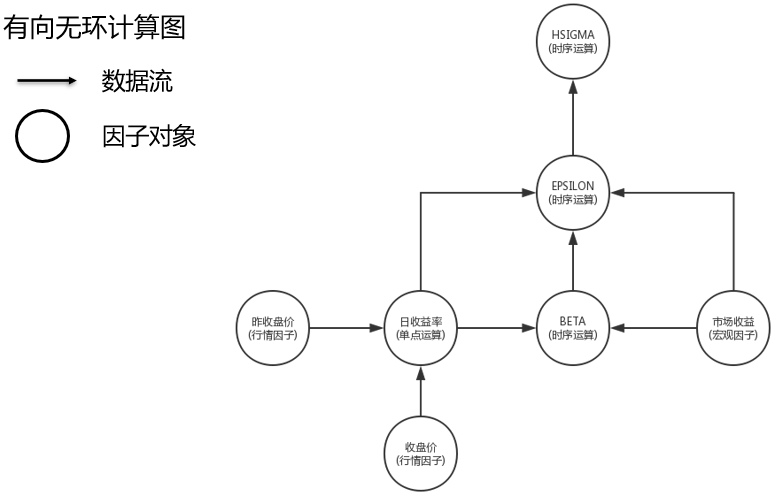

.. _因子定义:

因子定义
========

因子数据生成的主要难点有以下三个方面: 

    * 如何将不同来源、不同形式的原始数据转化成我们统一的因子数据形式；
    * 如何简单方便的定义因子之间的运算以衍生更多的因子；
    * 如何高效快速的生成因子数据. 

下面是 QuantStudio 尝试对上述三个难点的解决方案. 


.. attention::

    本章节的应用需要一些基本的数据, 参见 :ref:`示例数据<示例数据>` 的配置.


因子定义框架
------------

首先我们将所有的因子划分成两类: 

    * :strong:`基础因子`: 指直接由原始数据转化而来, 并不依赖于其他因子的因子, 比如最新股东权益因子就是以财务报表里的股东权益合计这个数据项转化而来的基础因子, 大多数的基础因子通过因子表的 :py:meth:`getFactor` 方法得到
    * :strong:`衍生因子`: 依赖于其他因子通过因子运算得到的因子, 而 BP 因子则是用最新股东权益因子除以总市值因子运算得来的衍生因子. 

因子的运算分成四类: :strong:`单点运算`, :strong:`时间序列运算`, :strong:`横截面运算` 以及 :strong:`面板运算`. 每种运算的适用范围各不相同, 在效率上也有所差异. 这些运算可以嵌套组合以形成更复杂的计算. 

因子运算整体上是一个层次化的树状结构. 对于已有的因子可以施加上述四种因子运算生成新因子, 新生成的因子跟已有的因子没有区别, 可以继续施加因子运算生成其他因子, 该定义的层次数目没有限制, 可以一直叠加上去. 

这里我们以 HSIGMA 因子的定义举例说明. HSIGMA 因子（参见: :ref:`风险因子` 定义）是 Barra 中国市场风险模型([CNE5]_)里的一个风险因子, 称为历史残余波动率因子. 该因子的计算首先用股票的超额收益率和市场超额收益率进行时间序列回归得到残余收益率因子 EPSILON, 然后取一段时间的残余收益率求其标准差得到残余波动率因子 HSIGMA. 

在 Quant Studio 中, HSIGMA 因子是由 EPSILON 因子通过时间序列运算生成, 而 EPSILON 由 BETA 因子、市场收益率因子、股票收益率因子再通过时间序列运算生成, 最后, BETA 因子则是基于股票收益率因子和市场收益率因子计算得到, 而这些收益率因子则是由价格等基础因子通过施加单点运算得到. 整个的因子定义共有六层, 最底层是基础因子, 而其他层是由已经定义好的衍生因子或者基础因子组成, 因子可以复用, 在任意层的运算里都可以引用已经定义过的任何因子, 具体定义如下图所示:


    
    HSIGMA因子定义结构


基础因子
--------

基础因子是指直接由原始数据转化而来, 并不依赖于其他因子的因子. 大多数的基础因子对象通过调用因子表的 :py:meth:`FactorTable.getFactor` 方法得到. 具体的因子可以参考因子库的 API 说明.


.. _衍生因子:

衍生因子
--------

前面我们提到的衍生因子是指依赖于其他因子通过因子运算得到的因子. 而因子运算我们定义了五类: 单点运算, 时间序列运算, 横截面运算, 面板运算以及聚合运算. 所有的衍生因子共同的两个基本要素是: 描述子和定义算子, 其中, 描述子是计算该因子所需要的下层因子, 而定义算子则是因子运算的具体算法. 


单点运算
````````

固定时点、固定 ID 的不同因子间的运算. 单点运算是最简单的一类因子运算, 其典型例子是各种估值因子的定义, 比如市净率(BP)因子, 其是由股东权益除以总市值得到. BP 因子的描述子即为股东权益因子和总市值因子, 而定义算子是一个除法运算(真正的实现可能还要包括缺失值处理以及对于分母为 0 的处理). 

这里我们以中间价因子的定义为例, 中间价定义为最高价和最低价的平均值, 数据来自 TushareDB::

    >>>import QuantStudio.api as QS
    >>>TSDB = QS.FactorDB.TushareDB(sys_args={"token":"123456"})
    >>>TSDB.connect()
    >>>print(TSDB.TableNames)
    

首先获取基础因子: 最高价和最低价, 这两个因子在因子表 "日线行情" 中::

    >>>FT = TSDB.getTable(table_name="日线行情")
    >>>High, Low = FT.getFactor("最高价"), FT.getFactor("最低价")

然后定义一个函数作为算子用于计算两者的平均值, 这个函数的输入参数必须为: (f, idt, iid, x, args), 这里先给出中间价的算子定义再做解释::

    >>>def MidFun(f, idt, iid, x, args):
        return (x[0] + x[1]) / 2

有了算子之后, 中间价因子可以如下定义::

    >>>Mid = QS.FactorDB.PointOperation(name="中间价", descriptors=[High, Low], sys_args={"算子":MidFun})

单点运算衍生因子对象的 API 如下:

.. py:module:: FactorDB

.. py:class:: PointOperation(name, descriptors=[], sys_args={}, **kwargs)

    单点运算衍生因子, 继承自 :py:class:`Factor`
    
    :param str name: 因子名称
    :param list(Factor) descriptors: 描述子列表
    :param dict sys_args: 因子对象参数

    .. py:attribute:: Args
    
        因子对象参数, {参数名: 参数值}, 用于控制因子数据生成的行为, 来自于构造函数中的 sys_args 参数
        
        * 算子: 用户自定义的运算函数, 比如上面例子中的 :py:func:`MidFun`
        * 参数: 用户自定义的传递给自定义的运算函数的附加参数, {参数名: 参数值}, 即上述算子 :py:func:`MidFun` 的最后一个输入参数 args.
        * 数据类型: 因子的数据类型, str, 可选 "double", "string", 该参数也指明了自定义算子的返回值类型, 默认值 "double"
        * 运算时点: 进行运算的时点是单个时点还是一列时点, 可选: "单时点", "多时点", 通常可以在时间维度向量化运算的情况下选择 "多时点", 默认值 "单时点"
        * 运算ID: 进行运算的 ID 是单个 ID 还是一列 ID, 可选: "单ID", "多ID", 通常可以在 ID 维度向量化运算的情况下选择 "多ID", 默认值 "单ID"

用户自己编写单点运算定义算子的代码, 为新因子数据生成提供核心运算逻辑. 单点运算定义算子的函数接口如下::

    def Operator(f, idt, iid, x, args):
        ...# 用户逻辑代码
        return ...

在定义单点运算衍生因子时附加的参数 "运算时点" 和 "运算ID" 的取值会影响该算子的输入参数和返回值, 用户定义该算子时必须遵守下面的约定, 下面分类说明:

如果 "运算时点" 为 "单时点", "运算ID" 为 "单ID":
    
    * f: 该算子隶属于的因子对象, 比如上面的例子中, f 就是中间价因子对象 Mid
    * idt: 当前待计算的时点, datetime.datetime
    * iid: 当前待计算的 ID, str
    * x: 定义该因子的描述子的数据, [标量], x[i] 为第 i 个描述子在时点 idt, ID 为 iid 时的数据, 比如上面的例子中, x 是两个元素的 list, x[0] 是最高价, x[1] 是最低价.
    * args: 用户传入的自定义参数, {参数名: 参数值}, 默认值 {}

    返回值: 给定时点 idt, 给定 ID iid 的衍生因子值, 标量

如果 "运算时点" 为 "多时点", "运算ID" 为 "单ID":

    * f: 该算子隶属于的因子对象, 比如上面的例子中, f 就是中间价因子对象 Mid
    * idt: 当前一起计算的时间序列, [datetime.datetime], 注意该序列并不一定为全体运算时点
    * iid: 当前待计算的 ID, str
    * x: 定义该因子的描述子的数据, [array], x[i] 为第 i 个描述子在 ID 为 iid 时的因子数据: array(shape=(len(idt), ))
    * args: 用户传入的自定义参数, {参数名: 参数值}, 默认值 {}
    
    返回值: 衍生因子值, array(shape=(len(idt), ))

如果 "运算时点" 为 "单时点", "运算ID" 为 "多ID":
    
    * f: 该算子隶属于的因子对象, 比如上面的例子中, f 就是中间价因子对象 Mid
    * idt: 当前待计算的时点, datetime.datetime
    * iid: 当前一起计算的 ID 序列, [ID], 注意该序列并不一定为整个截面
    * x: 定义该因子的描述子的数据, [array], x[i] 为第 i 个描述子在时点为 idt 时的因子数据: array(shape=(len(iid), ))
    * args: 用户传入的自定义参数, {参数名: 参数值}, 默认值 {}
    
    返回值: 衍生因子值, array(shape=(len(iid), ))

如果 "运算时点" 为 "多时点", "运算ID" 为 "多ID":
    
    * f: 该算子隶属于的因子对象, 比如上面的例子中, f 就是中间价因子对象 Mid
    * idt: 当前一起计算的时间序列, [datetime.datetime], 注意该序列并不一定为全体运算时点
    * iid: 当前一起计算的 ID 序列, [ID], 注意该序列并不一定为整个截面
    * x: 定义该因子的描述子的数据, [array], x[i] 为第 i 个描述子的因子数据: array(shape=(len(idt), len(iid)))
    * args: 用户传入的自定义参数, {参数名: 参数值}, 默认值 {}
    
    返回值: 衍生因子值, array(shape=(len(idate), len(iid)))


时间序列运算
````````````

固定 ID 不同因子间在时间序列上的运算. 除了指定描述子和定义算子外, 时间序列运算还需要指定每个描述子的回溯期数. 时间序列运算的典型例子是移动平均线的定义, 其是由证券过去一段时间的价格序列取某种形式的平均得到的. 移动平均线因子的描述子即为价格因子, 而定义算子是一个平均值运算. 

这里我们以收盘价的 5 日移动平均线因子的定义为例, 5 日移动均线定义为过去 5 天收盘价的算术平均值, 数据来自 TushareDB, 首先获取基础因子: 收盘价, 这个因子在因子表 "日线行情" 中(假定已经如上一节一样创建了 TushareDB 因子库对象)::

    >>>FT = TSDB.getTable(table_name="日线行情")
    >>>Close = FT.getFactor("收盘价")

然后定义一个函数作为算子用于计算其过去 5 日的平均值, 这个函数的输入参数必须为: (f, idt, iid, x, args), 这里先给出算子定义再做解释::

    >>>def AvgFun(f, idt, iid, x, args):
        return np.nanmean(x[0])

有了算子之后, 移动平均价因子可以如下定义::

    >>>Avg = QS.FactorDB.TimeOperation(name="移动平均价", descriptors=[Close], sys_args={"算子": AvgFun, "回溯期数": [5-1]})

时间序列运算衍生因子对象的 API 如下:

.. py:class:: TimeOperation(name, descriptors=[], sys_args={}, **kwargs)

    时间序列运算衍生因子, 继承自 :py:class:`Factor`
    
    :param str name: 因子名称
    :param list(Factor) descriptors: 描述子列表
    :param dict sys_args: 因子对象参数

    .. py:attribute:: Args
    
        因子对象参数, {参数名: 参数值}, 用于控制因子数据生成的行为, 来自于构造函数中的 sys_args 参数
        
        * 算子: 用户自定义的运算函数, 比如上面例子中的 :py:func:`AvgFun`
        * 参数: 用户自定义的传递给自定义的运算函数的附加参数, {参数名: 参数值}, 即上述算子 :py:func:`AvgFun` 的最后一个输入参数 args.
        * 数据类型: 因子的数据类型, str, 可选 "double", "string", 该参数也指明了自定义算子的返回值类型, 默认值 "double"
        * 运算时点: 进行运算的时点是单个时点还是一列时点, 可选: "单时点", "多时点", 通常可以在时间维度向量化运算的情况下选择 "多时点", 默认值 "单时点"
        * 运算ID: 进行运算的 ID 是单个 ID 还是一列 ID, 可选: "单ID", "多ID", 通常可以在 ID 维度向量化运算的情况下选择 "多ID", 默认值 "单ID"
        * 回溯期数: 每个描述子的回溯期数(不包括当前所在的时点), [int(>=0)], 比如上面计算 5 日平均, 则回溯期数为 5-1=4
        * 回溯模式: 每个描述子的回溯窗口模式, ["滚动窗口" 或者 "扩张窗口"], 默认值皆为 "滚动窗口"
        * 自身回溯期数: 该因子本身需要回溯的期数, int, >=0, 默认值 0 表示无自身迭代, 并忽略 "自身回溯模式" 参数
        * 自身回溯模式: 该因子本身的回溯窗口模式, str, 可选: "滚动窗口" 或者 "扩张窗口", 默认值 "滚动窗口"

用户自己编写时间序列运算算子的代码, 为新因子数据生成提供核心运算逻辑. 时间序列运算算子的函数接口如下::

    def Operator(f, idt, iid, x, args):
        ...# 用户逻辑代码
        return ...

在定义时间序列运算衍生因子时附加的参数 "运算时点", "运算ID", "回溯模式", "自身回溯模式", "自身回溯期数" 取值会影响该算子的输入参数和返回值, 用户定义该算子时必须遵守下面的约定, 下面分类说明:

:strong:`无自身迭代, 滚动窗口模式`: "自身回溯期数" 为 0 (无自身迭代), 所有描述子的 "回溯模式" 均为 "滚动窗口"

1. "运算时点" 为 "单时点", "运算ID" 为 "单ID":
    
    * f: 该算子隶属于的因子对象, 比如上面的例子中, f 就是移动平均价因子对象 Avg
    * idt: 当前回溯期数最大的描述子的时间序列, [datetime.datetime]
    * iid: 当前待计算的 ID, str
    * x: 描述子数据, [array], x[i]: 第 i 个描述子在时点为 idt[-1] ID 为 iid 时的回溯数据, array(shape=(第 i 个描述子的回溯期数+1, )), +1 表示会把当前时点的数据也添加进去
    * args: 用户传入的自定义参数, {参数名: 参数值}, 默认值 {}
    
    返回值: 给定时点 idt[-1], 给定 ID iid 的衍生因子值, 标量

2. "运算时点" 为 "单时点", "运算ID" 为 "多ID":

    * f: 该算子隶属于的因子对象, 比如上面的例子中, f 就是移动平均价因子对象 Avg
    * idt: 当前回溯期数最大的描述子的时间序列, [datetime.datetime]
    * iid: 当前一起计算的 ID 序列, [ID], 注意该序列并不一定为整个截面
    * x: 描述子数据, [array], x[i] 为第 i 个描述子在时点为 idt[-1] 的回溯数据: array(shape=(第 i 个描述子的回溯期数+1, len(iid))), +1 表示会把当前时点的数据也添加进去
    * args: 用户传入的自定义参数, {参数名: 参数值}, 默认值 {}
    
    返回值: 衍生因子值, array(shape=(len(iid), ))

3. "运算时点" 为 "多时点", "运算ID" 为 "单ID":

    * f: 该算子隶属于的因子对象, 比如上面的例子中, f 就是移动平均价因子对象 Avg
    * idt: [datetime.datetime], 注意该序列并不一定为全体运算时点, 其长度等于最长回溯期数 + 待计算的时间序列长度
    * iid: 当前待计算的 ID, str
    * x: 描述子数据, [array], x[i]: 第 i 个描述子在 ID 为 iid 时的因子数据: array(shape=(第 i 个描述子的回溯期数+待计算的时间序列长度, ))
    * args: 用户传入的自定义参数, {参数名: 参数值}, 默认值 {}
    
    返回值: 衍生因子值, array(shape=(待计算的时间序列长度, ))

4. "运算时点" 为 "多时点", "运算ID" 为 "多ID"

    * f: 该算子隶属于的因子对象, 比如上面的例子中, f 就是移动平均价因子对象 Avg
    * idt: [datetime.datetime], 注意该序列并不一定为全体运算时点, 其长度等于最长回溯期数 + 待计算的时间序列长度
    * iid: 当前一起计算的 ID 序列, [ID], 注意该序列并不一定为整个截面
    * x: 描述子数据, [array], x[i] 为第 i 个描述子的因子数据: array(shape=(第 i 个描述子的回溯期数+待计算的时间序列长度, len(iid)))
    * args: 用户传入的自定义参数, {参数名: 参数值}, 默认值 {}
    
    返回值: 衍生因子值, array(shape=(待计算的时间序列长度, len(iid)))


:strong:`自身迭代, 滚动窗口模式`: "自身回溯期数" >0 (自身迭代), 所有描述子的 "回溯模式" 均为 "滚动窗口"

1. "运算时点" 参数一般为 "单时点", 如果 "运算ID" 为 "单ID":

    * f: 该算子隶属于的因子对象, 比如上面的例子中, f 就是移动平均价因子对象 Avg
    * idt: 当前回溯期数最大的因子(包括该因子自身)的时间序列, [datetime.datetime]
    * iid: 当前待计算的 ID, str
    * x: 描述子数据, [array], 其中 x[0] 为自身因子在时点为 idt[-1] ID 为 iid 时的回溯数据, 在运算首个时点为 array(shape=(0, )), 其他时点为 array(shape=(自身回溯期数, )); x[i](i>=1): 第 i-1 个描述子在时点为 idt[-1] ID 为 iid 时的回溯数据, array(shape=(第 i-1 个描述子的回溯期数+1, )), +1 表示会把当前时点的数据也添加进去
    * args: 用户传入的自定义参数, {参数名: 参数值}, 默认值 {}
    
    返回值: 衍生因子值, 标量

2. "运算时点" 参数一般为 "单时点", 如果 "运算ID" 为 "多ID":

    * f: 该算子隶属于的因子对象, 比如上面的例子中, f 就是移动平均价因子对象 Avg
    * idt: 当前回溯期数最大的因子(包括该因子自身)的时间序列, [datetime.datetime]
    * iid: 当前一起计算的 ID 序列, [ID], 注意该序列并不一定为整个截面
    * x: 描述子数据, [array], 其中 x[0] 为自身因子在时点为 idt[-1] 时的回溯数据, 在运算首个时点为 array(shape=(0, len(iid))), 其他时点为 array(shape=(自身回溯期数, len(iid))); x[i](i>=1): 第 i-1 个描述子在时点为 idt[-1] 时的回溯数据, array(shape=(第 i-1 个描述子的回溯期数+1, len(iid))), +1 表示会把当前时点的数据也添加进去
    * args: 用户传入的自定义参数, {参数名: 参数值}, 默认值 {}
    
    返回值: 衍生因子值, array(shape=(len(iid), ))


:strong:`无自身迭代, 扩张窗口模式`: "自身回溯期数" 为 0 (无自身迭代), 有描述子的 "回溯模式" 为 "扩张窗口"

1. "运算时点" 为 "单时点", "运算ID" 为 "单ID":

    * f: 该算子隶属于的因子对象, 比如上面的例子中, f 就是移动平均价因子对象 Avg
    * idt: [datetime.datetime]
    * iid: 当前待计算的 ID, str
    * x: 描述子数据, [array], x[i]: 第 i 个描述子在时点为 idt[-1] ID 为 iid 时的回溯数据, 如果第 i 个描述子的回溯模式为 "扩张窗口" 则为 array(shape=(第 i 个描述子的回溯期数+起始时点至当前时点 idt[-1] 的期数,)), 如果第 i 个描述子的回溯模式为 "滚动窗口" 则为 array(shape=(第 i 个描述子的回溯期数+1,)), +1 表示会把当前时点的数据也添加进去
    * args: 用户传入的自定义参数, {参数名: 参数值}, 默认值 {}
    
    返回值: 衍生因子值, 标量

2. "运算时点" 为 "多时点", "运算ID" 为 "单ID":

    * f: 该算子隶属于的因子对象, 比如上面的例子中, f 就是移动平均价因子对象 Avg
    * idt: [datetime.datetime], 注意该序列并不一定为全体运算日期
    * iid: 当前待计算的 ID, str
    * x: 描述子数据, [array], 其中, x[i]: 第 i 个描述子在 ID 为 iid 时的回溯数据, 如果第 i 个描述子的回溯模式为 "扩张窗口" 则为 array(shape=(第 i 个描述子的回溯期数+起始时点至 idt[-1] 的期数, )), 如果第 i 个描述子的回溯模式为 "滚动窗口" 则为 array(shape=(第 i 个描述子的回溯期数+待计算的时间序列长度, ))
    * args: 用户传入的自定义参数, {参数名: 参数值}, 默认值 {}
    
    返回值: 衍生因子值, array(shape=(待计算的时间序列长度, ))

3. "运算时点" 为 "单时点", "运算ID" 为 "多ID":

    * f: 该算子隶属于的因子对象, 比如上面的例子中, f 就是移动平均价因子对象 Avg
    * idt: [datetime.datetime]
    * iid: 当前一起计算的 ID 序列, [ID], 注意该序列并不一定为整个截面
    * x: 描述子数据, [array], 其中, x[i]: 第 i 个描述子在时点为 idt[-1] 时的回溯数据, 如果第 i 个描述子的回溯模式为 "扩张窗口" 则为 array(shape=(第 i 个描述子的回溯期数+起始时点至 idt[-1] 的期数, len(iid))), 如果第 i 个描述子的回溯模式为 "滚动窗口" 则为 array(shape=(第 i 个描述子的回溯期数+1, len(iid))), +1 表示会把当前时点的数据也添加进去
    * args: 用户传入的自定义参数, {参数名: 参数值}, 默认值 {}
    
    返回值: 衍生因子值, array(shape=(len(iid), ))

4. "运算时点" 为 "多时点", "运算ID" 为 "多ID":

    * f: 该算子隶属于的因子对象, 比如上面的例子中, f 就是移动平均价因子对象 Avg
    * idt: [datetime.datetime], 注意该序列并不一定为全体运算日期
    * iid: 当前一起计算的 ID 序列, [ID], 注意该序列并不一定为整个截面
    * x: 描述子数据, [array], 其中, x[i]: 第 i 个描述子数据, 如果第 i 个描述子的回溯模式为 "扩张窗口" 则为 array(shape=(第 i 个描述子的回溯期数+起始时点至 idt[-1] 的期数, len(iid))), 如果第 i 个描述子的回溯模式为 "滚动窗口" 则为 array(shape=(第 i 个描述子的回溯期数+待计算的时间序列长度, len(iid)))
    * args: 用户传入的自定义参数, {参数名: 参数值}, 默认值 {}
    
    返回值: 衍生因子值, array(shape=(待计算的时间序列长度, len(iid)))

:strong:`自身迭代, 扩张窗口模式`: "自身回溯期数" >0(自身迭代), 有描述子的回溯模式为 "扩张窗口":

1. "运算时点" 参数一般为 "单时点", 如果 "运算ID" 为 "单ID":

    * f: 该算子隶属于的因子对象, 比如上面的例子中, f 就是移动平均价因子对象 Avg
    * idt: [datetime.datetime]
    * iid: 当前待计算的 ID, str
    * x: 描述子数据, [array], 其中 x[0]: 自身因子数据, 在运算首个时点为 array(shape=(0, )), 其他时点为 array(shape=(自身回溯期数, )); x[i](i>=1): 第 i-1 个描述子数据, 如果第 i-1 个描述子的回溯模式为 "扩张窗口" 则为 array(shape=(第 i-1 个描述子的回溯期数+起始时点至当前时点 idt[-1] 的期数, )), 如果第 i-1 个描述子的回溯模式为 "滚动窗口" 则为 array(shape=(第 i-1 个描述子的回溯期数+1, )), +1 表示会把当前时点的数据也添加进去
    * args: 用户传入的自定义参数, {参数名: 参数值}, 默认值 {}
    
    返回值: 衍生因子值, 标量

2. "运算时点" 参数一般为 "单时点", 如果 "运算ID" 为 "多ID":

    * f: 该算子隶属于的因子对象, 比如上面的例子中, f 就是移动平均价因子对象 Avg
    * idt: [datetime.datetime]
    * iid: 当前一起计算的 ID 序列, [ID], 注意该序列并不一定为整个截面
    * x: 描述子数据, [array], 其中 x[0]: 自身因子数据, 在运算首个时点为 array(shape=(0, len(iid))), 其他时点为 array(shape=(自身回溯期数, len(iid))); x[i](i>=1): 第 i-1 个描述子数据, 如果第 i-1 个 描述子的回溯模式为 "扩张窗口" 则为 array(shape=(第 i-1 个描述子的回溯期数+起始时点至当前时点 idt[-1] 的期数, len(iid))), 如果第 i-1 个描述子的回溯模式为 "滚动窗口" 则为 array(shape=(第 i-1 个描述子的回溯期数+1, len(iid))), +1 表示会把当前时点的数据也添加进去
    * args: 用户传入的自定义参数, {参数名: 参数值}, 默认值 {}
    
    返回值: 衍生因子值, array(shape=(len(iid), ))


横截面运算
``````````

固定时点不同因子间在横截面上的运算. 横截面运算的典型例子是各种因子数据标准化的处理. 比如 Z-score 标准化方法, 即是用每只证券的因子值减去整个截面因子值的平均数并处以截面标准差所得. 标准化的描述子只有一个, 定义算子即是 Z-score 的具体算法. 

这里我们以成交额的 z-score 标准化因子的定义为例, 数据来自 TushareDB, 首先获取基础因子: 成交额, 这个因子在因子表 "日线行情" 中(假定已经如上一节一样创建了 TushareDB 因子库对象)::

    >>>FT = TSDB.getTable(table_name="日线行情")
    >>>Amt = FT.getFactor("成交额(千元)")

然后定义一个函数作为算子用于计算其 z-score 得分, 这个函数的输入参数必须为: (f, idt, iid, x, args), 这里先给出算子定义再做解释::

    >>>def ZScoreFun(f, idt, iid, x, args):
        return (x[0] - np.nanmean(x[0])) / np.nanstd(x[0])

有了算子之后, z-score 标准化因子可以如下定义::

    >>>Amt_Std = QS.FactorDB.SectionOperation(name="成交额标准化", descriptors=[Amt], sys_args={"算子": ZScoreFun})

横截面运算衍生因子对象的 API 如下:

.. py:class:: SectionOperation(name, descriptors=[], sys_args={}, **kwargs)

    横截面运算衍生因子, 继承自 :py:class:`Factor`
    
    :param str name: 因子名称
    :param list(Factor) descriptors: 描述子列表
    :param dict sys_args: 因子对象参数

    .. py:attribute:: Args
    
        因子对象参数, {参数名: 参数值}, 用于控制因子数据生成的行为, 来自于构造函数中的 sys_args 参数
        
        * 算子: 用户自定义的运算函数, 比如上面例子中的 :py:func:`ZScoreFun`
        * 参数: 用户自定义的传递给自定义的运算函数的附加参数, {参数名: 参数值}, 即上述算子 :py:func:`ZScoreFun` 的最后一个输入参数 args.
        * 数据类型: 因子的数据类型, str, 可选 "double", "string", 该参数也指明了自定义算子的返回值类型, 默认值 "double"
        * 运算时点: 进行运算的时点是单个时点还是一列时点, 可选: "单时点", "多时点", 通常可以在时间维度向量化运算的情况下选择 "多时点", 默认值 "单时点"

用户自己编写横截面运算算子的代码, 为新因子数据生成提供核心运算逻辑. 横截面运算算子的函数接口如下::

    def Operator(f, idt, iid, x, args):
        ...# 用户逻辑代码
        return ...

在定义横截面运算衍生因子时附加的参数 "运算时点" 取值会影响该算子的输入参数和返回值, 用户定义该算子时必须遵守下面的约定, 下面分类说明:

1. "运算时点" 为 "单时点":
    
    * f: 该算子隶属于的因子对象, 比如上面的例子中, f 就是移动平均价因子对象 Amt_Std
    * idt: 当前待计算的时点, datetime.datetime
    * iid: [ID], 注意该序列一定为整个截面
    * x: 描述子数据, [array], x[i] 为第 i 个描述子在时点为 idt 时的截面数据: array(shape=(len(iid), ))
    * args: 用户传入的自定义参数, {参数名: 参数值}, 默认值 {}
    
    返回值: 衍生因子值, array(shape=(len(iid), ))

2. "运算时点" 为 "多时点"

    * f: 该算子隶属于的因子对象, 比如上面的例子中, f 就是移动平均价因子对象 Amt_Std
    * idt: [datetime.datetime], 注意该序列并不一定为全体运算时点
    * iid: [ID], 注意该序列一定为整个截面
    * x: 描述子数据, [array], x[i] 为第 i 个描述子的因子数据: array(shape=(len(idt), len(iid)))
    * args: 用户传入的自定义参数, {参数名: 参数值}, 默认值 {}
    
    返回值: 衍生因子值, array(shape=(len(idt), len(iid)))


面板运算
````````

是需要时间序列和整个截面数据的不同因子间的运算. 面板运算是我们这里最复杂的一种运算, 同时间序列运算一样也需要指定每个描述子的回溯期数, 系统传递给定义算子的描述子数据是一个二维的面板数据. 面板运算的一个典型例子是进行时间序列和截面的双重标准化. 

面板运算 API:

.. py:class:: PanelOperation(name, descriptors=[], sys_args={}, **kwargs)

    面板运算衍生因子, 继承自 :py:class:`Factor`
    
    :param str name: 因子名称
    :param list(Factor) descriptors: 描述子列表
    :param dict sys_args: 因子对象参数

    .. py:attribute:: Args
    
        因子对象参数, {参数名: 参数值}, 用于控制因子数据生成的行为, 来自于构造函数中的 sys_args 参数
        
        * 算子: 用户自定义的运算函数
        * 参数: 用户自定义的传递给自定义的运算函数的附加参数, {参数名: 参数值}
        * 数据类型: 因子的数据类型, str, 可选 "double", "string", 该参数也指明了自定义算子的返回值类型, 默认值 "double"
        * 运算时点: 进行运算的时点是单个时点还是一列时点, 可选: "单时点", "多时点", 通常可以在时间维度向量化运算的情况下选择 "多时点", 默认值 "单时点"
        * 回溯期数: 每个描述子的回溯期数(不包括当前所在的时点), [int(>=0)]
        * 回溯模式: 每个描述子的回溯窗口模式, ["滚动窗口" 或者 "扩张窗口"], 默认值皆为 "滚动窗口"
        * 自身回溯期数: 该因子本身需要回溯的期数, int, >=0, 默认值 0 表示无自身迭代, 并忽略 "自身回溯模式" 参数
        * 自身回溯模式: 该因子本身的回溯窗口模式, str, 可选: "滚动窗口" 或者 "扩张窗口", 默认值 "滚动窗口"

面板运算各个参数的含义, 算子的输入参数以及返回值可以参考时间序列运算和横截面运算的说明, 这里不再赘述.


聚合运算
````````

宏观因子是证券 ID 这个维度缺失的数据, 常用的宏观因子有无风险收益率、市场收益率以及 GDP 等宏观经济数据. 在参与因子运算时, 宏观因子需要按照所有的证券 ID 进行扩展形成二维矩阵, 即对每个证券 ID 都填充相同的一维宏观因子数据. 

.. py:class:: SectionAggregation(name, descriptors=[], sys_args={}, **kwargs)

    聚合运算衍生因子, 继承自 :py:class:`Factor`
    
    :param str name: 因子名称
    :param list(Factor) descriptors: 描述子列表
    :param dict sys_args: 因子对象参数

    .. py:attribute:: Args
    
        因子对象参数, {参数名: 参数值}, 用于控制因子数据生成的行为, 来自于构造函数中的 sys_args 参数
        
        * 算子: 用户自定义的运算函数
        * 参数: 用户自定义的传递给自定义的运算函数的附加参数, {参数名: 参数值}
        * 数据类型: 因子的数据类型, str, 可选 "double", "string", 该参数也指明了自定义算子的返回值类型, 默认值 "double"
        * 类别因子: 类别因子在描述子列表中的位置, None 或者 int
        * 代码对照: {旧代码:新代码}


内建运算
--------

运算符重载
``````````

对于因子对象, 系统实现了运算符的重载以及一些内建的因子运算. 使用运算符或者内建运算方法可以嵌套形成因子运算表达式以衍生新的因子. 需要特别注意的是, 因子运算表达式定义的新因子没有因子名称, 是不完全的因子, 不能作为添加到自定义因子表的因子, 必须调用 :py:func:`Factorize` 函数将该未命名的因子对象因子化后才能成为完全的因子. 

.. py:function:: Factorize(factor_object, factor_name, **other_args)

    将未命名的因子对象因子化成为完全的因子
        
    :param Factor factor_object: 不完全的因子对象
    :param str factor_name: 指定的因子名称
    :param dict other_args: 其他参数
    :return: 命名后可加入自定义因子表的完全因子对象
    :rtype: Factor

重载的运算符如下所示(A, B, C, ...表示因子对象, 或者具体的标量数据), 使用运算符构建表达式的输出结果本质上是基于单点运算构建的衍生因子. 

* A + B: 将因子 A 数据和因子 B 数据对应相加, 返回新因子
* A - B: 将因子 A 数据和因子 B 数据对应相减, 返回新因子
* A * B: 将因子 A 数据和因子 B 数据对应相乘, 返回新因子
* A / B: 将因子 A 数据和因子 B 数据对应相除, 返回新因子
* A // B: 将因子 A 数据和因子 B 数据对应做向下取整除法, 返回新因子
* A % B: 将因子 A 数据和因子 B 数据对应取余, 返回新因子
* A ** B: 将因子 A 数据和因子 B 数据对应取乘方, A 是底数, B 是幂次, 返回新因子
* A < B: 将因子 A 数据和因子 B 数据对应取小于运算, 结果是 True 或者 False, 返回新因子
* A <= B: 将因子 A 数据和因子 B 数据对应取小于等于运算, 结果是 True 或者 False, 返回新因子
* A > B: 将因子 A 数据和因子 B 数据对应取大于运算, 结果是 True 或者 False, 返回新因子
* A >= B: 将因子 A 数据和因子 B 数据对应取大于等于运算, 结果是 True 或者 False, 返回新因子
* A == B: 将因子 A 数据和因子 B 数据对应是否相等, 结果是 True 或者 False, 返回新因子
* A != B: 将因子 A 数据和因子 B 数据对应是否不等, 结果是 True 或者 False, 返回新因子
* A & B: 将因子 A 数据和因子 B 数据对应做并操作, A 和 B 的数据必须为 True 或者 False的逻辑值, 返回新因子
* A | B: 将因子 A 数据和因子 B 数据对应做或操作, A 和 B 的数据必须为 True 或者 False的逻辑值, 返回新因子
* A ^ B: 将因子 A 数据和因子 B 数据对应做异或操作, A 和 B 的数据必须为 True 或者 False的逻辑值, 返回新因子
* ~A: 将因子 A 数据做取反操作, A 的数据必须为 True 或者 False的逻辑值, 返回新因子
* abs(A): 将因子 A 数据取绝对值, 返回新因子
* -A: 将因子 A 数据取相反数, 返回新因子


其他内建的运算方法定义在模块 :py:mod:`FactorTools` 中, 具体如下: 

.. attention::
    
    每个内建算子的其他参数 keywords 中可以设置 factor_name=因子名, 通过 factor_name 参数命名后的因子不需要再调用 :py:func:`Factorize` 函数. 


.. py:module:: FactorTools

基于单点运算实现的内建算子
``````````````````````````

.. py:function:: log(f, base=np.e, **keywords)

    给定底数 base, 取对数
    
    :param Factor f: 因子对象
    :param float base: 给定的底数, 默认值自然常数 e
    :return: 因子 f 取过对数后形成的新因子对象
    :rtype: Factor

.. py:function:: isnull(f, **keywords)
    
    是否为 None 或者 nan, 参见 pandas 模块的 isnull 函数

    :param Factor f: 因子对象
    :return: 数据为 True 或者 False 的新因子对象
    :rtype: Factor

.. py:function:: notnull(f, **keywords)

    是否不为 None 或者 nan, 参见 pandas 模块的 notnull 函数

    :param Factor f: 因子对象
    :return: 数据为 True 或者 False 的新因子对象
    :rtype: Factor

.. py:function:: where(f, mask, other, **keywords)
    
    给定因子 mask 作为条件, 对因子 f 中条件为 False 的地方以因子 other 的值进行填充, 参见 pandas 模块 DataFrame 对象的 where 方法

    :param Factor f: 因子对象
    :param Factor mask: 条件因子对象, 其值为 True 或者 False
    :param Factor other: 用于填充的因子对象
    :return: 新因子对象
    :rtype: Factor

.. py:function:: sign(f, **keywords)

    取数字的符号, 参见 numpy 模块的 sign 函数

    :param Factor f: 因子对象
    :return: 数据为 1 或者 -1 的新因子对象
    :rtype: Factor
    
.. py:function:: ceil(f, **keywords)

    向上取整, 参见 numpy 模块的 ceil 函数

    :param Factor f: 因子对象
    :return: 新因子对象
    :rtype: Factor
    
.. py:function:: floor(f, **keywords)

    向下取整, 参见 numpy 模块的 floor 函数

    :param Factor f: 因子对象
    :return: 新因子对象
    :rtype: Factor
    
.. py:function:: fix(f, **keywords)

    向 0 取整, 参见 numpy 模块的 fix 函数

    :param Factor f: 因子对象
    :return: 新因子对象
    :rtype: Factor

.. py:function:: clip(f, a_min, a_max, **keywords)

    给定因子 a_max 和 a_min 作为上下界, 对因子 f 中超越上下界的值以因子 a_max 和 a_min 的值进行替换, 参见 numpy 模块 clip 方法

    :param Factor f: 因子对象
    :param Factor a_min: 下界因子对象, 或者标量
    :param Factor a_max: 上界因子对象, 或者标量
    :return: 新因子对象
    :rtype: Factor
    
    返回值: 新因子对象

.. py:function:: nansum(*factors, **keywords)

    给定因子对象序列 factors, 计算这些因子的和(忽略 nan)

    :param list(Factor) factors: 因子对象列表
    :return: 新因子对象
    :rtype: Factor

.. py:function:: nanprod(*factors, **keywords)

    给定因子对象序列 factors, 计算这些因子的积(忽略 nan)

    :param list(Factor) factors: 因子对象列表
    :return: 新因子对象
    :rtype: Factor

.. py:function:: nanmax(*factors, **keywords)

    给定因子对象序列 factors, 计算这些因子的最大值(忽略 nan)

    :param list(Factor) factors: 因子对象列表
    :return: 新因子对象
    :rtype: Factor

.. py:function:: nanmin(*factors, **keywords)

    给定因子对象序列 factors, 计算这些因子的最小值(忽略 nan)

    :param list(Factor) factors: 因子对象列表
    :return: 新因子对象
    :rtype: Factor

.. py:function:: nanargmax(*factors, **keywords)

    给定因子对象序列 factors, 计算这些因子的最大值在 factors 中的位置(忽略 nan)

    :param list(Factor) factors: 因子对象列表
    :return: 新因子对象
    :rtype: Factor

.. py:function:: nanargmin(*factors, **keywords)

    给定因子对象序列 factors, 计算这些因子的最小值在 factors 中的位置(忽略 nan)

    :param list(Factor) factors: 因子对象列表
    :return: 新因子对象
    :rtype: Factor

.. py:function:: nanmean(*factors, weights=None, ignore_nan_weight=True, **keywords)

    给定因子对象序列 factors, 计算这些因子的平均值(忽略 nan)

    :param list(Factor) factors: 因子对象列表
    :param list(float) weights: 每个因子对应的权重
    :param bool ignore_nan_weight: 是否忽略缺失值的权重, 如果为 True, 表示缺失的因子权重不计入总权重进行归一化, 否则依然计入总权重进行归一化
    :return: 新因子对象
    :rtype: Factor

.. py:function:: nanstd(*factors, ddof=1, **keywords)

    给定因子对象序列 factors, 计算这些因子的标准差(忽略 nan)

    :param list(Factor) factors: 因子对象列表
    :param int ddof: 自由度, 参见 numpy 模块 nanstd 方法
    :return: 新因子对象
    :rtype: Factor

.. py:function:: nanvar(*factors, ddof=1, **keywords)

    给定因子对象序列 factors, 计算这些因子的方差(忽略 nan)

    :param list(Factor) factors: 因子对象列表
    :param int ddof: 自由度, 参见 numpy 模块 nanvar 方法
    :return: 新因子对象
    :rtype: Factor

.. py:function:: nanmedian(*factors, **keywords)

    给定因子对象序列 factors, 计算这些因子的中位数(忽略 nan)

    :param list(Factor) factors: 因子对象列表
    :return: 新因子对象
    :rtype: Factor

.. py:function:: nanquantile(*factors, quantile=0.5, **keywords)

    给定因子对象序列 factors, 计算这些因子的分位数(忽略 nan)

    :param list(Factor) factors: 因子对象列表
    :param float quantile: 分位数, 0 到 1 之间
    :return: 新因子对象
    :rtype: Factor

.. py:function:: nancount(*factors, **keywords)

    给定因子对象序列 factors, 计算这些因子不缺失的个数

    :param list(Factor) factors: 因子对象列表
    :return: 新因子对象
    :rtype: Factor

.. py:function:: regress_change_rate(*factors, **keywords)

    给定因子对象序列 factors, 以回归的方式计算这些因子相对于 [0,1,...] 的增长率

    :param list(Factor) factors: 因子对象列表
    :return: 新因子对象
    :rtype: Factor

.. py:function:: fetch(f, pos=0, dtype="double", **keywords)

    从返回多个值的因子对象中取某个位置的值形成新的因子

    :param Factor f: 因子对象
    :param int pos: 取值的位置
    :param str dtype: 新因子的数据类型, 可选 "double", "string"
    :return: 新因子对象
    :rtype: Factor


基于时间序列运算实现的内建算子
``````````````````````````````

.. py:function:: rolling_mean(f, window, min_periods=None, win_type=None, **keywords)

    在时间方向上滚动平均, 参数说明参见 pandas 模块的 rolling 函数

    :param Factor f: 因子对象
    :param int window: 窗口长度
    :param int min_periods: 可进行计算的最小不缺失样本数
    :param str win_type: 窗口类型
    :return: 新因子对象
    :rtype: Factor
    
.. py:function:: rolling_sum(f, window, min_periods=None, win_type=None, **keywords)

    在时间方向上滚动求和, 参数说明参见 pandas 模块的 rolling 函数

    :param Factor f: 因子对象
    :param int window: 窗口长度
    :param int min_periods: 可进行计算的最小不缺失样本数
    :param str win_type: 窗口类型
    :return: 新因子对象
    :rtype: Factor
    
.. py:function:: rolling_std(f, window, min_periods=None, win_type=None, ddof=1, **keywords)
    
    在时间方向上滚动标准差, 参数说明参见 pandas 模块的 rolling 函数

    :param Factor f: 因子对象
    :param int window: 窗口长度
    :param int min_periods: 可进行计算的最小不缺失样本数
    :param str win_type: 窗口类型
    :param int ddof: 自由度
    :return: 新因子对象
    :rtype: Factor

.. py:function:: rolling_var(f, window, min_periods=None, win_type=None, ddof=1, **keywords)

    在时间方向上滚动方差, 参数说明参见 pandas 模块的 rolling 函数

    :param Factor f: 因子对象
    :param int window: 窗口长度
    :param int min_periods: 可进行计算的最小不缺失样本数
    :param str win_type: 窗口类型
    :param int ddof: 自由度
    :return: 新因子对象
    :rtype: Factor

.. py:function:: rolling_max(f, window, min_periods=None, win_type=None, **keywords)
    
    在时间方向上滚动最大值, 参数说明参见 pandas 模块的 rolling 函数

    :param Factor f: 因子对象
    :param int window: 窗口长度
    :param int min_periods: 可进行计算的最小不缺失样本数
    :param str win_type: 窗口类型
    :return: 新因子对象
    :rtype: Factor
    
.. py:function:: rolling_min(f, window, min_periods=None, win_type=None, **keywords)

    在时间方向上滚动最小值, 参数说明参见 pandas 模块的 rolling 函数

    :param Factor f: 因子对象
    :param int window: 窗口长度
    :param int min_periods: 可进行计算的最小不缺失样本数
    :param str win_type: 窗口类型
    :return: 新因子对象
    :rtype: Factor

.. py:function:: rolling_median(f, window, min_periods=None, win_type=None, **keywords)

    在时间方向上滚动中位数, 参数说明参见 pandas 模块的 rolling 函数

    :param Factor f: 因子对象
    :param int window: 窗口长度
    :param int min_periods: 可进行计算的最小不缺失样本数
    :param str win_type: 窗口类型
    :return: 新因子对象
    :rtype: Factor
    
.. py:function:: rolling_skew(f, window, min_periods=None, win_type=None, **keywords)

    在时间方向上滚动偏度, 参数说明参见 pandas 模块的 rolling 函数

    :param Factor f: 因子对象
    :param int window: 窗口长度
    :param int min_periods: 可进行计算的最小不缺失样本数
    :param str win_type: 窗口类型
    :return: 新因子对象
    :rtype: Factor
    
.. py:function:: rolling_kurt(f, window, min_periods=None, win_type=None, **keywords)

    在时间方向上滚动峰度, 参数说明参见 pandas 模块的 rolling 函数

    :param Factor f: 因子对象
    :param int window: 窗口长度
    :param int min_periods: 可进行计算的最小不缺失样本数
    :param str win_type: 窗口类型
    :return: 新因子对象
    :rtype: Factor
    
.. py:function:: rolling_quantile(f, window, quantile=0.5, min_periods=None, win_type=None, **keywords)

    在时间方向上滚动分位数, 参数说明参见 pandas 模块的 rolling 函数

    :param Factor f: 因子对象
    :param int window: 窗口长度
    :param float quantile: 分位数, 0 到 1 之间
    :param int min_periods: 可进行计算的最小不缺失样本数
    :param str win_type: 窗口类型
    :return: 新因子对象
    :rtype: Factor
    
.. py:function:: rolling_count(f, window, **keywords)

    在时间方向上滚动计数, 参数说明参见 pandas 模块的 rolling 函数

    :param Factor f: 因子对象
    :param int window: 窗口长度
    :return: 新因子对象
    :rtype: Factor

.. py:function:: rolling_change_rate(f, window, **keywords)

    在时间方向上滚动增长率, 参数说明参见 pandas 模块的 rolling 函数

    :param Factor f: 因子对象
    :param int window: 窗口长度
    :return: 新因子对象
    :rtype: Factor

.. py:function:: expanding_mean(f, min_periods=1, **keywords)

    在时间方向上以扩张窗口方式求平均, 参数说明参见 pandas 模块的 expanding 函数

    :param Factor f: 因子对象
    :param int min_periods: 可进行计算的最小不缺失样本数
    :return: 新因子对象
    :rtype: Factor
    
.. py:function:: expanding_sum(f, min_periods=1, **keywords)
    
    在时间方向上以扩张窗口方式求和, 参数说明参见 pandas 模块的 expanding 函数

    :param Factor f: 因子对象
    :param int min_periods: 可进行计算的最小不缺失样本数
    :return: 新因子对象
    :rtype: Factor
    
.. py:function:: expanding_std(f, min_periods=1, ddof=1, **keywords)

    在时间方向上以扩张窗口方式求标准差, 参数说明参见 pandas 模块的 expanding 函数

    :param Factor f: 因子对象
    :param int min_periods: 可进行计算的最小不缺失样本数
    :param int ddof: 自由度
    :return: 新因子对象
    :rtype: Factor

.. py:function:: expanding_var(f, min_periods=1, ddof=1, **keywords)

    在时间方向上以扩张窗口方式求方差, 参数说明参见 pandas 模块的 expanding 函数

    :param Factor f: 因子对象
    :param int min_periods: 可进行计算的最小不缺失样本数
    :param int ddof: 自由度
    :return: 新因子对象
    :rtype: Factor

.. py:function:: expanding_max(f, min_periods=1, **keywords)

    在时间方向上以扩张窗口方式求最大值, 参数说明参见 pandas 模块的 expanding 函数

    :param Factor f: 因子对象
    :param int min_periods: 可进行计算的最小不缺失样本数
    :return: 新因子对象
    :rtype: Factor
    
.. py:function:: expanding_min(f, min_periods=1, **keywords)

    在时间方向上以扩张窗口方式求最小值, 参数说明参见 pandas 模块的 expanding 函数

    :param Factor f: 因子对象
    :param int min_periods: 可进行计算的最小不缺失样本数
    :return: 新因子对象
    :rtype: Factor
    
.. py:function:: expanding_median(f, min_periods=1, **keywords)

    在时间方向上以扩张窗口方式求中位数, 参数说明参见 pandas 模块的 expanding 函数

    :param Factor f: 因子对象
    :param int min_periods: 可进行计算的最小不缺失样本数
    :return: 新因子对象
    :rtype: Factor
    
.. py:function:: expanding_skew(f, min_periods=1, **keywords)

    在时间方向上以扩张窗口方式求偏度, 参数说明参见 pandas 模块的 expanding 函数

    :param Factor f: 因子对象
    :param int min_periods: 可进行计算的最小不缺失样本数
    :return: 新因子对象
    :rtype: Factor
    
.. py:function:: expanding_kurt(f, min_periods=1, **keywords)

    在时间方向上以扩张窗口方式求峰度, 参数说明参见 pandas 模块的 expanding 函数

    :param Factor f: 因子对象
    :param int min_periods: 可进行计算的最小不缺失样本数
    :return: 新因子对象
    :rtype: Factor
    
.. py:function:: expanding_quantile(f, quantile=0.5, min_periods=1, **keywords)

    在时间方向上以扩张窗口方式求分位数, 参数说明参见 pandas 模块的 expanding 函数

    :param Factor f: 因子对象
    :param int min_periods: 可进行计算的最小不缺失样本数
    :param float quantile: 分位数, 0 到 1 之间
    :return: 新因子对象
    :rtype: Factor
    
.. py:function:: expanding_count(f, **keywords)

    在时间方向上以扩张窗口方式计数, 参数说明参见 pandas 模块的 expanding 函数

    :param Factor f: 因子对象
    :return: 新因子对象
    :rtype: Factor
    
.. py:function:: ewm_mean(f, com=None, span=None, halflife=None, alpha=None, min_periods=0, adjust=True, ignore_na=False, **keywords)

    在时间方向上求 EWM 平均, 参数说明参见 pandas 模块的 ewm 函数

    :param Factor f: 因子对象
    :return: 新因子对象
    :rtype: Factor
    
.. py:function:: ewm_std(f, com=None, span=None, halflife=None, alpha=None, min_periods=0, adjust=True, ignore_na=False, bias=False, **keywords)

    在时间方向上求 EWM 标准差, 参数说明参见 pandas 模块的 ewm 函数

    :param Factor f: 因子对象
    :return: 新因子对象
    :rtype: Factor
    
.. py:function:: ewm_var(f, com=None, span=None, halflife=None, alpha=None, min_periods=0, adjust=True, ignore_na=False, bias=False, **keywords)

    在时间方向上求 EWM 方差, 参数说明参见 pandas 模块的 ewm 函数

    :param Factor f: 因子对象
    :return: 新因子对象
    :rtype: Factor
    
.. py:function:: rolling_cov(f1, f2, window, min_periods=None, win_type=None, ddof=1, **keywords)

    在时间方向上以滚动窗口的方式求因子 f1 和因子 f2 的协方差, 参数说明参见 pandas 模块的 rolling 函数

    :param Factor f1: 因子对象
    :param Factor f2: 因子对象
    :param int window: 窗口长度
    :param int min_periods: 可进行计算的最小不缺失样本数
    :param str win_type: 窗口类型
    :param int ddof: 自由度
    :return: 新因子对象
    :rtype: Factor
    
.. py:function:: rolling_corr(f1, f2, window, min_periods=None, win_type=None, **keywords)

    在时间方向上以滚动窗口的方式求因子 f1 和因子 f2 的相关系数, 参数说明参见 pandas 模块的 rolling 函数

    :param Factor f1: 因子对象
    :param Factor f2: 因子对象
    :param int window: 窗口长度
    :param int min_periods: 可进行计算的最小不缺失样本数
    :param str win_type: 窗口类型
    :return: 新因子对象
    :rtype: Factor

.. py:function:: rolling_regress(Y, *X, window=20, constant=True, half_life=np.inf, **keywords)

    在时间方向上以滚动窗口的方式计算因子 Y 相对于因子序列 X 的回归结果
    
    :param Factor Y: 作为因变量的因子对象
    :param list(Factor) X: 作为自变量的因子对象列表
    :param int window: 窗口长度
    :param bool constant: 回归是否有常数项
    :param float half_life: 加权回归的权重半衰期, 默认值 inf 表示等权
    :return: 新因子对象, 该因子数据是多值类型的, (回归系数) + (回归系数 t 值) + (F 检验统计量, R平方, 调整R平方)
    :rtype: Factor

.. py:function:: expanding_cov(f1, f2, min_periods=1, ddof=1, **keywords)

    在时间方向上以扩张窗口的方式求因子 f1 和因子 f2 的协方差, 参数说明参见 pandas 模块的 expanding 函数

    :param Factor f1: 因子对象
    :param Factor f2: 因子对象
    :param int min_periods: 可进行计算的最小不缺失样本数
    :param int ddof: 自由度
    :return: 新因子对象
    :rtype: Factor
    
.. py:function:: expanding_corr(f1, f2, min_periods=1, **keywords)

    在时间方向上以扩张窗口的方式求因子 f1 和因子 f2 的相关系数, 参数说明参见 pandas 模块的 expanding 函数

    :param Factor f1: 因子对象
    :param Factor f2: 因子对象
    :param int min_periods: 可进行计算的最小不缺失样本数
    :return: 新因子对象
    :rtype: Factor
    
.. py:function:: ewm_cov(f1, f2, com=None, span=None, halflife=None, alpha=None, min_periods=0, adjust=True, ignore_na=False, bias=False, **keywords)

    在时间方向上求因子 f1 和因子 f2 的 EWM 协方差, 参数说明参见 pandas 模块的 ewm 函数

    :param Factor f1: 因子对象
    :param Factor f2: 因子对象
    :return: 新因子对象
    :rtype: Factor
    
.. py:function:: ewm_corr(f1, f2, com=None, span=None, halflife=None, alpha=None, min_periods=0, adjust=True, ignore_na=False, **keywords)

    在时间方向上求因子 f1 和因子 f2 的 EWM 相关系数, 参数说明参见 pandas 模块的 ewm 函数

    :param Factor f1: 因子对象
    :param Factor f2: 因子对象
    :return: 新因子对象
    :rtype: Factor
    
.. py:function:: lag(f, lag_period=1, window=1, dt_change_fun=None, **keywords)

    在时间方向上将因子 f 的数据向前平移 lag_period 期

    :param Factor f: 因子对象
    :param int lag_period: 平移期
    :param int window: 回溯期数
    :param function dt_change_fun: 时间变换函数, 如果为 None 表示不做变换直接平移, 否则变换后再平移
    :return: 新因子对象
    :rtype: Factor


基于截面运算实现的内建算子
``````````````````````````

这类算子主要是进行数据的标准化或者正规化处理.

**符号说明**

用变量 :math:`i\ (1\le i\le N)` 标识股票, :math:`N` 为横截面宽度, :math:`k` 表示因子

1. :math:`\mathbf{X}` （ :math:`N\times K` 维矩阵）表示因子暴露度（因子载荷）, 其中, :math:`{{X}_{ik}}` 是股票 :math:`i` 在因子 :math:`k` 上的暴露；
2. :math:`\mu_k` 是因子 :math:`k` 的横截面均值: 

    .. math::
        \mu_k = \sum\limits_{i=1}^{N}w^{\mu}_i\cdot X_{ik}

    其中, :math:`w^{\mu}_i`: 是计算横截面均值所使用的股票 :math:`i` 的权重；

3. :math:`\sigma_k` 是因子 :math:`k` 的横截面标准差: 

    .. math::
        \sigma_k = \sqrt{\sum\limits_{i=1}^{N}w^{\sigma}_i\cdot \left(X_{ik}-\mu_k\right)^2}
    
    其中, :math:`w^{\sigma}_i`: 是计算横截面标准差所使用的股票 :math:`i` 的权重. 

4. :math:`{{I}_{j}}=\left\{ {{i}_{1}},\cdots ,{{i}_{{{N}_{j}}}} \right\}` 为行业 :math:`j` 的成份股集合, 其中 :math:`{{N}_{j}}` 是行业 :math:`j` 的成分股数；


标准化
,,,,,,

**Z-Score 标准化**

    .. math::
        X_{ik}^{std} = \frac{X_{ik}-\mu_k}{\sigma_k}

    其中, :math:`X_{ik}^{std}` 是因子 :math:`k` 的标准化后的值.

.. py:function:: standardizeZScore(f, mask=None, cat_data=None, avg_statistics="平均值", dispersion_statistics="标准差", avg_weight=None, dispersion_weight=None, other_handle='填充None', **keywords)

    对因子 f 进行截面 z-score 标准化

    :param Factor f: 因子对象
    :param Factor mask: 作为过滤条件的因子对象
    :param Factor cat_data: 作为分类数据的因子对象
    :param str avg_statistics: 计算中心统计量的方法, 可选: "平均值", "中位数"
    :param str dispersion_statistics: 计算离散统计量的方法, 可选: "标准差", "MAD"
    :param Factor avg_weight: 中心统计量是平均值时, 作为权重数据的因子对象
    :param Factor dispersion_weight: 离散统计量是标准差时, 作为权重数据的因子对象
    :param str other_handle: 不满足 mask 过滤条件的数据的处理方式, 可选: "填充None", "保持不变"
    :return: 新因子对象
    :rtype: Factor


**Rank 标准化**

    .. math::
        X_{ik}^{std} = \operatorname{rank}\left(X_{ik}\right)

    其中, 函数 :math:`\operatorname{rank}` 返回股票因子值在整个横截面中的排名（ :math:`1-N` ）. 通常, 取完排名后, 还可以除以截面宽度 :math:`N`, 得到归一化的排名. 

.. py:function:: standardizeRank(f, mask=None, cat_data=None, ascending=True, uniformization=True, perturbation=False, offset=0.5, other_handle='填充None', **keywords)

    对因子 f 进行截面 rank 标准化

    :param Factor f: 因子对象
    :param Factor mask: 作为过滤条件的因子对象
    :param Factor cat_data: 作为分类数据的因子对象
    :param bool ascending: 是否升序排列, False 表示降序排列
    :param bool uniformization: 是否归一化, True 表示将排名归一到 0-1 之间
    :param bool perturbation: 是否进行随机微扰
    :param float offset: 偏离量, 将排名加上 offset 作为最终的排名
    :param str other_handle: 不满足 mask 过滤条件的数据的处理方式, 可选: "填充None", "保持不变"
    :return: 新因子对象
    :rtype: Factor


**分位数变换标准化**

    .. math::
        X_{ik}^{std} = \operatorname{\Phi}^{-1}\left(\frac{\operatorname{rank}\left(X_{ik}\right)}{N}\right)

    其中, 函数 :math:`\operatorname{\Phi}` 是标准正态分布函数, :math:`\operatorname{\Phi}^{-1}` 是其逆函数. 

.. py:function:: standardizeQuantile(f, mask=None, cat_data=None, ascending=True, perturbation=False, other_handle='填充None', **keyword)

    对因子 f 进行截面分位数变换标准化

    :param Factor f: 因子对象
    :param Factor mask: 作为过滤条件的因子对象
    :param Factor cat_data: 作为分类数据的因子对象
    :param bool ascending: 是否升序排列, False 表示降序排列
    :param bool perturbation: 是否进行随机微扰
    :param str other_handle: 不满足 mask 过滤条件的数据的处理方式, 可选: "填充None", "保持不变"
    :return: 新因子对象
    :rtype: Factor


异常值处理
,,,,,,,,,,

通常将相对于均值的若干倍标准差（常用三倍标准差）之外的数值作为异常值, 对于这些异常值, 可以采取简单截断方法处理: 

    .. math::
        {X_{ik}^{adj}}=\left\{ \begin{matrix}
        \mu_k+3\cdot\sigma_k,\ X_{ik}>\mu_k+3\cdot\sigma_k \\
        \mu_k-3\cdot\sigma_k,\ X_{ik}<\mu_k-3\cdot\sigma_k \\
        X_{ik},\mu_k-3\cdot\sigma_k\le X_{ik}\le \mu_k+3\cdot\sigma_k \\
        \end{matrix} \right.,

稍微复杂一点, 可以采取如下变换方式处理异常值: 

    .. math::
        {X_{ik}^{adj}}=\left\{ \begin{matrix}
        \mu_k+3\sigma_k\left(1-s_{(+)}\right)+X_{ik}\cdot s_{(+)},X_{ik}>\mu_k+3\cdot\sigma_k \\
        \mu_k-3\sigma_k\left(1-s_{(-)}\right)+X_{ik}\cdot s_{(-)},X_{ik}<\mu_k-3\cdot\sigma_k \\
        X_{ik},\mu_k-3\cdot\sigma_k\le X_{ik}^{std}\le \mu_k+3\cdot\sigma_k \\
        \end{matrix} \right.,

其中: 

    .. math::
        \begin{align}
        & s_{(+)} = \operatorname{max}\left\{0,\operatorname{min}\left\{1,\frac{0.5\sigma_k}{\operatorname{max}_i\{X_{ik}\}-\mu_k-3\sigma_k}\right\}\right\} \\
        & s_{(-)} = \operatorname{max}\left\{0,\operatorname{min}\left\{1,\frac{0.5\sigma_k}{\mu_k-3\sigma_k-\operatorname{min}_i\{X_{ik}\}}\right\}\right\} \\
        \end{align}

.. py:function:: winsorize(f, mask=None, cat_data=None, method='截断', avg_statistics="平均值", dispersion_statistics="标准差", std_multiplier=3, std_tmultiplier=3.5, other_handle='填充None', **keywords)

    对因子 f 做异常值处理

    :param Factor f: 因子对象
    :param Factor mask: 作为过滤条件的因子对象
    :param Factor cat_data: 作为分类数据的因子对象
    :param str method: 异常值处理的方法, 可选: "截断", "丢弃", "变换"
    :param str avg_statistics: 计算中心统计量的方法, 可选: "平均值", "中位数"
    :param str dispersion_statistics: 计算离散统计量的方法, 可选: "标准差", "MAD"
    :param float std_multiplier: 确定异常范围的标准差倍数
    :param float std_tmultiplier: 变换方式处理异常值的标准差倍数
    :param str other_handle: 不满足 mask 过滤条件的数据的处理方式, 可选: "填充None", "保持不变"
    :return: 新因子对象
    :rtype: Factor


缺失值填充
,,,,,,,,,,

对于缺失值, 比较简单的方法是以某个固定值进行填充, 比如横截面均值, 行业均值等；较为复杂一点的方式可以借鉴 Barra 风险模型中的回归方式, 在每个行业分类内, 以不缺失的证券因子值相对于一些特征因子（比如市值的对数等）进行回归: 

    .. math::
        X_{ik} = a_k+\sum\limits_{j}X_{ij}\cdot b_j+\epsilon_i
        
    对于因子值缺失的证券, 以 :math:`a_k+\sum\limits_{j}X_{ij}\cdot b_j` 进行填充. 

.. py:function:: fillNaNByVal(f, mask=None, value=0.0, **keywords)

    对因子 f 进行缺失值填充

    :param Factor f: 因子对象
    :param Factor mask: 作为过滤条件的因子对象
    :param object value: 填充值
    :return: 新因子对象
    :rtype: Factor

.. py:function:: fillNaNByFun(f, mask=None, cat_data=None, val_fun="平均值", **keywords)

    对因子 f 以某种计算的结果进行缺失值填充

    :param Factor f: 因子对象
    :param Factor mask: 作为过滤条件的因子对象
    :param Factor cat_data: 作为分类数据的因子对象
    :param str val_fun: 计算方法, 可选: "平均值", "中位数", "最大值", "最小值", "高斯随机数", "均匀随机数"
    :return: 新因子对象
    :rtype: Factor

.. py:function:: fillNaNByRegress(Y, X, mask=None, cat_data=None, constant=False, dummy_data=None, drop_dummy_na=False, **keywords)

    对因子 f 以回归的方式进行缺失值填充

    :param Factor Y: 需要填充缺失的因子对象
    :param list(Factor) X: 作为自变量的因子对象或者因子对象列表
    :param Factor mask: 作为过滤条件的因子对象
    :param Factor cat_data: 作为分类数据的因子对象
    :param bool constant: 回归是否有常数项
    :param Factor dummy_data: 回归中作为哑变量的因子对象
    :param bool drop_dummy_na: 是否去除哑变量中的缺失值
    :return: 新因子对象
    :rtype: Factor


正交化
,,,,,,

对于传统的线性因子, 可以使用回归的方式去除因子相关性. 对于目标因子 :math:`k` , 相对于若干个因子进行多元回归: 

    .. math::
        X_{ik} = a_k+\sum\limits_{j}X_{ij}\cdot b_j+\epsilon_i
        
以 :math:`\epsilon_i` 作为因子 :math:`k` 正交化后的值. 

.. py:function:: orthogonalize(Y, X, mask=None, constant=False, dummy_data=None, drop_dummy_na=False, other_handle='填充None')

    因子 Y 相对于 X 做正交化处理

    :param Factor Y: 需要填充缺失的因子对象
    :param list(Factor) X: 作为自变量的因子对象或者因子对象列表
    :param Factor mask: 作为过滤条件的因子对象
    :param bool constant: 回归是否有常数项
    :param Factor dummy_data: 回归中作为哑变量的因子对象
    :param bool drop_dummy_na: 是否去除哑变量中的缺失值
    :param str other_handle: 不满足 mask 过滤条件的数据的处理方式, 可选: "填充None", "保持不变"
    :return: 新因子对象
    :rtype: Factor


基于聚合运算实现的内建算子
``````````````````````````

.. py:function:: disaggregate(f, target_id=None, cat_data=None, **keywords)

    将聚合因子分解成为普通因子

    :param Factor f: 因子对象
    :param str target_id: 目标 ID
    :param Factor cat_data: 作为分类数据的因子对象
    :return: 新因子对象
    :rtype: Factor

.. py:function:: aggr_sum(f, mask=None, cat_data=None, code_map=None, **keywords):

    对因子 f 做截面聚合求和
    
    :param Factor f: 因子对象
    :param Factor mask: 作为过滤条件的因子对象
    :param Factor cat_data: 作为分类数据的因子对象
    :param dict code_map: 代码对照, {旧代码:新代码}
    :return: 新因子对象
    :rtype: Factor

.. py:function:: aggr_prod(f, mask=None, cat_data=None, code_map=None, **keywords):

    对因子 f 做截面聚合求积

    :param Factor f: 因子对象
    :param Factor mask: 作为过滤条件的因子对象
    :param Factor cat_data: 作为分类数据的因子对象
    :param dict code_map: 代码对照, {旧代码:新代码}
    :return: 新因子对象
    :rtype: Factor

.. py:function:: aggr_max(f, mask=None, cat_data=None, code_map=None, **keywords):

    对因子 f 做截面聚合求最大值

    :param Factor f: 因子对象
    :param Factor mask: 作为过滤条件的因子对象
    :param Factor cat_data: 作为分类数据的因子对象
    :param dict code_map: 代码对照, {旧代码:新代码}
    :return: 新因子对象
    :rtype: Factor

.. py:function:: aggr_min(f, mask=None, cat_data=None, code_map=None, **keywords):

    对因子 f 做截面聚合求最小值

    :param Factor f: 因子对象
    :param Factor mask: 作为过滤条件的因子对象
    :param Factor cat_data: 作为分类数据的因子对象
    :param dict code_map: 代码对照, {旧代码:新代码}
    :return: 新因子对象
    :rtype: Factor

.. py:function:: aggr_mean(f, mask=None, cat_data=None, weight_data=None, ignore_na=False, code_map=None, **keywords):

    对因子 f 做截面聚合求平均值

    :param Factor f: 因子对象
    :param Factor mask: 作为过滤条件的因子对象
    :param Factor cat_data: 作为分类数据的因子对象
    :param Factor weight_data: 作为权重数据的因子对象
    :param bool ignore_na: 是否忽略缺失
    :param dict code_map: 代码对照, {旧代码:新代码}
    :return: 新因子对象
    :rtype: Factor

.. py:function:: aggr_std(f, ddof=1, mask=None, cat_data=None, code_map=None, **keywords):

    对因子 f 做截面聚合求标准差

    :param Factor f: 因子对象
    :param int ddof: 自由度
    :param Factor mask: 作为过滤条件的因子对象
    :param Factor cat_data: 作为分类数据的因子对象
    :param dict code_map: 代码对照, {旧代码:新代码}
    :return: 新因子对象
    :rtype: Factor

.. py:function:: aggr_var(f, ddof=1, mask=None, cat_data=None, code_map=None, **keywords):

    对因子 f 做截面聚合求方差

    :param Factor f: 因子对象
    :param int ddof: 自由度
    :param Factor mask: 作为过滤条件的因子对象
    :param Factor cat_data: 作为分类数据的因子对象
    :param dict code_map: 代码对照, {旧代码:新代码}
    :return: 新因子对象
    :rtype: Factor

.. py:function:: aggr_median(f, mask=None, cat_data=None, code_map=None, **keywords):

    对因子 f 做截面聚合求中位数

    :param Factor f: 因子对象
    :param Factor mask: 作为过滤条件的因子对象
    :param Factor cat_data: 作为分类数据的因子对象
    :param dict code_map: 代码对照, {旧代码:新代码}
    :return: 新因子对象
    :rtype: Factor

.. py:function:: aggr_quantile(f, quantile=0.5, mask=None, cat_data=None, code_map=None, **keywords):

    对因子 f 做截面聚合求中位数

    :param Factor f: 因子对象
    :param float quantile: 分位数, 0 到 1 之间
    :param Factor mask: 作为过滤条件的因子对象
    :param Factor cat_data: 作为分类数据的因子对象
    :param dict code_map: 代码对照, {旧代码:新代码}
    :return: 新因子对象
    :rtype: Factor

.. py:function:: aggr_count(f, mask=None, cat_data=None, code_map=None, **keywords):

    对因子 f 做截面聚合求非缺失个数

    :param Factor f: 因子对象
    :param Factor mask: 作为过滤条件的因子对象
    :param Factor cat_data: 作为分类数据的因子对象
    :param dict code_map: 代码对照, {旧代码:新代码}
    :return: 新因子对象
    :rtype: Factor