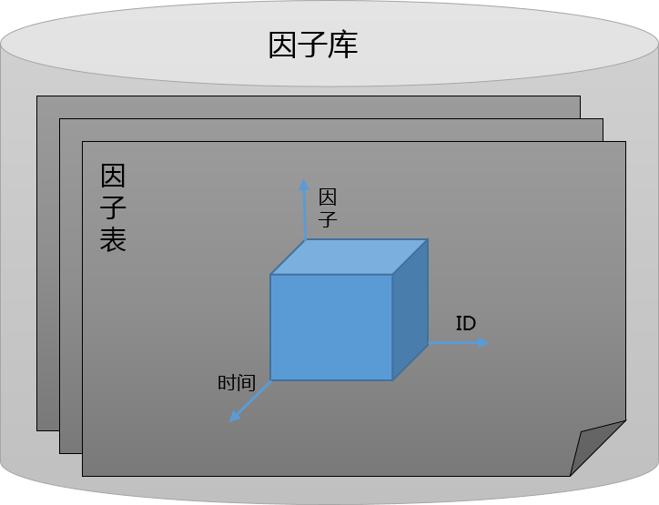
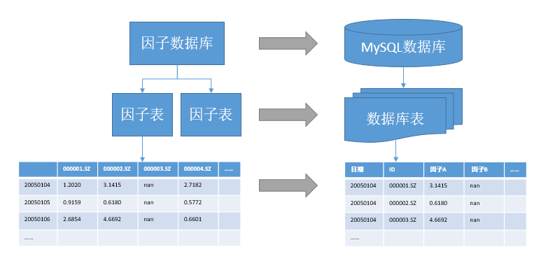
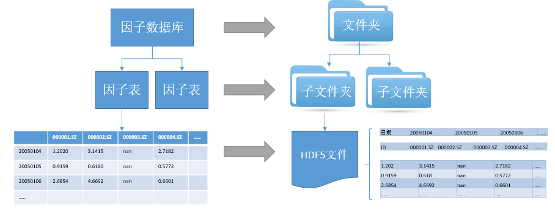

.. _因子数据库:

因子数据库
==========


.. _数据管理原则:

数据管理原则
------------

数据管理可能是量化投资和研究中最耗费时间的部分, 数据库的构建, 不同数据源数据的采集和映射, 数据的清洗, 数据格式的转换等等. 通常, 如果数据已经很好的组织起来, 那么量化模型的开发将事半功倍. 另外, 数据的重要性也不可忽视, 就像大家常说的, "garbage in, garbage out".

QuantStudio 数据管理的三个基本原则是: 

1. :strong:`尽可能以统一的逻辑形式组织数据`. 所有的数据以二维矩阵的形式表示, 和大多数统计分析所用的数据形式一致. 这可能不是一种经济的方式(数据存储量较大, 浪费内存和硬盘空间),  但可以使得我们将主要的精力集中在模型的开发上, 并提升读取数据和回测的速度, 另外, 这样做还可以使得我们的框架具有足够的弹性. 
2. :strong:`时点数据（Point-in-time Data）`. 当前国外很多的数据提供商都开发了各自的时点数据库, 例如 Compustat, 以及 Thomson Reuters 的 Worldscope 数据库. 国内还鲜有数据提供商开发完备的时点数据库. 传统的非时点型数据在量化研究中常常带来以下问题: 
    
    a. :strong:`数据时滞性假设`. 例如, 对于财务报表数据, 并不是所有的上市公司会在同一时点公布其财务报表, 使用财务数据的一个简单方法是设置一个财务报表公布截止日, 在该时点之后所有的公司使用同一报告期的财务报表. 对于年报和一季报通常认为在 4 月 30 日之后均公布完成, 中报为 8 月 31 日之后可以使用, 而三季报以 10 月 31 日作为截止日. 此方法实现简单, 但也存在一个突出的问题, 即对于财务报表公布较及时的上市公司引入了一到两个月的滞后期, 在这段时间内虽然我们可以获得最新信息, 但依然选择使用过于陈腐的滞后信息. 而时点数据可以有效的避免这类问题, 在每个时点, 我们使用当前所能获得的最新信息生成数据, 比如当前时点位于 4 月 30 日之前, 如果一个上市公司公布了其年报, 我们就使用该年报的数据进行计算, 如果没有公布, 我们使用其三季报（或者更早的报告期）的数据进行计算. 
    b. :strong:`前视偏差（Look-ahead Bias）`. 由于统计错误或者会计标准的变化, 上市公司经常需要调整以前公布的财务报表数据, 很多的传统数据库往往只保留其调整后的数值. 而在历史回测的时候, 我们应该尽可能的构建一个相对现实的交易环境, 尤其是不能使用历史时点上无法获知的数据. 
    c. :strong:`生存性偏差（Survivorship Bias）`. 当有新的公司上市的时候, 数据提供商往往会把该公司若干年以前的财务数据也添加进数据库, 如果我们不加区分, 往往会在该公司上市以前就使用了其相关的数据. 

3. :strong:`尽可能的使用原始数据进行计算并保存未经任何正则化处理的因子`. 数据提供商往往会提供一些经过其加工的因子数据, 对于此类数据, 我们一般采取回避的态度. 各种指标的计算或者数据的合并, 我们倾向于自己完成, 这保证了最高级别的质量控制和操作弹性. 对于生成的因子, 我们一般不做进一步的标准化、中性化等处理, 而直接保存最初始的因子数据, 而将这些操作留作具体的模型中实现, 这是为了保存最完整的信息和最大的弹性. 


数据来源
--------

QuantStudio 本身不能产生数据, 需要借助其他的数据源生成数据. 支持的数据源有:

    1. tushare: 目前仅支持 tushare 中的一些行情数据, 其他尚在完善中.
    2. Wind 的两个数据库: Wind 金融工程数据库和 Wind 量化研究数据库. 这两个数据库都基于关系型数据库, 相比于 Wind 金融工程数据库, Wind 量化研究数据库的数据在组织上更为清晰合理. 
    3. Wind 插件: TODO
    4. 聚源数据库: TODO
    5. 天软: TODO


.. _因子数据模型:

因子数据模型
------------

我们的因子数据模型采用了三层结构, 最上层是因子库, 每个因子库有多张因子表组成, 每张因子表中又包含多个因子, 每张因子表是三维数组, 第一维是因子名称, 第二维是时间点, 第三维是证券 ID. 如下图所示: 


    
    因子数据模型

具体到数据在程序里的数据类型, 因子数据以 Python pandas 模块的 Panel 数据类型组织. 我们规定了这三个维度的先后顺序, 对应于 Panel 数据类型, items 是因子, major_axis 是时点, minor_axis 是证券 ID. 在 Quant Studio 的所有 API 中, 凡是涉及到因子数据的地方, 都将遵守此组织原则. 

另外, 对于时间点, 采用 Python 的 datetime 表示, ID 的数据类型为字符串, 例如, "000001.SZ", 因子名称的数据类型也是字符串. 

如前所述, 我们的数据管理原则的第一项是 :strong:`尽可能以统一的逻辑形式来组织数据` . 所以, 在 QuantStudio 里, 不仅仅是传统意义上的因子(比如 BP, EP 等等)以上述形式存在, 其他的数据我们也以该形式组织. 

比如上市公司的财务数据, 它的特征是每年只公布四个值, 但每个数据项还有报告期、公告期以及报表类型等其他的标志属性, 我们会按照时点数据的原则采用某种映射方式将其转换成因子数据形式. 

再比如宏观经济数据, 它没有证券 ID 这个维度, 只是一维的时间序列数据. 对于此类数据, 我们会添加默认的 ID 标志(比如“000000.HST”)来扩展出 ID 维度, 或者我们对所有的 ID 都填充该一维时间序列数据. 

另外, 对于像证券的行业属性、交易状态、证券名称等数据, 我们也组织成因子数据的形式. 换句话说, 在 QuantStudio 里, 几乎所有的数据都具有这种统一的形式, 我们对于 :strong:`因子` 这个概念的使用要比通常意义上的更广泛一些. 

QuantStudio 针对每种特定的数据类型对外部数据进行转化, 变成因子数据模型定义的格式. 下面简要说明各种经常遇到的数据类型.


行情因子
````````

行情数据应该是最接近于因子数据形式的数据了, 每个数据项都是由时点和证券 ID 两个维度来唯一确定. 常见的行情类因子有：价格类因子、成交量、成交额、换手率、收益率等等.

不同数据源中的行情因子主要来源有:

    * tushare: 日线行情, 复权因子等
    * Wind 金融工程数据库: 沪深交易所行情、沪深交易所复权行情、AB股日行情指标、个股投资评级（汇总）等数据表
    * Wind 量化研究数据库: 中国A股日行情, 中国A股周收益率, 中国A股月收益率, 中国A股日行情估值指标, 中国A股融资融券交易明细等
    * 聚源数据库: 日行情库表、复权因子表等.

原始行情数据转化成行情因子需要注意的一个问题是原始的行情数据在时间这个维度上可能不连续, 比如 Wind 投资评级的汇总数据只在综合评级发生变化的时间点上才有数据, 这就需要对没有数据的时间点进行填充. 我们的填充方案有两种, 一是直接以缺失对待, 另一种是给定一个回溯期（比如 3 个月）, 以该回溯期内距离当前最近的非空值填充. 


财务因子
````````

财务数据应该是处理起来最复杂的数据了, 每个数据项都是由 ID、报告期、公告期、报表类型这四个维度来唯一确定. 常见的财务类因子是各种涉及公司基本面的因子.

不同数据源中的财务因子主要来源有:

    * tushare: 资产负债表, 利润表, 现金流量表等
    * Wind 金融工程数据库: 资产负债表(新准则), 利润表(新准则), 现金流量表(新准则)等;
    * Wind 量化研究数据库: 中国A股资产负债表, 中国A股利润表, 中国A股现金流量表, 中国A股财务指标表等;
    * 聚源数据库: 非金融类资产负债表_新会计准则, 金融类资产负债表_新会计准则等.

原始财务数据转化成财务类因子有若干种方式, 常用的有以下几种：

    1. 指定报告期的最新财报：以当前时点能得到的（公告日期在当前时点之前）指定报告期的最新财务报表的数据值作为当前时点的因子值. 比如, 当前时点是 2010 年 8 月 20 日, 如果指定的报告期是年报, 此时公司已经公布了 2009 年年报, 则以该年报值作为因子值. 如果指定报告期为中报, 而此时公司尚未公布 2010 年中报, 则只能以 2009 年中报值作为因子值. 如果指定报告期为所有报告期, 公司在这天以前已经披露了中报, 则以该中报值作为当前因子值, 否则以一季报的值作为因子值. 
    2. 指定报告期的最新单季度：以当前时点能得到的（公告日期在当前时点之前）指定报告期的财务报告的数据值计算出的单季度数据作为当前时点的因子值. 比如, 当前时点是2010年8月20日, 指定的报告期是所有, 我们要计算最新单季度的净利润, 如果某公司在这天以前已经披露了2010年中报, 则我们用2010年中报的净利润减去2010年一季报的净利润得到二季度净利润作为当前最新单季度净利润因子值, 否则以2010年一季报的净利润值直接作为因子值. 
    3. 指定报告期的最新TTM：以当前时点能得到的（公告日期在当前时点之前）指定报告期的财务报告的数据值计算出的滚动四季度数据作为当前时点的因子值. 比如, 当前时点是2010年8月20日, 指定的报告期是所有, 我们要计算最新TTM的净利润, 如果某公司在这天以前已经披露了2010年中报, 则我们用2010年中报的净利润加上2009年年报的净利润再减去2009年中报的净利润值得到过去滚动四季度的净利润作为当前最新TTM净利润因子值, 否则以2010年一季报的净利润加上2009年年报的净利润再减去2009年一季报的净利润的值直接作为因子值. 
    4. 回溯n年财报（单季度, TTM）：给定回溯的年数n, 搜索当前时点能得到的（公告日期在当前时点之前）指定报告期的最新财务报表的报告期, 将该报告期减去n年后得到的报告期对应的财务报表数据值作为当前时点的因子值. 比如, 给定回溯年数为1, 当前时点是2010年8月20日, 如果某公司在这天以前已经披露了中报, 则以2009年的中报值作为当前因子值, 否则以2009年一季报的值作为因子值. 回溯n年最新年报、回溯n年最新单季度以及回溯n年TTM的变换方式可以类推. 
    5. 回溯n期财报（单季度, TTM）：给定回溯的期数n, 搜索当前时点能得到的（公告日期在当前时点之前）指定报告期的最新财务报表的报告期, 将该报告期减去n期后得到的报告期对应的财务报表数据值作为当前时点的因子值. 比如, 给定回溯期数为1, 当前时点是2010年8月20日, 如果某公司在这天以前已经披露了中报, 则以2010年的一季报的值作为当前因子值, 否则以2009年年报的值作为因子值. 回溯n期最新年报、回溯n期最新单季度以及回溯n期TTM的变换方式可以类推. 

上述的变换方式有一定的重叠. 最新财报（单季度, TTM ）是回溯0年的最新财报（单季度, TTM ）以及回溯0期的最新财报（单季度, TTM ）, 而回溯n年的最新财报（单季度, TTM ）也等于回溯 4*n 期的最新财报（单季度, TTM ）. 保留这些概念上的冗余主要是让因子定义更清晰易懂. 


预期因子
````````

预期因子来源于分析师报告中对上市公司未来基本面给出的盈利预测数据, 一般的数据提供商会提供明细和汇总两种类型的盈利预测数据. 明细数据记录了每个分析师在每个时点给出的预测数据, 其数据项由预测日期、证券 ID、报告期、研究机构、分析师、预测基准股本这六个维度来唯一确定. 汇总数据是数据提供商在给定的有效期下按照某种加权方式计算的平均预测值, 其数据项由日期、证券 ID、报告期以及有效期四个维度来唯一确定. 

对于 Wind 金融工程数据库, 盈利预测数据主要来源于：盈利预测(汇总), 盈利预测(明细)数据表. 而 Wind 量化研究数据库的盈利预测数据表主要有：中国A股盈利预测汇总以及中国A股盈利预测明细. 

不同数据源中的预期因子主要来源有:

    * Wind 金融工程数据库: 盈利预测(汇总), 盈利预测(明细)等;
    * Wind 量化研究数据库: 中国A股盈利预测汇总以及中国A股盈利预测明细

盈利预测数据转化成预期因子目前支持三种方式：

    1. 自定义汇总：该种方式主要针对盈利预测或者分析师评级的明细数据, 以当前时点能得到的（预测日期在当前时点之前）在给定有效期内的所有盈利预测或者分析师评级数据传递给自定义的汇总函数形成汇总值作为当前时点的因子值. 
    2. 指定向前预测年数：该种方式针对盈利预测汇总数据, 给定向前预测年数并确定当前时点对应的目标报告期, 以能得到的（预测日期在当前时点之前）盈利预测汇总值作为当前时点的因子值. 比如, 当前时点是 2010 年 4 月 20 日, 向前预测年数是 1 年, 如果 2009 年年报已经披露, 目标报告期为“20101231”, 若 2009 年年报尚未披露, 则目标报告期为“20091231”. 
    3. 未来12个月：该种方式针对盈利预测汇总数据, 以能得到的（预测日期在当前时点之前）当前时点所在预测年度以及下一年度的盈利预测汇总值的按照天数的插值平均值作为当前时点的因子值. 比如, 当前时点是 2010 年 4 月 20 日, 当前时点所在的预测年度即为 2010 年年报, 下一年度为 2011 年年报, 当前时点距离 2010 年 12 月 31 日是 255 天, 则这两个预测值以 255:110 的比例加权平均作为当前时点的因子值. 


特征因子
````````

特征因子是指与证券自身特征属性相关的数据, 比如证券的简称、上市天数等等, 这些因子一般不是直接用于选股的, 而是起到辅助作用的一类数据. 

常用的特征因子主要有以下几类：

    1. 所属行业：我们常用的行业分类有中信行业、申万行业以及 Wind 行业. 数据提供商往往记录了证券被划分进某个行业的起始日期以及离开该行业的剔除日期. 我们需要比对当前日期和起始日与剔除日的大小以确定当前所属的行业分类. 
    2. 指数成份：对于我们常见的指数, 数据提供商记录了证券被选入某个指数的纳入日期以及被剔除该指数的日期. 类似于行业分类, 我们也需要比对当前日期和纳入日与剔除日的大小以确定当前是否属于该指数. 
    3. 指数成份权重：对于某些指数, 数据提供商还记录了其成份股的权重信息, 但一般只在指数成份权重调整的离散时间点有相应记录, 这由涉及到缺失填充的问题, 我们的解决方案和行情数据的填充基本一致. 
    4. 特别处理（ST）：同行业分类和指数成份信息的记录方式一样, 数据提供商记录了证券被特别处理的开始日期和结束日期, 我们可以同样转换成因子. 
    5. 证券简称、所属板块等. 


因子数据读取
------------

QuantStudio 中的因子数据来自于各个因子库, 每个因子库对应一个因子库类, 这些类定义在子模块 FactorDB 中:

    * tushare: TushareDB
    * Wind 金融工程数据库: WindDB
    * Wind 量化研究数据库: WindDB2
    * 基于 HDF5 文件的本地因子库: HDF5DB
    * 基于关系型数据库的本地因子库: SQLDB
    * 基于 Arctic 的本地因子库: ArcticDB

其中, TushareDB, WindDB, WindDB2 是外部因子库, 只能读取数据, 不能写入数据, 而 HDF5DB, SQLDB, ArcticDB 是本地因子库, 既可以读取数据, 也可以写入. 

对于本地因子数据库的实现, 主要支持三种方式:

1. :strong:`基于关系型数据库`. 整个数据库对应于我们的因子库, 每张数据库表对应于我们的因子表, 每张数据库表用 DateTime 和 ID 这两个字段作为主键来唯一标识一行记录, 其他的字段对应于单个因子. 本质上, 我们是将一个二维的因子数据矩阵挤压成具有二重索引的一维向量. 对于因子数据的访问, 使用标准的 SQL 查询语句完成. 


    
    基于关系型数据库的因子数据模型实现

众所周知, 关系型数据库指的是采用了关系模型来组织数据的数据库. 传统的关系型数据库管理系统早在 20 世纪 70 年代已经出现, 并且帮助无数的公司和机构实现了给定问题的解决方案, 它是一种相对成熟的数据组织方式, 在完整性、一致性以及操作的便利上都有着充分的优势. 但我们使用的金融类数据有其独特的地方, 比如, 数据之间没有复杂的联系, 而我们对于数据的随机读写效率要求很高. 在这点上, 关系型数据库并不能很好的满足我们的要求（当然可以使用一些复杂的技术来提升数据库的效率, 但技术成本较高）, 迫使我们寻求其他更合适的解决方案. 

2. :strong:`基于 HDF5 文件`. HDF(Hierarchical Data File)是美国国家高级计算应用中心(National Center for Supercomputing Application, NCSA)为了满足各种领域研究需求而研制的一种能高效存储和分发科学数据的新型数据格式 . 许多数据类型都可以被嵌入在一个 HDF 文件里. 例如, 通过使用合适的 HDF 数据结构, 符号、数字和图形数据可以同时存储在一个 HDF 文件里. 另外, HDF 是一个与平台无关的文件格式. HDF 文件无需任何转换就可以在不同平台上使用. 

我们使用最新的 HDF5 来构建因子数据库, 所有数据文件存放的总目录对应于我们的因子数据库, 总目录下的每个子目录对应于我们的因子表, 子目录中的每个 HDF5 数据文件对应于单个因子. 每个 HDF5 因子文件由三个数据集(Dataset)组成: DateTime、ID 和 Data, DateTime 数据集存储一维的时间点序列, ID 数据集存储一维的证券 ID 序列, Data 数据集存储二维的因子数据矩阵. 


    
    基于 HDF 文件的因子数据模型实现

由于 HDF5 文件支持数据的切片访问, 我们可以直接存储整张因子表, 无论是随机性的局部读写或者一次性的整体读写, HDF5 文件的效率都非常高. 

3. :strong:`基于非关系型数据库`.  这里我们使用 Arctic 模块构建因子库, Arctic 是基于 MongoDB 的时间序列数据库, 关于 Arctic 的介绍可以参考 "https://github.com/manahl/arctic".


.. attention::

    本章节的应用需要一些基本的数据, 参见 :ref:`示例数据<示例数据>` 的配置.

使用某个因子库首先要创建该因子库对象, 这通过对应的类实例化得到, 然后调用连接方法 connect, 比如使用基于 tushare 的 TushareDB::
    
    >>>import QuantStudio.api as QS
    >>>TSDB = QS.FactorDB.TushareDB(sys_args={"Token":"123456"})
    >>>TSDB.connect()

每个因子库中都包含若干个因子表, 可以查看因子库对象的 TableNames 属性获取特定因子库包含的表名列表::

    >>>print(TSDB.TableNames)
    ['交易日历', 'A股基本资料', 'A股日线行情', 'A股复权因子', 'A股指数成分和权重', '期货合约信息表', '期货日线行情', '每日结算参数']

通过调用因子库的 getTable 方法即可获得指定名称的因子表对象::

    >>>FT = TSDB.getTable(table_name="A股日线行情")
    
每张因子表中都包含若干个因子, 可以查看因子表对象的 FactorNames 属性获取特定因子表包含的因子名列表::

    >>>print(FT.FactorNames)
    ['开盘价', '最高价', '最低价', '收盘价', '昨收价', '涨跌额', '涨跌幅', '成交量(手)', '成交额(千元)', '交易日期']

因子表除了因子这个维度外, 还有两个维度: 时间和 ID, 可以通过调用方法 getDateTime 和 getID 获取这两个维度的信息::
    
    >>>import datetime as dt
    >>>DTs = FT.getDateTime(start_dt=dt.datetime(2018,1,1), end_dt=dt.datetime(2018,10,15))
    >>>IDs = FT.getID()

getDateTime 和 getID 还有一个参数 ifactor_name 用于指定提取特定因子的时间和 ID 维度, 但大多数情况下每个因子表中因子的时间和 ID 维度都一样, 所以可以不指定该参数由 QuantStudio 执行默认行为. getDateTime 有两个额外的参数 start_dt, end_dt 控制提取的起止时间, DTs 是一个元素为 datetime 的列表, IDs 是一个元素为 ID 的列表::

    >>>print(DTs[-3:])
    [datetime.datetime(2018, 10, 11, 0, 0), datetime.datetime(2018, 10, 12, 0, 0), datetime.datetime(2018, 10, 15, 0, 0)]
    >>>print(IDs[:4])
    ['000001.SZ', '000002.SZ', '000003.SZ', '000004.SZ']

因子表通过调用方法 readData 来获取因子数据, 该方法需要提供因子(factor_names), 时间(dts)和 ID (ids)三个维度的信息作为参数::

    >>>Data = FT.readData(factor_names=["开盘价", "收盘价"], ids=IDs[:4], dts=DTs[-3:])

(这里只是为了演示方法, 所以只提取少量 ID 和时间的数据), Data 是一个 pandas 的 Panel 类型, 其 items 为因子列表, major_axis 为时间序列, minor_axis 为 ID 序列::

    >>>print(Data)
    <class 'pandas.core.panel.Panel'>
    Dimensions: 2 (items) x 3 (major_axis) x 4 (minor_axis)
    Items axis: 开盘价 to 收盘价
    Major_axis axis: 2018-10-11 00:00:00 to 2018-10-15 00:00:00
    Minor_axis axis: 000001.SZ to 000004.SZ

readData 还有一个可选参数: args, 用于指定控制数据提取的参数, 其数据类型为字典, key 是参数名, value 是参数值, 如果未指定参数, 则 QuantStudio 按照默认参数值进行数据提取, args 的默认值是空字典. 比如, TushareDB 中的表 "指数成分和权重" 有一个参数 "指数代码" 用于指定成分股所属的标的指数, 默认值是 "000016.SH", 如果直接调用 readData, 则是读取的上证 50 指数的成分权重::

    >>>FT1 = TSDB.getTable("指数成分和权重")
    >>>FT1.readData(factor_names=["权重"], ids=IDs[:4], dts=[dt.datetime(2018,9,3)]).iloc[0,0,:]
    000001.SZ   NaN
    000002.SZ   NaN
    000003.SZ   NaN
    000004.SZ   NaN
    Name: 2018-09-03 00:00:00, dtype: float64

如果想要提取沪深 300 指数的成分权重数据, 则需要修改该参数, 可以通过 args 来指明该参数的取值::

    >>>FT1.readData(factor_names=["权重"], ids=IDs[:4], dts=[dt.datetime(2018,9,3)], args={"指数代码":"399300.SZ"}).iloc[0,0,:]
    ID
    000001.SZ    0.8656
    000002.SZ    1.1330
    000003.SZ       NaN
    000004.SZ       NaN
    Name: 2018-09-03 00:00:00, dtype: float64

当然也可以先修改因子表对象的参数, 调用 readData 等方法就是以新的参数值来执行, 不必再传递 args 参数::

    >>>FT1["指数代码"] = "399300.SZ"
    >>>print(FT1["指数代码"])
    399300.SZ
    >>>FT1.readData(factor_names=["权重"], ids=IDs[:4], dts=[dt.datetime(2018,9,3)]).iloc[0,0,:]
    ID
    000001.SZ    0.8656
    000002.SZ    1.1330
    000003.SZ       NaN
    000004.SZ       NaN
    Name: 2018-09-03 00:00:00, dtype: float64

也可以在调用 getTable 获得因子表时指定初始化的参数::

    >>>FT1 = TSDB.getTable("指数成分和权重", args={"指数代码":"399300.SZ"})
    >>>print(FT1["指数代码"])
    399300.SZ
    >>>FT1.readData(factor_names=["权重"], ids=IDs[:4], dts=[dt.datetime(2018,9,3)]).iloc[0,0,:]
    ID
    000001.SZ    0.8656
    000002.SZ    1.1330
    000003.SZ       NaN
    000004.SZ       NaN
    Name: 2018-09-03 00:00:00, dtype: float64

因子表可以通过调用方法 getFactor 来获取相应的因子对象::
    
    >>>Close = FT.getFactor(ifactor_name="收盘价")

因子对象的参数同其所属的因子表一样, 也可以在调用 getFactor 时传入 args 来修改初始值, 因子对象同样有 getDateTime, getID 方法来获取维度信息以及 readData 方法来读取数据::

    >>>iDTs = Close.getDateTime(start_dt=dt.datetime(2018,1,1), end_dt=dt.datetime(2018,10,15))
    >>>iIDs = Close.getID()
    >>>iData = Close.readData(ids=iIDs[:4], dts=iDTs[-3:])
    >>>print(iDTs[-3:])
    [datetime.datetime(2018, 10, 11, 0, 0), datetime.datetime(2018, 10, 12, 0, 0), datetime.datetime(2018, 10, 15, 0, 0)]
    >>>print(iIDs[:4])
    ['000001.SZ', '000002.SZ', '000003.SZ', '000004.SZ']
    >>>print(iData)
    ID          000001.SZ  000002.SZ  000003.SZ  000004.SZ
    2018-10-11       9.86      20.93        NaN       15.9
    2018-10-12      10.30      21.80        NaN       15.9
    2018-10-15        NaN        NaN        NaN        NaN

除了从因子库中直接获取已经存在的因子表外, 还可以自定义因子表, 即通过 QuantStudio 提供的 CustomFT 类(也在子模块 FactorDB 下)实例化一个空因子表::

    >>>CFT = QS.FactorDB.CustomFT(name="MyFT")

目前, CFT 还是一个空的因子表, 其并不包含因子, 需要调用其方法 addFactors 来添加因子, 比如添加上文中因子表 FT 中的因子::

    >>>CFT.addFactors(factor_table=FT, factor_names=["开盘价", "最高价", "最低价"])
    >>>print(CFT.FactorNames)
    ['开盘价', '最低价', '最高价']

也可以添加因子对象, 比如添加上文中获得的因子 Close::

    >>>CFT.addFactors(factor_list=[Close])
    >>>print(CFT.FactorNames)
    ['开盘价', '收盘价', '最低价', '最高价']

另外, 自定义因子表还可以调用 deleteFactors 和 renameFactor 来删除和重命名已经添加的因子::

    >>>CFT.deleteFactors(factor_names=["最低价", "最高价"])
    >>>CFT.renameFactor(factor_name="收盘价", new_factor_name="Close")
    >>>print(CFT.FactorNames)
    ['Close', '开盘价']
    
添加好因子后, CFT 仍不完整, 还缺少时间和 ID 两个维度的信息, 可以通过调用 setDateTime 和 setID 来设置这两个维度::

    >>>CFT.setDateTime(dts=DTs[-3:])
    >>>CFT.setID(ids=IDs[:4])

这样, CFT 就是一个完整的因子表了, 其可以像前面介绍过的因子表 FT 那样使用来获取维度信息和数据了::

    >>>print(CFT.FactorNames)
    ['Close', '开盘价']
    >>>print(CFT.getDateTime())
    [datetime.datetime(2018, 10, 11, 0, 0), datetime.datetime(2018, 10, 12, 0, 0), datetime.datetime(2018, 10, 15, 0, 0)]
    >>>print(CFT.getID())
    ['000001.SZ', '000002.SZ', '000003.SZ', '000004.SZ']
    >>>Data = CFT.readData(factor_names=["开盘价", "Close"], ids=IDs[:4], dts=DTs[-3:])
    >>>print(Data)
    <class 'pandas.core.panel.Panel'>
    Dimensions: 2 (items) x 3 (major_axis) x 4 (minor_axis)
    Items axis: 开盘价 to Close
    Major_axis axis: 2018-10-11 00:00:00 to 2018-10-15 00:00:00
    Minor_axis axis: 000001.SZ to 000004.SZ

除了这些基本方法, 每个因子表可能包含若干个参数来控制数据生成的行为, 具体的参数信息参看下一章的 API 参考.

因子表除了以上述的方式进行数据读取, 还有一种特别的遍历模式, 即在时间序列遍历型的运算中, 因子表可以提供更高效的数据读取. 这里假设 DTs 是一个时间序列, 需要对其进行遍历, 在每个时点取用数据进行一些计算, 则比较高效的代码如下::

    if __name__=="__main__":
        FT.start(dts=DTs)# 启动遍历模式
        for iDT in DTs:
            FT.move(idt=iDT)# 移动当前时点位置
            # 以下是用户的代码, 在遍历模式中调用 readData 方法效率更高
            pass
        FT.end()# 结束遍历模式

由于遍历模式下 QuantStudio 会开启子进程, 所以也要写在 if __name__=="__main__": 之下.


因子数据存储
------------

QuantStudio 提供的本地因子库可以将因子数据存储到本地. 根据存储方式的不同, 本地因子库有基于 HDF5 文件的因子库 HDF5DB, 基于关系数据库的因子库 SQLDB, 还有基于非关系型数据库的因子库 ArcticDB, 这里以 HDF5DB 为例进行说明.

同上一节一样, 使用 HDF5DB 首先要实例化一个因子库对象并连接, HDF5DB 初始化需要一个额外参数, 指明数据文件存储的主目录, 比如这里打算将数据存储在文件夹 "C:\HDF5Data" 下::

    >>>import QuantStudio.api as QS
    >>>HDB = QS.FactorDB.HDF5DB(sys_args={"主目录":"C:\\HDF5Data"})
    >>>HDB.connect()
    >>>print(HDB.TableNames)
    []

可以看到, 当前因子库中并无任何数据, 所以因子表列表是空 list. 下面我们从 TushareDB 中读取部分因子数据存储到因子库 HDF5DB 里. 首先读取因子数据::

    >>>TSDB = QS.FactorDB.TushareDB(sys_args={"Token":"123456"})
    >>>TSDB.connect()
    >>>FT = TSDB.getTable(table_name="A股日线行情")
    >>>IDs = FT.getID()
    >>>DTs = FT.getDateTime(start_dt=dt.datetime(2018,1,1), end_dt=dt.datetime(2018,10,15))
    >>>Data = FT.readData(factor_names=["开盘价", "收盘价"], ids=IDs[:5], dts=DTs[-3:])
    >>>print(Data)
    <class 'pandas.core.panel.Panel'>
    Dimensions: 2 (items) x 3 (major_axis) x 5 (minor_axis)
    Items axis: 开盘价 to 收盘价
    Major_axis axis: 2018-10-11 00:00:00 to 2018-10-15 00:00:00
    Minor_axis axis: 000001.SZ to 000005.SZ

所有的本地因子库都有一个方法 writeData 来实现数据的存储. writeData 方法有四个参数: data, table_name, if_exists, data_type:

    * data: 要写入的数据, 类型为 pandas.Panel, 即是上段代码中得到 Data 类型; 
    * table_name: 要存入的因子表名称; 
    * if_exists: 用于指明如果因子库中同名因子已经存在的数据更新方法, 可选: "update"(默认值), "append", "update" 表示新旧数据重叠的部分以新写入的数据为准, "append" 表示新旧数据重叠的部分以已有数据为准; 
    * data_type: 用于指明每个待写入因子的数据类型, 类型为字典, key 是因子名称, value 是因子数据类型, 可选: "double", "string"两种, 如果未指明则交由 QuantStudio 自动判断, data_type 默认值为空字典

::

    >>>HDB.writeData(data=Data, table_name="TestTable", if_exists="update", data_type={"收盘价":"double", "开盘价":"double"})

这样再打印 HDB 的因子表列表就可以发现多了一张因子表 TestTable::

    >>>print(HDB.TableNames)
    ['TestTable']

我们就可以像上一节一样使用 HDB 因子库中的数据了::

    >>>HFT = HDB.getTable("TestTable")
    >>>print(HFT.FactorNames)
    ['开盘价', '收盘价']
    >>>HData = HFT.readData(factor_names=["开盘价", "收盘价"], ids=IDs[:5], dts=DTs[-3:])
    >>>print(HData)
    <class 'pandas.core.panel.Panel'>
    Dimensions: 2 (items) x 3 (major_axis) x 5 (minor_axis)
    Items axis: 开盘价 to 收盘价
    Major_axis axis: 2018-10-11 00:00:00 to 2018-10-15 00:00:00
    Minor_axis axis: 000001.SZ to 000005.SZ


API 参考
--------

因子库基类
``````````

.. py:module:: FactorDB

.. py:class:: FactorDB(sys_args={}, config_file=None, **kwargs)

    因子数据库基类, 不能实例化对象, 其他因子数据库的实现都继承自此类, 并实现相应的方法.

    :param dict sys_args: 因子库的参数
    :param str config_file: 因子库的配置文件地址
    
    .. py:attribute:: Name
    
        该因子库对象的名称, str
    
    .. py:attribute:: TableNames
    
        该因子库中所有因子表的名称列表, list(str)
    
    .. py:method:: connect()
        
        链接因子数据库
        
        :return: ErrorCode
        :rtype: int
    
    .. py:method:: disconnect()

        断开因子数据库链接
        
        :return: ErrorCode
        :rtype: int
    
    .. py:method:: isAvailable()
    
        检查当前因子数据库链接是否有效
        
        :return: ErrorCode
        :rtype: bool
    
    .. py:method:: getTable(table_name, [args={}])
    
        获取指定名称的因子表对象
        
        :param str table_name: 因子表名称
        :param dict args: 因子表的参数
        :return: 因子表对象


.. py:class:: WritableFactorDB(sys_args={}, config_file=None, **kwargs)

    支持写入和修改操作的因子库基类, 继承自 :py:class:`FactorDB.FactorDB`, 不能实例化对象
    
    .. py:method:: renameTable(old_table_name, new_table_name)
    
        重命名表
        
        :param str old_table_name: 旧因子表名
        :param str new_table_name: 新因子表名
        :return: ErrorCode
        :rtype: int
    
    .. py:method:: deleteTable(table_name)

        删除表
        
        :param str table_name: 因子表名
        :return: ErrorCode
        :rtype: int
    
    .. py:method:: setTableMetaData(table_name, key=None, value=None, meta_data=None)
    
        设置表的描述信息
        
        :param str table_name: 因子表名
        :param str key: 键名称
        :param value: 值
        :param dict meta_data: 键值对
        :return: ErrorCode
        :rtype: int

    .. py:method:: renameFactor(table_name, old_factor_name, new_factor_name)
    
        对因子表中的因子进行重命名
        
        :param str table_name: 因子表名
        :param str old_factor_name: 旧因子名
        :param str new_factor_name: 新因子名
        :return: ErrorCode
        :rtype: int
    
    .. py:method:: deleteFactor(table_name, factor_names)
    
        删除因子表中的某些因子
        
        :param str table_name: 因子表名
        :param list(str) factor_names: 要删除的因子名称
        :return: ErrorCode
        :rtype: int
    
    .. py:method:: setFactorMetaData(table_name, ifactor_name, key=None, value=None, meta_data=None)
    
        设置指定因子的描述信息
        
        :param str table_name: 因子表名
        :param str ifactor_name: 因子名
        :param str key: 键名称
        :param value: 值
        :param dict meta_data: 键值对
        :return: ErrorCode
        :rtype: int
    
    .. py:method:: writeData(data, table_name, if_exists="update", data_type={}, **kwargs)
    
        将数据存入因子数据库
        
        :param Panel data: 数据, Panel(items=[因子], major_axis=[时点], minor_axis=[ID])
        :param str table_name: 存入的目标表
        :param str if_exists: 如果目标因子已经存在于因子数据库的处理方式, 可选: "append", "update", "append" 表示只将新数据中多出来的部分存入, "update" 表示将原数据与新数据重合的部分以新数据代替
        :param dict data_type: 指定因子的数据类型, dict, 值可选: "double" 或者 "string", 如果未指定则交由系统自动判断.
        :return: ErrorCode
        :rtype: int

    .. py:method:: offsetDateTime(lag, table_name, factor_names, args={})
    
        时间平移, 沿着时间轴将指定因子的数据纵向移动 lag 期, 空出来的地方填 None(string) 或者 nan(double)
        
        :param int lag: 时间平移的期数, lag>0 向前移动, lag<0 向后移动
        :param str table_name: 因子表名
        :param list(str) factor_names: 因子列表
        :param dict args: 因子表的指定参数
        :return: ErrorCode
        :rtype: int
    
    .. py:method:: changeData(table_name, factor_names, ids, dts, args={})
    
        数据变换, 对原来的时间和 ID 序列变换为新的时间序列和 ID 序列
        
        :param str table_name: 因子表名
        :param list(str) factor_names: 因子列表
        :param list(str) ids: 调整后的目标 ID 序列
        :param list(datetime.datetime) dts: 调整后的目标时点序列
        :param dict args: 因子表的指定参数
        :return: ErrorCode
        :rtype: int
    
    .. py:method:: fillNA(filled_value, table_name, factor_names, ids, dts, args={})
    
        对指定的因子进行缺失值填充
        
        :param filled_value: 缺失值的填充值
        :param str table_name: 因子表名
        :param list(str) factor_names: 因子列表
        :param list(str) ids: 指定填充缺失的 ID 序列
        :param list(datetime.datetime) dts: 指定填充缺失的时点序列
        :param dict args: 因子表的指定参数
        :return: ErrorCode
        :rtype: int

    .. py:method:: replaceData(old_value, new_value, table_name, factor_names, ids, dts, args={})
    
        对指定的因子进行数据替换
        
        :param old_value: 待替换的旧值
        :param new_value: 替换的新值
        :param str table_name: 因子表名
        :param list(str) factor_names: 因子列表
        :param list(str) ids: 指定填充缺失的 ID 序列
        :param list(datetime.datetime) dts: 指定填充缺失的时点序列
        :param dict args: 因子表的指定参数
        :return: ErrorCode
        :rtype: int
    
    .. py:method:: compressData(table_name, factor_names)
    
        对指定因子的数据进行压缩, 压缩的程度依赖具体实现
        
        :param str table_name: 因子表名
        :param list(str) factor_names: 因子列表
        :return: ErrorCode
        :rtype: int


tushare 因子库
``````````````

.. py:module:: TushareDB

.. py:class:: TushareDB(sys_args={}, config_file=None, **kwargs)

    基于 tushare 的因子库, 继承自 :py:class:`FactorDB.FactorDB`, 只读因子库.
    
    :param dict sys_args: 因子库的参数
    :param str config_file: 因子库的配置文件地址, None 表示使用默认配置文件, 默认文件名为 "TushareDBConfig.json", 默认路径为参见: :ref:`配置文件`

    .. py:attribute:: Args
    
        参数集:
        
            * Token: 注册 tushare 时获得的 token, str

tushare 目前支持的因子表有:

.. csv-table:: tushare 因子表
	:header-rows: 0
	:file: csvtables/tushare因子表.csv

每种类型的因子表的参数:

**交易日历**: 无参数

**行情数据**:
    
    * 回溯天数: int, >=0, 默认值 0, 该参数 >0 时会对缺失数据以过去最近的未缺失数据填充, 该参数限制回溯的天数;
    * 日期字段: str, 作为日期来填充数据的字段;
    * 其他条件参数: 不同表有不同的条件


Wind 因子库
```````````

.. py:module:: WindDB

.. py:class:: WindDB(sys_args={}, config_file=None, **kwargs)

    基于 Wind 金融工程数据库的因子库, 继承自 :py:class:`FactorDB.FactorDB`, 只读因子库.
    
    :param dict sys_args: 因子库的参数
    :param str config_file: 因子库的配置文件地址, None 表示使用默认配置文件, 默认文件名为 "WindDBConfig.json", 默认路径为参见: :ref:`配置文件`

    .. py:attribute:: Args
    
        参数集:
        
            * 数据库类型: 可选 "SQL Server", "Oracle", "MySQL"
            * 数据库名: str
            * IP地址: str
            * 端口: int
            * 用户名: str
            * 密码: str
            * 表名前缀: str
            * 字符集: str
            * 连接器: 可选 "default", "cx_Oracle", "pymssql", "mysql.connector", "pyodbc"
            * 数据源: 当连接器是 pyodbc 时, 如果创建了 ODBC 数据源, 可以将数据源名赋予该参数

Wind 金融工程数据库目前支持的因子表有:

.. csv-table:: Wind 金融工程数据库因子表
	:header-rows: 0
	:file: csvtables/Wind金融工程数据库因子表.csv

每种类型的因子表的参数: (TODO)


.. py:module:: WindDB2

.. py:class:: WindDB2(sys_args={}, config_file=None, **kwargs)

    基于 Wind 量化研究数据库的因子库, 继承自 :py:class:`WindDB.WindDB`, 只读因子库.
    
    :param dict sys_args: 因子库的参数
    :param str config_file: 因子库的配置文件地址, None 表示使用默认配置文件, 默认文件名为 "WindDB2Config.json", 默认路径为参见: :ref:`配置文件`
    
    .. py:attribute:: Args
    
        参数集, 同 :py:class:`WindDB.WindDB`


Wind 量化研究数据库目前支持的因子表有:

.. csv-table:: Wind 量化研究数据库因子表
	:header-rows: 0
	:file: csvtables/Wind量化研究数据库因子表.csv

每种类型的因子表的参数:

**交易日历**: 无参数

**证券特征**: 无参数

**行业信息**: 

    * 分类级别: int, 可选: 1, 2, 3, 4, 默认值 1, 指定行业分类级别

**成份信息**: 无参数

**映射信息**: 无参数

**行情数据**:
    
    * 回溯天数: int, >=0, 默认值 0, 该参数 >0 时会对缺失数据以过去最近的未缺失数据填充, 该参数限制回溯的天数;
    * 日期字段: str, 作为日期来填充数据的字段;
    * 其他条件参数: 不同表有不同的条件

**财务数据**:

    * 报告期: str, 可选: "所有", "年报", "中报", "一季报", "三季报", 默认值 "所有", 指定计算所用的所有或者特定的报告期
    * 报表类型: list, 可选: "408001000", "408004000", 默认值 ["408001000", "408004000"], 指定计算所用的报表类型, 默认使用合并报表和合并报表(调整)来计算因子
    * 计算方法: str, 可选: "最新", "单季度", "TTM", 默认值 "最新", 指定计算财务因子的算法
    * 回溯年数: int, >=0, 默认值 0, 指定计算因子用到的财报的回溯年数, 比如当前最新财报报告期是 20180930, 则回溯年数为 1 表示使用报告期为 20170930 之前的财报计算因子
    * 回溯期数: int, >=0, 默认值 0, 指定计算因子用到的财报的回溯期数, 比如当前最新财报报告期是 20180930, 则回溯期数为 1 表示使用报告期为 20180630 之前的财报计算因子

**分析师一致预期**:

    * 计算方法: str, 可选: "FY0", "FY1", "FY2", "Fwd12M", 默认值 "FY0", 指定计算因子的算法, "FY0" 表示最近预测年度值, "FY1", "FY2" 依次类推, "Fwd12M" 表示未来 12 个月
    * 周期: str, 可选: "263001000", "263002000", "263003000", "263004000", 默认值 "263001000", 指定统计汇总的有效期, 参数可选值分别表示: 263001000:30 天;263002000:90 天;263003000:180 天;263004000:大事后 180 天, 指的是业绩事件之后的盈利预测明细业绩事件, 比如: 分红派息、转增、配股等事件之后计算而来
    * 回溯天数: int, >=0, 默认值 0, 该参数 >0 时会对缺失数据以过去最近的未缺失数据填充, 该参数限制回溯的天数;

**分析师预测明细**:

    * 算子: function, 指定计算因子值调用的函数
    * 参数: dict, 默认值 {}, 调用算子时传入的自定义参数
    * 向前年数: list(int), 列表元素为 >=0 且 <=2, 默认值 [0], 传入算子的预测年度的向前年数
    * 附加字段: list(str), 默认值 [], 传入算子的额外字段数据
    * 去重字段: list(str), 默认值 [], 传入算子的数据剔除重复值所依据的字段
    * 周期: int, >0, 默认值 180, 传入算子的数据汇总有效期
    * 数据类型: str, 可选: "double", "string", 算子返回值的数据类型, 只要是非数值型都算作 "string"

**分析师评级明细**:

    * 算子: function, 指定计算因子值调用的函数
    * 参数: dict, 默认值 {}, 调用算子时传入的自定义参数
    * 向前年数: list(int), 列表元素为 >=0 且 <=2, 默认值 [0], 传入算子的预测年度的向前年数
    * 附加字段: list(str), 默认值 [], 传入算子的额外字段数据
    * 去重字段: list(str), 默认值 [], 传入算子的数据剔除重复值所依据的字段
    * 周期: int, >0, 默认值 180, 传入算子的数据汇总有效期
    * 数据类型: str, 可选: "double", "string", 算子返回值的数据类型, 只要是非数值型都算作 "string"


本地因子库
``````````

.. py:module:: HDF5DB

.. py:class:: HDF5DB(sys_args={}, config_file=None, **kwargs)

    基于 HDF5 文件的因子库, 继承自 :py:class:`FactorDB.WritableFactorDB`.
    
    :param dict sys_args: 因子库的参数
    :param str config_file: 因子库的配置文件地址, None 表示使用默认配置文件, 默认文件名为 "HDF5DBConfig.json", 默认路径为参见: :ref:`配置文件`

    .. py:attribute:: Args
    
        参数集:
        
            * 主目录: 存放数据的主目录, str


.. py:module:: SQLDB

.. py:class:: SQLDB(sys_args={}, config_file=None, **kwargs)

    基于关系型数据库的因子库, 继承自 :py:class:`FactorDB.WritableFactorDB`.
    
    :param dict sys_args: 因子库的参数
    :param str config_file: 因子库的配置文件地址, None 表示使用默认配置文件, 默认文件名为 "SQLDBConfig.json", 默认路径为参见: :ref:`配置文件`

    .. py:attribute:: Args
    
        参数集:
        
            * 数据库类型: 可选 "SQL Server", "Oracle", "MySQL"
            * 数据库名: str
            * IP地址: str
            * 端口: int
            * 用户名: str
            * 密码: str
            * 表名前缀: str
            * 字符集: str
            * 连接器: 可选 "default", "cx_Oracle", "pymssql", "mysql.connector", "pyodbc"
            * 数据源: 当连接器是 pyodbc 时, 如果创建了 ODBC 数据源, 可以将数据源名赋予该参数


.. py:module:: ArcticDB

.. py:class:: ArcticDB(sys_args={}, config_file=None, **kwargs)

    基于 Arctic 数据库的因子库, 继承自 :py:class:`FactorDB.WritableFactorDB`.
    
    :param dict sys_args: 因子库的参数
    :param str config_file: 因子库的配置文件地址, None 表示使用默认配置文件, 默认文件名为 "ArcticDBConfig.json", 默认路径为参见: :ref:`配置文件`

    .. py:attribute:: Args
    
        参数集:
            
            * 数据库名: str
            * IP地址: str
            * 端口: int
            * 用户名: str
            * 密码: str


因子表
``````

.. py:currentmodule:: FactorDB

除了自定义因子表, 因子表对象一般都是通过调用因子库的方法 :py:meth:`FactorDB.FactorDB.getTable` 得到的. 下面列示因子表的属性和方法.

.. py:class:: FactorTable(name, fdb=None, sys_args={}, config_file=None, **kwargs)

    因子表基类, 不能直接实例化对象, 其他因子表的实现都继承自此类, 并实现相应的方法.

    :param str name: 因子表名称
    :param FactorDB fdb: 因子库对象
    :param dict sys_args: 因子表的参数
    :param str config_file: 因子表的配置文件地址
    
    .. py:attribute:: Name
    
    该因子表对象的名称, str
    
    .. py:attribute:: FactorDB
    
    该因子表对象所属的因子库, 为 None 表示该因子表为自定义因子表
    
    .. py:attribute:: FactorNames
    
    该因子表中所有因子的名称列表, list(str)
    
    .. py:method:: getMetaData(key=None)
        
        读取因子表的描述信息
        
        :param str key: 键名称, 如果为 None 表示返回所有描述信息
        :return: key 不为 None, 表示返回对应键 key 的值, 否则返回所有描述信息集
        :rtype: Series
    
    .. py:method:: getFactor(ifactor_name, args={}, [new_name=None])

        获取指定名称的因子对象
        
        :param str ifactor_name: 因子名称
        :param dict args: 因子的参数
        :param str new_name: 将因子重命名为给定的新名字
        :return: 因子对象
    
    .. py:method:: getFactorMetaData(factor_names, key=None)
    
        读取因子的描述信息
        
        :param list(str) factor_names: 因子列表
        :param str key: 键名称, 如果为 None 表示返回所有描述信息
        :return: key 不为 None, 表示返回对应键 key 的值, 否则返回所有描述信息集
        :rtype: Series 或者 DataFrame
    
    .. py:method:: getID(ifactor_name=None, idt=None, args={})
    
        读取给定因子在给定时点的 ID 序列
        
        :param str ifactor_name: 给定的因子名称, 如果为 None 表示读取因子表的公共 ID 序列, 由具体的因子表实现
        :param datetime.datetime idt: 给定时点, 如果为 None 表示读取所有时点 ID 序列的并集
        :param dict args: 因子表参数
        :return: ID 序列
        :rtype: list(str)

    .. py:method:: getIDMask(idt, ids=None, id_filter_str=None, args={})
        
        读取在给定时点的 ID 过滤 mask
        
        :param datetime.datetime idt: 给定时点
        :param list(str) ids: 截面 ID 序列, 如果为 None 表示因子表的 ID 序列作为截面
        :param str id_filter_str: ID 过滤条件
        :param dict args: 因子表参数
        :return: 过滤 mask, Series(bool, index=ids)
        :rtype: Series
        
    .. py:method:: getFilteredID(idt, ids=None, id_filter_str=None, args={})
        
        读取在给定时点过滤后的 ID 序列
        
        :param datetime.datetime idt: 给定时点
        :param list(str) ids: 截面 ID 序列, 如果为 None 表示因子表的 ID 序列作为截面
        :param str id_filter_str: ID 过滤条件
        :param dict args: 因子表参数
        :return: 过滤后的 ID 序列
        :rtype: list(str)
        
    .. py:method:: getDateTime(ifactor_name=None, iid=None, start_dt=None, end_dt=None, args={})
    
        读取给定因子在给定 ID 上的时间序列
        
        :param str ifactor_name: 给定的因子名称, 如果为 None 表示读取因子表的公共时间序列, 由具体的因子表实现
        :param str iid: 给定 ID, 如果为 None 表示读取所有 ID 时间序列的并集
        :param datetime.datetime start_dt: 起始时点, 如果为 None 表示以因子表支持的最早的时点作为起始
        :param datetime.datetime end_dt: 终止时点, 如果为 None 表示以因子表支持的最晚的时点作为终止
        :param dict args: 因子表参数
        :return: 时间序列
        :rtype: list(datetime.datetime)
    
    .. py:method:: readData(factor_names, ids, dts, args={})

        读取因子表数据
        
        :param list(str) factor_names: 因子名列表
        :param list(str) ids: ID 序列
        :param list(datetime.datetime) dts: 时间序列
        :param dict args: 因子表参数
        :return: 数据, Panel(items=factor_names, major_axis=dts, minor_axis=ids)
        :rtype: Panel

    .. py:method:: start(dts, ids=None, **kwargs)

        启动遍历模式
        
        :param list(datetime.datetime) dts: 待遍历的时间序列
        :param list(str) ids: ID 序列, 如果为 None 表示因子表的 ID 序列
        :return: ErrorCode
        :rtype: int

    .. py:method:: move(idt, **kwargs)

        遍历运行至某个时点时调用
        
        :param datetime.datetime idt: 遍历中的某个时点
        :return: ErrorCode
        :rtype: int

    .. py:method:: end()

        结束遍历模式
        
        :return: ErrorCode
        :rtype: int

    .. py:method:: write2FDB(factor_names, ids, dts, factor_db, table_name, if_exists="update", subprocess_num=cpu_count()-1, dt_ruler=None, **kwargs)

        将因子表中因子数据写入因子库中
        
        :param list(str) factor_names: 因子名列表
        :param list(str) ids: ID 序列
        :param list(datetime.datetime) dts: 时间序列
        :param FactorDB.WritableFactorDB factor_db: 支持写入操作的因子库
        :param str table_name: 数据写入的表名
        :param str if_exists: 如果目标因子已经存在于因子数据库的处理方式, 可选: "append", "update", "append" 表示只将新数据中多出来的部分存入, "update" 表示将原数据与新数据重合的部分以新数据代替
        :param int subprocess_num: 子进程数, 数据计算和写入时开启的额外子进程个数
        :param list(datetime.datetime) dt_ruler: 时间标尺, 在进行回溯计算时所依赖的时间序列, 如果为 None 则以 dts 作为时间标尺
        :return: ErrorCode
        :rtype: int


.. py:class:: CustomFT(name, sys_args={}, config_file=None, **kwargs)

    自定义因子表, 继承自 :py:class:`FactorDB.FactorTable`, 该因子表没有所属的因子库, 是由用户通过添加因子而自定义的因子表
    
    :param str name: 因子表名称
    :param dict sys_args: 因子表的参数
    :param str config_file: 因子表的配置文件地址
    
    .. py:method:: addFactors(factor_list=[], factor_table=None, factor_names=None, args={})

        添加因子, 将 factor_list 列表中的因子以及因子表 factor_table 中的 factor_names 里列示的因子添加到自定义因子表中
        
        :param list(Factor) factor_list: 因子对象列表
        :param factor_table: 因子表对象
        :param list(str) factor_names: 因子表 factor_table 中的因子名列表
        :param dict args: 因子表 factor_table 的参数集
        :return: ErrorCode
        :rtype: int
        
    .. py:method:: deleteFactors(factor_names=None)

        删除因子
        
        :param list(str) factor_names: 待删除的因子名列表, 为 None 表示删除所有因子
        :return: ErrorCode
        :rtype: int

    .. py:method:: renameFactor(factor_name, new_factor_name)

        重命名因子
        
        :param str factor_name: 旧因子名
        :param str new_factor_name: 新因子名
        :return: ErrorCode
        :rtype: int

    .. py:method:: setDateTime(dts)
    
        设置因子表的时间序列
        
        :param list(datetime.datetime) dts: 时间序列
        :return: ErrorCode
        :rtype: int
    
    .. py:method:: setID(ids)
    
        设置因子表的 ID 序列
        
        :param list(str) ids: ID 序列
        :return: ErrorCode
        :rtype: int


因子
````

除了自定义因子, 因子对象一般都是通过调用因子表的方法 :py:meth:`FactorDB.FactorTable.getFactor` 得到的. 下面列示因子的属性和方法.

.. py:class:: Factor(name, ft, sys_args={}, config_file=None, **kwargs)

    因子基类, 不能直接实例化对象, 其他因子的实现都继承自此类, 并实现相应的方法.

    :param str name: 因子名称
    :param ft: 因子表对象
    :param dict sys_args: 因子的参数
    :param str config_file: 因子的配置文件地址
    
    .. py:attribute:: Name
    
    该因子对象的名称, str
    
    .. py:attribute:: FactorTable
    
    该因子对象所属的因子表, 为 None 表示该因子为自定义因子
    
    .. py:method:: getMetaData(key=None)
        
        读取因子的描述信息
        
        :param str key: 键名称, 如果为 None 表示返回所有描述信息
        :return: key 不为 None, 表示返回对应键 key 的值, 否则返回所有描述信息集, Series
        :rtype: Series
    
    .. py:method:: getID(idt=None)
    
        读取在给定时点的 ID 序列
        
        :param datetime.datetime idt: 给定时点, 如果为 None 表示读取所有时点 ID 序列的并集
        :return: ID 序列
        :rtype: list(str)

    .. py:method:: getDateTime(iid=None, start_dt=None, end_dt=None)
    
        读取在给定 ID 上的时间序列
        
        :param str iid: 给定 ID, 如果为 None 表示读取所有 ID 时间序列的并集
        :param datetime.datetime start_dt: 起始时点, 如果为 None 表示以因子支持的最早的时点作为起始
        :param datetime.datetime end_dt: 终止时点, 如果为 None 表示以因子支持的最晚的时点作为终止
        :return: 时间序列
        :rtype: list(datetime.datetime)
    
    .. py:method:: readData(ids, dts)

        读取因子数据
        
        :param list(str) ids: ID 序列
        :param list(datetime.datetime) dts: 时间序列
        :return: 数据, DataFrame(index=dts, columns=ids)
        :rtype: DataFrame