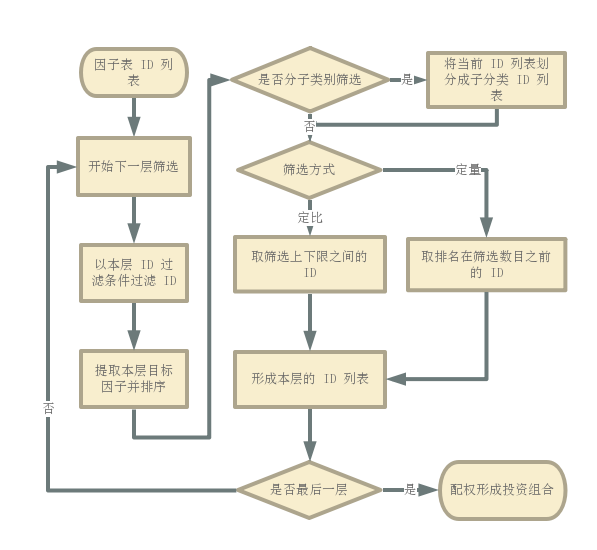

.. _策略测试:

策略测试
========

.. attention::

    本章节的应用需要一些基本的数据, 参见 :ref:`示例数据<示例数据>` 的配置.

在 QuantStudio 中, 用户通过实现事先规定好的接口来定义自己的投资策略, 每个策略均需继承自 :py:class:`Strategy`, 该类位于 :py:mod:`BackTest` 模块下, 需要用户实现的方法有:

    * :py:meth:`Strategy.init`: 策略初始化方法, 在回测开始之前调用, 用户可以在该方法中设置策略的参数或初始化一些变量;
    * :py:meth:`Strategy.genSignal`: 策略信号生成方法, 在回测的每个时点调用, 用户可以自定义自己的策略信号, 并将该信号作为此方法的返回值;
    * :py:meth:`Strategy.trade`: 策略交易方法, 该方法以 :py:meth:`Strategy.genSignal` 的返回值作为输入, 完成从信号到交易订单的转化.
    
从上面的描述可知, QuantStudio 将策略信号和交易订单分离, 策略的主要逻辑体现在信号的生成中, 而信号到交易订单的转化属于交易算法的部分, 对于同一种类型的信号其交易算法可以通用. 当然, 上述三个方法, 必须实现的是 :py:meth:`Strategy.trade`, 对于比较简单的策略, 用户可以将所有的逻辑都放在这个方法里.

一个简单的策略测试脚本如下::

    # coding=utf-8
    import datetime as dt

    import numpy as np
    import pandas as pd

    import QuantStudio.api as QS

    class BuyAndHoldStrategy(QS.BackTest.Strategy.Strategy):
        """买入并持有策略"""
        def init(self):
            self.ModelArgs["TargetID"] = "000001.SZ"# 进行交易的目标 ID
        def trade(self, idt, trading_record, signal):
            TargetID = self.ModelArgs["TargetID"]
            if self.Accounts[0].PositionNum[TargetID]==0:
                self.Accounts[0].order(TargetID, 1)

    if __name__=='__main__':
        HDB = QS.FactorDB.HDF5DB(sys_args={"主目录":"C:\\HDF5Data"})# 主目录为数据存放的文件夹路径
        HDB.connect()
        FT = HDB.getTable("ElementaryFactor")
        DTs = FT.getDateTime(start_dt=dt.datetime(2017, 1, 1), end_dt=dt.datetime(2017, 12, 31))
        DTs = QS.Tools.DateTime.getMonthLastDateTime(DTs)
        IDs = FT.getID()
        
        # 创建自定义因子表
        CFT = QS.FactorDB.CustomFT("CFT")
        Close, AdjFactor = FT.getFactor("收盘价"), FT.getFactor("复权因子")
        AdjClose = QS.FactorDB.Factorize(Close * AdjFactor, factor_name="复权收盘价")
        CFT.addFactors(factor_list=[AdjClose])
        CFT.setDateTime(DTs)
        CFT.setID(IDs)
        
        # 创建回测模型
        Model = QS.BackTest.BackTestModel()
        
        # 添加回测模块
        iModule = BuyAndHoldStrategy(name="买入并持有策略")
        iAccount = QS.BackTest.Strategy.DefaultAccount(market_ft=CFT)
        iAccount["初始资金"] = 1e4
        iAccount["负债上限"] = 0
        iAccount["交易延迟"] = False
        iAccount["最新价"] = "复权收盘价"
        iAccount["买入限制"]["交易费率"] = 0.0
        iAccount["卖出限制"]["交易费率"] = 0.0
        iModule.Accounts.append(iAccount)
        Model.Modules.append(iModule)
        
        # 运行模型
        Model.run(dts=DTs)
        
        # 查看结果
        QS.Tools.QtGUI.showOutput(Model.output())

因子库和因子表的创建设置, 模型创建以及运行, 结果展示等代码同 :ref:`回测模型`, 这里不再赘述. 不同点主要在于策略对象的创建和设置.

这里定义了一个新的策略: 买入并持有策略, 类的定义如下::

    class BuyAndHoldStrategy(QS.BackTest.Strategy.Strategy):
        def init(self):
            self.ModelArgs["TargetID"] = "000001.SZ"# 进行交易的目标 ID
            return ()
        def trade(self, idt, trading_record, signal):
            TargetID = self.ModelArgs["TargetID"]
            if self.Accounts[0].PositionNum[TargetID]==0:
                self.Accounts[0].order(TargetID, 1)

如上所示, BuyAndHoldStrategy 继承自 :py:class:`Strategy`, 新类实现了两个方法: :py:meth:`Strategy.init` 和 :py:meth:`Strategy.trade`. 

:py:meth:`Strategy.init` 方法在策略回测前调用, 主要是初始化策略需要的一些参数, 比如这里定义了一个参数 "TargetID", 其表示策略将要交易的证券 ID, 策略的参数放在对象属性 ModelArgs 中, ModelArgs 默认是一个空字典, 通过添加新的键值储存参数, 另外, 策略对象还提供了一个属性 UserData, 其也是一个空字典, 用于存储策略运行过程中的一些临时数据.

:py:meth:`Strategy.trade` 方法在策略回测的每个时点都会调用, 有三个参数:

    * idt: 当前的时点, datetime.datetime
    * trading_record: 上一期所有账户的交易记录, dict, key 是账户名, value 是此账户的交易记录 DataFrame(columns=["时间点", "ID", "买卖数量", "价格", "交易费", "现金收支", "类型"])
    * signal: 当前时点的信号, 由于这里没有实现 :py:meth:`Strategy.genSignal`, 所以 signal 为 None (表示无信号).
    
:py:meth:`Strategy.trade` 方法中实现策略的主要逻辑, 这里的逻辑比较简单, 即买入一股 000001.SZ, 并一直持有, 所以首先检查 000001.SZ 的持仓数量, 如果为 0 则买入一股, 否则不进行任何交易.

像持仓数量等账户信息存储在账户对象中, 策略对象的属性 Accounts 中存储了策略用到的所有账户对象, Accounts 为 list, 每个元素是一个账户对象, 这里的策略比较简单, 只用到一个账户, 即 Accounts[0], 即回测前通过此行代码创建的账户对象::

    iAccount = QS.BackTest.Strategy.DefaultAccount(market_ft=CFT)
    
设置完其相关的参数后添加到了 Accounts 中::

    iModule.Accounts.append(iAccount)

在 :py:meth:`Strategy.trade` 方法中通过属性 Accounts[0] 获得了该账户, 并通过账户属性 PositionNum 获得当前的持仓数量, PositionNum 是 Series(float, index=[ID]).

通过调用账户对象的方法 order 来实现模拟下单, order 方法的第一个参数为证券 ID, 第二个参数为交易数量, 正数表示买入, 负数表示卖出.

定义好策略类后, 利用该策略类 BuyAndHoldStrategy 实例化了一个策略对象::
    
    iModule = BuyAndHoldStrategy(name="BuyAndHold")
    
, 接着用 BackTest.Strategy.DefaultAccount 账户类实例化了一个账户对象::

    iAccount = QS.BackTest.Strategy.DefaultAccount(market_ft=CFT)

设置好账户对象的一些参数后添加到策略中来::

    iModule.Accounts.append(iAccount)

最后将策略添加的回测模型中::
    
    Model.Modules.append(iModule)

上述策略是一个比较简单的策略, 需要用户自己实现交易订单的生成, 对于一些比较常见的策略类型, 比如投资组合策略, 择时策略等, QuantStudio 进一步包装了 :py:class:`Strategy`, 定义了标准的信号格式, 实现好了 :py:meth:`Strategy.trade` 方法, 用户只需实现信号生成方法 :py:meth:`Strategy.genSignal`, 只要返回符合标准格式的信号即可, 无需关心信号到交易订单的转换. 下面主要就投资组合策略和择时策略来讨论.


投资组合策略
------------

自定义投资组合策略
``````````````````

投资组合策略给出每一期要持有的证券, 以及证券对应的资金配置权重. 定义投资组合策略的信号格式为: Series(权重值, index=[ID]) 或者 None(表示无信号), 每个 ID 投资组合信号权重值的可能范围及其含义:

    * =0 表示清空所有头寸;
    * >0 表示做多, 数值为多头资金占比
    * <0 表示做空, 数值为空头资金占比

:py:meth:`Strategy.genSignal` 方法的返回值必须遵守以上约定. 用户实现的投资组合策略类应该继承自 :py:class:`Strategy.PortfolioStrategy`.

以下是一个简单的投资组合策略示例, 策略的逻辑为选择反转因子(过去 20 个交易日的收益率)最小的 10 只股票构建等权组合, 纯多头策略::

    # coding=utf-8
    """自定义组合策略"""
    import datetime as dt

    import numpy as np
    import pandas as pd

    import QuantStudio.api as QS


    # 选择反转因子最小的 10 只股票构建等权组合
    class DIYPortfolioStrategy(QS.BackTest.Strategy.PortfolioStrategy):
        def genSignal(self, idt, trading_record):
            Momentum = self.MainFactorTable.readData(factor_names=["RTN_20D"], ids=self.Accounts[0].IDs, dts=[idt]).iloc[0,0,:]
            TargetIDs = Momentum.sort_values().index[:10].tolist()
            return pd.Series(1/len(TargetIDs), index=TargetIDs)

    if __name__=='__main__':
        # 创建因子库
        HDB = QS.FactorDB.HDF5DB(sys_args={"主目录":"C:\\HDF5Data"})
        HDB.connect()
        
        # 创建自定义因子表
        FT = HDB.getTable("ElementaryFactor")
        DTs = FT.getDateTime(ifactor_name="收盘价", start_dt=dt.datetime(2017, 1, 1), end_dt=dt.datetime(2017, 12, 31))
        CFT = QS.FactorDB.CustomFT("CFT")
        Close, AdjFactor = FT.getFactor("收盘价"), FT.getFactor("复权因子")
        AdjClose = QS.FactorDB.Factorize(Close * AdjFactor, factor_name="复权收盘价")
        CFT.addFactors(factor_list=[AdjClose])
        CFT.addFactors(factor_table=FT, factor_names=["交易状态", "涨跌停"])
        CFT.addFactors(factor_table=HDB.getTable("StyleMomentumFactor"), factor_names=["RTN_20D"])
        CFT.setDateTime(DTs)
        CFT.setID(FT.getID(ifactor_name="收盘价"))
        
        # 创建回测模型
        Model = QS.BackTest.BackTestModel()
        # 创建账户对象
        iAccount = QS.BackTest.Strategy.DefaultAccount(market_ft=CFT)
        iAccount["初始资金"] = 1e8
        iAccount["负债上限"] = 0.0
        iAccount["交易延迟"] = False
        iAccount["买入限制"]["禁止条件"] = "(@交易状态=='停牌') | pd.isnull(@交易状态) | (@涨跌停==1)"# 满足该条件的 ID 不能买入
        iAccount["买入限制"]["交易费率"] = 0.0
        iAccount["卖出限制"]["禁止条件"] = "(@交易状态=='停牌') | pd.isnull(@交易状态) | (@涨跌停==-1)"# 满足该条件的 ID 不能卖出
        iAccount["卖出限制"]["交易费率"] = 0.0
        iAccount["卖出限制"]["允许卖空"] = False
        iAccount["最新价"] = "复权收盘价"
        # 创建策略对象
        iModule = DIYPortfolioStrategy(name="PortfolioStrategy", factor_table=CFT)
        SignalDTs = QS.Tools.DateTime.getMonthLastDateTime(DTs)
        iModule["信号滞后期"] = 0
        iModule["信号有效期"] = 1
        iModule["信号触发时点"] = SignalDTs
        iModule["目标账户"] = iAccount
        iModule["交易目标"] = "锁定买卖金额"# 可选值: "锁定买卖金额", "锁定目标权重", "锁定目标金额"
        iModule["比较基准"]["因子表"] = HDB.getTable("BenchmarkIndexFactor")
        iModule["比较基准"]["价格因子"] = "收盘价"
        iModule["比较基准"]["基准ID"] = "000905.SH"
        iModule["比较基准"]["再平衡时点"] = SignalDTs
        Model.Modules.append(iModule)
        
        # 运行模型
        Model.run(dts=DTs)
        
        # 查看结果
        QS.Tools.QtGUI.showOutput(Model.output())

上述脚本首先实现了一个新的投资组合策略::

    class DIYPortfolioStrategy(QS.BackTest.Strategy.PortfolioStrategy):
        def genSignal(self, idt, trading_record):
            Momentum = self.MainFactorTable.readData(factor_names=["RTN_20D"], ids=self.Accounts[0].IDs, dts=[idt]).iloc[0,0,:]
            TargetIDs = Momentum.sort_values().index[:10].tolist()
            return pd.Series(1/len(TargetIDs), index=TargetIDs)

如上所示, DIYPortfolioStrategy 继承自 :py:class:`PortfolioStrategy`, 新类实现了方法: :py:meth:`PortfolioStrategy.genSignal`. 在 :py:meth:`PortfolioStrategy.genSignal` 中首先通过策略对象的属性 :py:attr:`PortfolioStrategy.MainFactorTable` 获得提供数据的因子表对象, 读取反转因子数据, 然后按照反转因子升序排列取前十个 ID 的列表, 返回以这 10 个 ID 为 index 值为 0.1 的 Series 作为投资组合信号.

脚本的其他地方类似于本章最开始的买入并持有策略脚本, 这里不再赘述.

       
分层筛选投资组合策略
````````````````````

QuantStudio 还实现了基于分层筛选机制的投资组合策略 :py:class:`Strateg.HierarchicalFiltrationStrategy`, 该策略不需要用户实现接口方法, 只需要设置参数即可. 分层筛选机制具体流程如下图所示: 


    
    分层筛选投资组合信号生成流程

一个简单的分层筛选投资组合策略示例如下, 策略的逻辑为:

    1. 先根据流通市值在每个 Wind 行业分类里选择市值最大的前 10% 的非 ST 股票;
    2. 在 1 筛选后的股票池里选择 BP 因子值最大的 10 值股票;
    3. 将 2 筛选后的股票按照流通市值加权形成投资组合.

::

    # coding=utf-8
    """分层筛选组合策略"""
    import datetime as dt

    import numpy as np
    import pandas as pd

    import QuantStudio.api as QS

    if __name__=='__main__':
        # 创建因子库
        HDB = QS.FactorDB.HDF5DB(sys_args={"主目录":"C:\\HDF5Data"})
        HDB.connect()
        
        # 创建自定义因子表
        FT = HDB.getTable("ElementaryFactor")
        DTs = FT.getDateTime(ifactor_name="收盘价", start_dt=dt.datetime(2017, 1, 1), end_dt=dt.datetime(2017, 12, 31))
        IDs = FT.getID(ifactor_name="收盘价")
        CFT = QS.FactorDB.CustomFT("CFT")
        Close, AdjFactor = FT.getFactor("收盘价"), FT.getFactor("复权因子")
        AdjClose = QS.FactorDB.Factorize(Close * AdjFactor, factor_name="复权收盘价")
        CFT.addFactors(factor_list=[AdjClose])
        CFT.addFactors(factor_table=FT, factor_names=["流通市值", "交易状态", "涨跌停", "特殊处理", "Wind行业"])
        CFT.addFactors(factor_table=HDB.getTable("StyleValueFactor"), factor_names=["BP_LR"])
        CFT.setDateTime(DTs)
        CFT.setID(IDs)
        
        # 创建回测模型
        Model = QS.BackTest.BackTestModel()
        
        # 创建证券账户
        iAccount = QS.BackTest.Strategy.DefaultAccount(market_ft=CFT)
        iAccount["初始资金"] = 100000000
        iAccount["负债上限"] = 0
        iAccount["交易延迟"] = False
        iAccount["目标ID"] = []# 空 list 表示因子表的所有 ID, 或者为 [ID]
        iAccount["买入限制"]["成交价"] = "复权收盘价"
        iAccount["买入限制"]["禁止条件"] = "(@交易状态=='停牌') | pd.isnull(@交易状态) | (@涨跌停==1)"# 满足该条件的 ID 不能买入
        iAccount["买入限制"]["交易费率"] = 0.0
        iAccount["买入限制"]["成交额"] = None
        iAccount["买入限制"]["成交额限比"] = 0.1# 当指定了买入限制的成交额, 则每个时点限制买入的总额为: 成交额*成交额限比
        iAccount["卖出限制"]["成交价"] = "复权收盘价"
        iAccount["卖出限制"]["禁止条件"] = "(@交易状态=='停牌') | pd.isnull(@交易状态) | (@涨跌停==-1)"# 满足该条件的 ID 不能卖出
        iAccount["卖出限制"]["交易费率"] = 0.0
        iAccount["卖出限制"]["成交额"] = None
        iAccount["卖出限制"]["成交额限比"] = 0.1# 当指定了卖出限制的成交额, 则每个时点限制卖出的总额为: 成交额*成交额限比
        iAccount["卖出限制"]["允许卖空"] = False
        iAccount["最新价"] = "复权收盘价"
        
        # 创建策略
        iModule = QS.BackTest.Strategy.HierarchicalFiltrationStrategy(name="StockSelection", factor_table=CFT)
        SignalDTs = QS.Tools.DateTime.getMonthLastDateTime(DTs)
        iModule["信号滞后期"] = 0
        iModule["信号有效期"] = 1
        iModule["信号触发时点"] = SignalDTs# 只有在指定的时点才触发选股信号
        iModule["筛选层数"] = 2
        iModule["第0层"]["信号类型"] = "多头信号"# 可选值: "多头信号", "空头信号"
        iModule["第0层"]["筛选条件"] = "pd.isnull(@特殊处理)"# 如果指定了 ID 过滤条件, 则首先按照此条件过滤后再执行下面的选股算法
        iModule["第0层"]["目标因子"] = "流通市值"
        iModule["第0层"]["排序方向"] = "降序"
        iModule["第0层"]["筛选方式"] = "定比"# 可选值: "定量", "定比", "定量&定比"
        iModule["第0层"]["筛选上限"] = 0.1# 定比方式是选择分位数处于筛选下限和筛选上限之间的 ID
        iModule["第0层"]["筛选下限"] = 0.0# 筛选上限和筛选下限参数只有在筛选方式为 "定比" 或者 "定量&定比" 时才可用
        iModule["第0层"]["分类因子"] = ["Wind行业"]# 如果指定了分类因子, 则在每个子类别内依次运行筛选算法, 集合所有子类别内筛选出的 ID 总体作为本层筛选的最终 ID 序列
        iModule["第1层"]["信号类型"] = "多头信号"# 可选值: "多头信号", "空头信号"
        iModule["第1层"]["筛选条件"] = ""
        iModule["第1层"]["目标因子"] = "BP_LR"
        iModule["第1层"]["排序方向"] = "降序"
        iModule["第1层"]["筛选方式"] = "定量"
        iModule["第1层"]["筛选数目"] = 10# 定量方式是选择排名处于筛选数目以内的 ID, 筛选数目参数只有在筛选方式为 "定量" 或者 "定量&定比" 时才可用
        iModule["第1层"]["分类因子"] = []
        iModule["多头权重配置"]["权重因子"] = "流通市值"# 可选因子表中的因子
        iModule["多头权重配置"]["分类因子"] = []
        iModule["多头权重配置"]["类别权重"] = "等权"# 可选因子表中的因子
        iModule["空头权重配置"]["权重因子"] = "等权"
        iModule["空头权重配置"]["分类因子"] = []
        iModule["空头权重配置"]["类别权重"] = "等权"
        iModule["目标账户"] = iAccount
        iModule["交易目标"] = "锁定买卖金额"# 可选值: "锁定买卖金额", "锁定目标权重", "锁定目标金额"
        iModule["比较基准"]["因子表"] = HDB.getTable("BenchmarkIndexFactor")
        iModule["比较基准"]["价格因子"] = "收盘价"
        iModule["比较基准"]["基准ID"] = "000905.SH"
        iModule["比较基准"]["再平衡时点"] = SignalDTs
        Model.Modules.append(iModule)
        
        # 运行模型
        Model.run(dts=DTs)
        
        # 查看结果
        QS.Tools.QtGUI.showOutput(Model.output())


组合优化策略
````````````

QuantStudio 还实现了基于优化器的投资组合策略 :py:class:`Strateg.OptimizerStrategy`, 该策略不需要用户实现接口方法, 只需要设置参数即可.

一个简单的组合优化策略示例如下, 策略的逻辑为最小方差组合::

    # coding=utf-8
    """优化组合策略"""
    import datetime as dt

    import numpy as np
    import pandas as pd

    import QuantStudio.api as QS

    if __name__=='__main__':
        # 创建因子库
        HDB = QS.FactorDB.HDF5DB(sys_args={"主目录":"C:\\HDF5Data"})
        HDB.connect()
        
        # 创建自定义因子表
        FT = HDB.getTable("ElementaryFactor")
        DTs = FT.getDateTime(ifactor_name="收盘价", start_dt=dt.datetime(2017, 1, 31), end_dt=dt.datetime(2017, 12, 31))
        IDs = FT.getID(ifactor_name="收盘价")
        CFT = QS.FactorDB.CustomFT("CFT")
        Close, AdjFactor = FT.getFactor("收盘价"), FT.getFactor("复权因子")
        AdjClose = QS.FactorDB.Factorize(Close * AdjFactor, factor_name="复权收盘价")
        CFT.addFactors(factor_list=[AdjClose])
        CFT.addFactors(factor_table=FT, factor_names=["成交金额", "交易状态", "涨跌停", "特殊处理"])
        CFT.addFactors(factor_table=HDB.getTable("IndexConstituentFactor"), factor_names=["中证500", "中证500成份权重"])
        CFT.addFactors(factor_table=HDB.getTable("StyleValueFactor"), factor_names=["BP_LR"])
        CFT.setDateTime(DTs)
        CFT.setID(IDs)
        
        # 创建投资组合构造器
        import matlab.engine
        MatlabEng = matlab.engine.start_matlab(option="-desktop")# 启动一个新的 MATLAB
        #MatlabEng = matlab.engine.connect_matlab(name="MATLAB_24080")# 链接到一个已经启动的 MATLAB
        PC = QS.PortfolioConstructor.MatlabPC(matlab_eng=MatlabEng)
        #PC = QS.PortfolioConstructor.CVXPC(sys_args={"优化选项":{"solver":"MOSEK"}})
        
        # 设置优化目标
        Objective = QS.PortfolioConstructor.MeanVarianceObjective(pc=PC)
        Objective["相对基准"] = False
        Objective["收益项系数"] = 0.0
        Objective["风险厌恶系数"] = 1.0
        Objective["换手惩罚系数"] = 0.0
        Objective["买入惩罚系数"] = 0.0
        Objective["卖出惩罚系数"] = 0.0
        PC["优化目标"] = Objective
        
        # 设置约束条件
        # 预算约束
        iConstraint = QS.PortfolioConstructor.BudgetConstraint(pc=PC)
        iConstraint["限制上限"] = 1.0
        iConstraint["限制下限"] = 1.0
        iConstraint["相对基准"] = False
        iConstraint["舍弃优先级"] = -1# 当优化问题无解时, 按照舍弃优先级从大到小依次舍弃约束条件后求解优化问题直到有解为止, 优先级为-1的无法舍弃
        PC["约束条件"].append(iConstraint)
        # 权重约束
        iConstraint = QS.PortfolioConstructor.WeightConstraint(pc=PC)
        iConstraint["目标ID"] = ""# 空字符串表示所有 ID, 或者为 ID 过滤条件
        iConstraint["限制上限"] = 1.0
        iConstraint["限制下限"] = 0.0
        iConstraint["相对基准"] = False
        iConstraint["舍弃优先级"] = -1
        PC["约束条件"].append(iConstraint)
        
        # 创建回测模型
        Model = QS.BackTest.BackTestModel()
        
        # 创建证券账户
        iAccount = QS.BackTest.Strategy.DefaultAccount(market_ft=CFT)
        iAccount["初始资金"] = 100000000
        iAccount["负债上限"] = 0
        iAccount["交易延迟"] = False
        iAccount["目标ID"] = []# 空 list 表示因子表的所有 ID, 或者为 [ID]
        iAccount["买入限制"]["禁止条件"] = "(@交易状态=='停牌') | pd.isnull(@交易状态) | (@涨跌停==1)"# 满足该条件的 ID 不能买入
        iAccount["买入限制"]["交易费率"] = 0.0
        iAccount["买入限制"]["成交额限比"] = 0.1# 当指定了行情信息里的成交额, 则每个时点限制成交的总额为: 成交额*成交额限比
        iAccount["卖出限制"]["禁止条件"] = "(@交易状态=='停牌') | pd.isnull(@交易状态) | (@涨跌停==-1)"# 满足该条件的 ID 不能卖出
        iAccount["卖出限制"]["交易费率"] = 0.0
        iAccount["卖出限制"]["成交额限比"] = 0.1
        iAccount["最新价"] = "复权收盘价"
        
        # 创建策略
        iModule = QS.BackTest.Strategy.OptimizerStrategy(name="StockSelection", pc=PC, factor_table=CFT)
        SignalDTs = QS.Tools.DateTime.getMonthLastDateTime(DTs)
        iModule["信号滞后期"] = 0
        iModule["信号有效期"] = 1
        iModule["信号触发时点"] = SignalDTs# 只有在指定的时点才触发选股信号
        iModule["目标ID"] = "@中证500==1"# 只在满足条件的范围内选股
        iModule["预期收益"] = "BP_LR"
        RDB = QS.RiskDB.HDF5FRDB(sys_args={"主目录":"C:\\RiskData"})
        RDB.connect()
        iModule["风险表"] = RDB.getTable("BarraRiskData")
        iModule["基准权重"] = "中证500成份权重"
        iModule["成交金额"] = "成交金额"
        iModule["信号调整"]["调整方式"] = "忽略小权重"# 可选值: "忽略小权重", "累计权重"
        iModule["信号调整"]["小权重阈值"] = 1e-5# 该参数在调整方式为"忽略小权重"时有效
        iModule["信号调整"]["权重累计阈值"] = 0.97# 该参数在调整方式为"累计权重"时有效
        iModule["信号调整"]["是否归一"] = False# 信号经过调整后是否重新归一化
        iModule["信号调整"]["打印信息"] = False# 是否立即打印求解失败的信息
        iModule["目标账户"] = iAccount
        iModule["交易目标"] = "锁定买卖金额"# 可选值: "锁定买卖金额", "锁定目标权重", "锁定目标金额"
        iModule["比较基准"]["因子表"] = HDB.getTable("BenchmarkIndexFactor")
        iModule["比较基准"]["价格因子"] = "收盘价"
        iModule["比较基准"]["基准ID"] = "000905.SH"
        iModule["比较基准"]["再平衡时点"] = SignalDTs
        Model.Modules.append(iModule)

        # 运行模型
        Model.run(dts=DTs)
        
        # 查看结果
        QS.Tools.QtGUI.showOutput(Model.output())


择时策略
--------

择时策略给出每一期针对某证券的仓位水平. 定义择时策略的信号格式为: Series(-inf~inf 的仓位水平(float)或者 nan 表示维持目前仓位, index=[ID]) 或者 None(表示无信号, 默认值), :py:meth:`Strategy.genSignal` 方法的返回值必须遵守以上约定.

每个 ID 择时信号取值的可能范围及其含义:

    * =0 表示清空所有头寸;
    * >0 表示做多, 取值为 1 表示满仓, <1 表示有资金剩余, >1 表示加杠杆做多;
    * <0 表示做空, 取值为 -1 表示满仓, >-1 表示空头头寸金额小于分配到的资金, <-1 表示加杠杆做空;
    * nan 表示维持当前头寸规模

用户实现的择时策略类应该继承自 :py:class:`Strategy.TimingStrategy`, 并实现其 :py:meth:`TimingStrategy.genSignal` 方法, 返回择时信号, 格式必须满足上述要求.

这里以一个简单的均线交叉策略作为示例, 每个时点计算长期均线 LMA, 短期均线 SMA 的值, 策略的逻辑为: 
    
    * 当 SMA 向上突破 LMA 时, 如果当时持有空仓, 则先平仓, 再开多仓; 如果没有仓位, 则直接开多仓;
    * 当 SMA 向下突破 LMA 时, 如果当时持有多仓, 则先平仓, 再开空仓; 如果没有仓位, 则直接开空仓;
    * 在每个月月底重新再平衡所有 ID 的资金权重为等权

::
    
    # coding=utf-8
    """择时策略"""
    import datetime as dt

    import numpy as np
    import pandas as pd

    import QuantStudio.api as QS

    # 均线交叉策略
    # 计算:
    # (1) NL 期长期均线 LMA;
    # (2) NS 期短期均线 SMA;
    # 交易逻辑:
    # (1) 当 SMA 向上突破 LMA 时, 如果当时持有空仓, 则先平仓, 再开多仓; 如果没有仓位, 则直接开多仓;
    # (2) 当 SMA 向下突破 LMA 时, 如果当时持有多仓, 则先平仓, 再开空仓; 如果没有仓位, 则直接开空仓;
    # (3) 在每个月月底重新再平衡所有 ID 的资金权重为等权
    class MACrossStrategy(QS.BackTest.Strategy.TimingStrategy):
        def genSignal(self, idt, trading_record):
            TargetIDs = self.TargetIDs
            if self.Model.DateTimeIndex<self.ModelArgs["NL"]: return None
            DTs = self.Model.DateTimeSeries[-self.ModelArgs["NL"]-1:]
            Price = self.MainFactorTable.readData(factor_names=["收盘价"], ids=TargetIDs, dts=DTs).iloc[0]
            LMA = Price.rolling(window=self.ModelArgs["NL"]).mean()
            SMA = Price.rolling(window=self.ModelArgs["NS"]).mean()
            Signal = pd.Series(np.nan, index=TargetIDs)
            if idt in self.ModelArgs["再平衡时点"]:
                self["资金分配"] = pd.Series(self["目标账户"].AccountValue/len(TargetIDs), index=TargetIDs)
                Signal[SMA.iloc[-1]>LMA.iloc[-1]] = 1
                Signal[SMA.iloc[-1]<LMA.iloc[-1]] = -1
            else:
                Signal[(SMA.iloc[-2]<=LMA.iloc[-2]) & (SMA.iloc[-1]>LMA.iloc[-1])] = 1
                Signal[(SMA.iloc[-2]>=LMA.iloc[-2]) & (SMA.iloc[-1]<LMA.iloc[-1])] = -1
            return Signal

    if __name__=='__main__':
        # 创建因子库
        HDB = QS.FactorDB.HDF5DB(sys_args={"主目录":"C:\\HDF5Data"})
        HDB.connect()

        # 创建自定义因子表
        FT = HDB.getTable("BenchmarkIndexFactor")
        FT["遍历模式"]["向后缓冲时点数"] = 60# 增加缓冲区向后缓冲的时点数, 保证缓冲区里有足够的历史时间序列
        DTs = FT.getDateTime(ifactor_name="收盘价", start_dt=dt.datetime(2006, 1, 1), end_dt=dt.datetime(2010, 1, 1))
        IDs = ["000300.SH", "000905.SH"]

        # 创建回测模型
        Model = QS.BackTest.BackTestModel()

        iAccount = QS.BackTest.Strategy.DefaultAccount(market_ft=FT)
        iAccount["初始资金"] = 1e8
        iAccount["负债上限"] = 0.0
        iAccount["交易延迟"] = False
        iAccount["目标ID"] = IDs
        iAccount["买入限制"]["交易费率"] = 0.00
        iAccount["卖出限制"]["交易费率"] = 0.00
        iAccount["卖出限制"]["允许卖空"] = False
        iAccount["最新价"] = "收盘价"

        iModule = MACrossStrategy(name="MACrossStrategy", factor_table=FT)
        iModule["目标账户"] = iAccount
        iModule["资金分配"] = pd.Series(1e8/len(IDs), index=IDs)
        iModule.ModelArgs["NL"] = 60
        iModule.ModelArgs["NS"] = 10
        iModule.ModelArgs["再平衡时点"] = QS.Tools.DateTime.getMonthLastDateTime(DTs)
        Model.Modules.append(iModule)

        # 运行模型
        Model.run(dts=DTs)

        # 查看结果
        QS.Tools.QtGUI.showOutput(Model.output())


API 参考
--------

证券账户
````````

账户基类
,,,,,,,,

.. py:module:: StrategyModule

.. py:class:: Account(name="Account", sys_args={}, config_file=None, **kwargs)
    
    账户基类, 继承自 :py:class:`BackTesModel.BaseModule`, 不能实例化对象, 所有的证券账户继承自此类
    
    :param str name: 账户名称
    :param dict sys_args: 对象参数
    :param str config_file: 对象配置文件地址
    
    .. py:attribute:: Args
    
        参数集
        
            * 初始资金: float, 默认值 1e8
            * 负债上限: 当交易所需的资金超过当前的账户的剩余现金, 会自动以增加负债的方式以增加现金, 但不能超过该参数设置的负债上限, float, 默认值 0
    
    .. py:attribute:: Cash

        当前账户的剩余现金, float
    
    .. py:attribute:: Debt
    
        当前账户的负债额, float
        
    .. py:attribute:: AvailableCash
    
        当前账户的可用现金, float, = Cash + 负债上限 - Debt
        
    .. py:attribute:: AccountValue
    
        当前账户价值, float, = Cash - Debt
    
    .. py:attribute:: CashRecord
    
        截止到当前的现金流记录, 现金流入为正, 现金流出为负, DataFrame(columns=["时间点", "现金流", "备注"])
    
    .. py:attribute:: DebtRecord
    
        截止到当前的负债记录, 增加负债为正, 减少负债为负, DataFrame(columns=["时间点", "融资", "备注"])
    
    .. py:attribute:: TradingRecord
    
        截止到当前的交易记录, DataFrame(columns=["时间点", "ID", "买卖数量", "价格", "交易费", "现金收支", "类型"])
    
    .. py:method:: getCashSeries(dts=None, start_dt=None, end_dt=None)

        获取账户剩余现金的历史序列
        
        :param list(datetime.datetime) dts: 给定的时间序列, None 表示所有历史时间
        :param datetime.datetime start_dt: 时间序列的起始时点
        :param datetime.datetime end_dt: 时间序列的终止时点
        :return: 账户剩余现金的历史序列, Series(float, index=[时点])
        :rtype: Series

    .. py:method:: getDebtSeries(dts=None, start_dt=None, end_dt=None)

        获取账户负债的历史序列
        
        :param list(datetime.datetime) dts: 给定的时间序列, None 表示所有历史时间
        :param datetime.datetime start_dt: 时间序列的起始时点
        :param datetime.datetime end_dt: 时间序列的终止时点
        :return: 账户负债的历史序列, Series(float, index=[时点])
        :rtype: Series

    .. py:method:: getAccountValueSeries(dts=None, start_dt=None, end_dt=None)

        获取账户价值的历史序列
        
        :param list(datetime.datetime) dts: 给定的时间序列, None 表示所有历史时间
        :param datetime.datetime start_dt: 时间序列的起始时点
        :param datetime.datetime end_dt: 时间序列的终止时点
        :return: 账户价值的历史序列, Series(float, index=[时点])
        :rtype: Series


默认证券账户
,,,,,,,,,,,,

.. py:module:: Strategy

.. py:class:: DefaultAccount(market_ft, name="默认证券账户", sys_args={}, config_file=None, **kwargs)
    
    基于价格和成交额数据的简单账户, 继承自 :py:class:`StrategyModule.Account`, 下面只列出新的属性和方法
    
    :param FactorTable market_ft: 提供行情价格和成交额等数据的因子表对象
    :param str name: 账户名称
    :param dict sys_args: 对象参数
    :param str config_file: 对象配置文件地址
    
    .. py:attribute:: Args
    
        参数集
        
            * 初始资金: 同 :py:class:`StrategyModule.Account`
            * 负债上限: 同 :py:class:`StrategyModule.Account`
            * 交易延迟: 是否将交易订单延迟到下一期处理, bool, 默认值 True
            * 目标ID: 账户可以交易的 ID 列表, [ID], 默认值 [] 表示调用 market_ft.getID() 得到的 ID 列表
            * 买入限制: 买入交易限制参数集, 其子参数为:
                - 成交价: 用于模拟买入交易的价格因子, str, 默认值 None 表示用最新价买入
                - 禁止条件: 不能买入的 ID 过滤条件, str, 默认值 "" 表示所有 ID 均可买入
                - 交易费率: 交易费占买入金额的比例, float, 默认值 0.003
                - 成交额: 每期的成交额信息, 用于模拟买入交易时限制账户的最大买入额, str, None 表示模拟买入交易时不限制交易额
                - 成交额限比: 如果指定了成交额, 则该参数为账户当期最高买入额占成交额的比例, float, 默认值 0.1
            * 卖出限制: 卖出交易限制参数集, 其子参数为:
                - 成交价: 用于模拟卖出交易的价格因子, str, 默认值 None 表示用最新价卖出
                - 禁止条件: 不能卖出的 ID 过滤条件, str, 默认值 "" 表示所有 ID 均可卖出
                - 交易费率: 交易费占卖出金额的比例, float, 默认值 0.003
                - 成交额: 每期的成交额信息, 用于模拟卖出交易时限制账户的最大卖出额, str, None 表示模拟卖出交易时不限制交易额
                - 成交额限比: 如果指定了成交额, 则该参数为账户当期最高卖出额占成交额的比例, float, 默认值 0.1
                - 允许卖空: 账户是否允许卖空操作, bool, 默认值 False
            * 最新价: 用于记录账户每期持仓金额的价格因子, str, 必须指定

    .. py:attribute:: IDs

        账户支持交易的 ID 列表, [ID]

    .. py:attribute:: PositionNum

        当前账户的持仓数量, Series(float, index=[ID])
            
    .. py:attribute:: PositionAmount

        当前账户的持仓金额, Series(float, index=[ID])
            
    .. py:attribute:: AccountValue

        当前账户价值, float, = Cash - Debt + sum(PositionAmount)

    .. py:attribute:: LastPrice

        当前账户 ID 的最新价, Series(float, index=[ID])

    .. py:attribute:: Orders

        当前账户尚未完成交易的交易订单, DataFrame(index=[订单号], columns=["ID", "数量", "目标价"])
    
    .. py:method:: getPositionNumSeries(dts=None, start_dt=None, end_dt=None)

        获取账户持仓数量的历史序列
        
        :param list(datetime.datetime) dts: 给定的时间序列, None 表示所有历史时间
        :param datetime.datetime start_dt: 时间序列的起始时点
        :param datetime.datetime end_dt: 时间序列的终止时点
        :return: 账户持仓数量的历史序列, DataFrame(float, index=[时点], columns=[ID])
        :rtype: DataFrame

    .. py:method:: getPositionAmountSeries(dts=None, start_dt=None, end_dt=None)

        获取账户持仓金额的历史序列
        
        :param list(datetime.datetime) dts: 给定的时间序列, None 表示所有历史时间
        :param datetime.datetime start_dt: 时间序列的起始时点
        :param datetime.datetime end_dt: 时间序列的终止时点
        :return: 账户持仓金额的历史序列, DataFrame(float, index=[时点], columns=[ID])
        :rtype: DataFrame

    .. py:method:: order(target_id=None, num=0, target_price=np.nan, combined_order=None)

        基本的下单函数
        
        :param str target_id: ID, None 会忽略后面的 num, target_price 输入
        :param float num: target_id 的买卖数量, >0 表示买入, <0 表示卖出, 忽略 0
        :param float target_price: nan 表示市价单, 非 nan 表示限价单(该账户目前仅支持市价单, 非 nan 值将被忽略)
        :param DataFrame combined_order: 组合订单, 一次性传入多个 ID 的订单, DataFrame(index=[ID], columns=["数量", "目标价"])
        :return: ErrorCode
        :rtype: int

    .. py:method:: cancelOrder(order_ids)

        撤销订单
        
        :param list(int) order_ids: 待撤销的订单号列表, 订单号是账户 Orders 属性的 index
        :return: ErrorCode
        :rtype: int


策略
````

.. py:class:: Strategy(name, accounts=[], fts=[], sys_args={}, config_file=None, **kwargs)
    
    策略基类, 继承自 :py:class:`BackTesModel.BaseModule`, 不能实例化对象, 所有的策略均需继承自此类
    
    :param str name: 策略名称
    :param list(Account) accounts: 策略用到的账户对象列表
    :param list(FactorTable) fts: 策略用到的因子表对象列表
    :param dict sys_args: 对象参数
    :param str config_file: 对象配置文件地址
    
    .. py:attribute:: Args
    
        参数集
        
            * 比较基准: 比较基准参数集, 其子参数为:
                - 因子表: 提供基准数据的因子表对象
                - 价格因子: 基准的价格
                - 基准ID: 基准的 ID
                - 再平衡时点: 计算相对表现的再平衡时点, [datetime.datetime]
    
    .. py:attribute:: Accounts
    
        策略用到的账户对象列表, 初始值为传入构造函数的 accounts 参数
        
    .. py:attribute:: FactorTables
    
        策略用到的因子表对象列表, 初始值为传入构造函数的 fts 参数
    
    .. py:method:: getSignal(idt)

        获取给定时点 idt 策略发出的信号, 即 genSignal 方法的返回值
        
        :param datetime.datetime idt: 给定的时点
        :return: 信号
        
    .. py:method:: init()

        留给用户实现的策略初始化方法, 用于设置策略的参数等, 在回测开始之前调用
        
        :return: ErrorCode
        :rtype: int

    .. py:method:: genSignal(idt, trading_record)

        留给用户实现的策略信号生成方法, 在回测的每个时点调用, 用户可以自定义自己的信号, 默认实现返回 None
        
        :param datetime.datetime idt: 回测当前的时点
        :param dict(DataFrame) trading_record: 上一期所有账户的交易记录, {账户名: DataFrame(columns=["时间点", "ID", "买卖数量", "价格", "交易费", "现金收支", "类型"])}
        :return: 信号

    .. py:method:: trade(idt, trading_record, signal)

        留给用户实现的发送交易订单实现交易的方法, 在回测的每个时点调用, QuantStudio 会先调用 :py:meth:`genSignal` 方法, 将其返回值作为参数 signal 传入并调用 trade 方法, 用户在 trade 方法中可以调用证券账户对象的 :py:meth:`order` 方法下单.
        
        :param datetime.datetime idt: 回测当前的时点
        :param dict(DataFrame) trading_record: 上一期所有账户的交易记录, {账户名: DataFrame(columns=["时间点", "ID", "买卖数量", "价格", "交易费", "现金收支", "类型"])}
        :param object signal: :py:meth:`genSignal` 方法的返回值
        :return: ErrorCode
        :rtype: int


投资组合策略
````````````

.. py:class:: PortfolioStrategy(name, factor_table=None, sys_args={}, config_file=None, **kwargs)
    
    投资组合策略, 继承自 :py:class:`StrategyModule.Strategy`, 定义投资组合信号为: Series(权重值, index=[ID]) 或者 None(表示无信号). 下面只列出新的属性和方法.
    
    :param str name: 策略名称
    :param FactorTable factor_table: 策略用到的因子表对象
    :param dict sys_args: 对象参数
    :param str config_file: 对象配置文件地址
    
    .. py:attribute:: Args
    
        参数集
        
            * 比较基准: 同 :py:class:`StrategyModule.Strategy`
            * 信号滞后期: 当期信号生成到发出的滞后期, int, >=0, 默认值 0 表示不滞后当期信号当期发出
            * 信号有效期: 信号持续有效的期数, int, >=1, 默认值 1 表示当期信号仅当期有效
            * 信号触发时点: 触发并生成信号的时点列表, 非信号时点信号设为 None, list(datetime.datetime), 默认值 [] 表示回测的每个时点均触发信号
            * 多头权重配置: 多头信号权重配置参数集, 其子参数为:
                - 重配权重: 是否对生成的投资组合信号重新设置权重值(保留信号的 ID 列表不变), bool, 默认值 False 即不改变原始信号
                - 权重因子: 用作组合权重的因子, str, 必须为 MainFactorTable 因子表中的因子
                - 分类因子: 用作划分 ID 类别的因子, 比如行业分类, [因子名], 必须为 MainFactorTable 因子表中的因子, [] 表示无分类因子
                - 类别权重: 用作计算不同类别总权重的因子, str, 必须为 MainFactorTable 因子表中的因子
                - 类别缺失: ID 所属的类别值缺失时的处理方法, str, 可选: "忽略", "全配", 默认值 "忽略"
                - 权重缺失: ID 权重因子值缺失时的处理方法, str, 可选: "舍弃", "填充均值"
            * 空头权重配置: 空头信号权重配置参数集, 其子参数类似多头权重配置
            * 目标账户: 信号进行交易的账户对象, :py:class:`Account`, None 表示忽略所有信号, 不进行交易
            * 交易目标: 在信号有效期内, 控制信号转成交易订单的方式, str, 可选: "锁定买卖金额", "锁定目标权重", "锁定目标金额", 默认值 "锁定买卖金额".

    .. py:attribute:: MainFactorTable
    
        策略的主因子表, 初始值为传入构造函数的 factor_table 参数

    .. py:method:: init()

        留给用户实现的策略初始化方法, 用于设置策略的参数等, 在回测开始之前调用
        
        :return: ErrorCode
        :rtype: int

    .. py:method:: genSignal(idt, trading_record)

        留给用户实现的策略投资组合信号生成方法, 在回测的每个信号触发时点调用, 默认实现返回 None, 用户需重写该方法实现信号的生成.
        
        :param datetime.datetime idt: 回测当前的时点
        :param dict(DataFrame) trading_record: 上一期所有账户的交易记录, {账户名: DataFrame(columns=["时间点", "ID", "买卖数量", "价格", "交易费", "现金收支", "类型"])}
        :return: 投资组合信号, Series(权重值, index=[ID]) 或 None
        :rtype: Series


.. py:class:: HierarchicalFiltrationStrategy(name, factor_table, sys_args={}, config_file=None, **kwargs)
    
    分层筛选投资组合策略, 继承自 :py:class:`PortfolioStrategy.PortfolioStrategy`, 用户只需设置参数, 无需实现任何方法即可生成策略.
    
    :param str name: 策略名称
    :param FactorTable factor_table: 策略用到的因子表对象
    :param dict sys_args: 对象参数
    :param str config_file: 对象配置文件地址
    
    .. py:attribute:: Args
    
        参数集
        
            * 比较基准: 同 :py:class:`StrategyModule.Strategy`
            * 信号滞后期: 同 :py:class:`PortfolioStrategy.PortfolioStrategy`
            * 信号有效期: 同 :py:class:`PortfolioStrategy.PortfolioStrategy`
            * 信号触发时点: 触发并生成投资组合信号的时点列表, 非信号时点多头信号设为 None, list(datetime.datetime), 默认值 [] 表示回测的每个时点均触发信号
            * 多头权重配置: 同 :py:class:`PortfolioStrategy.PortfolioStrategy`
            * 空头权重配置: 同 :py:class:`PortfolioStrategy.PortfolioStrategy`
            * 目标账户: 同 :py:class:`PortfolioStrategy.PortfolioStrategy`
            * 交易目标: 同 :py:class:`PortfolioStrategy.PortfolioStrategy`
            * 筛选层数: int, >=1, 默认值 1
            * 第i层: 第 i 层(0<=i<=筛选层数-1) 的筛选参数集, 其子参数为:
                + 信号类型: 表示本层筛选出的 ID 是作为多头信号还是空头信号, str, 可选: "多头信号", "空头信号", 默认值 "多头信号"
                + 筛选条件: 用作本层进一步筛选的初始 ID 过滤条件, str
                + 目标因子: 本层筛选所依据的因子, str, 必须是因子表对象 MainFactorTable 中的因子
                + 排序方向: 目标因子先验的逻辑顺序, 降序表示因子值越大预期下期收益率越高; 而升序表示因子值越小预期下期收益率越高. str, 可选: "降序", "升序", 默认值 "降序"
                + 筛选方式: 本层筛选的方式, str, 可选: "定比", "定量", "定比&定量". "定比" 表示按照固定的数量占比来筛选股票, 该方式下下面的筛选上限, 筛选下限两个参数起效, 而筛选数目参数失效; "定量" 表示按照固定的数量来筛选 ID, 该方式下下面的筛选上限, 筛选下限两个参数失效, 而筛选数目参数起效; "定比&定量" 表示即考虑定比方式, 也使用定量方式, 即分别使用定比和定量两种方式筛选, 然后将两个结果取一个交集作为最后的结果, 该方式下下面的筛选上限, 筛选下限, 筛选数目三个参数均有效.
                + 筛选数目: 在 "定量" 或者 "定比&定量" 的筛选方式下用于指明入选的最大 ID 数量, int, 默认是 30.
                + 筛选上限: 在 "定比" 或者 "定比&定量" 的筛选方式下, 其表示位于该分位数以下的股票才可以选入, float, 默认是 0.1. 
                + 筛选下限: 在 "定比" 或者 "定比&定量" 的筛选方式下, 其表示位于该分位数以上的 ID 才可以选入, float, 默认是 0.0. 
                + 分类因子: list(str), 如果不为 [], 表示本层的筛选是在每个子类别里单独进行, 最后将每个子类别里选出的证券合并后得到最终结果.
                + 换手缓冲: 跟换手缓冲区设置有关的参数集, 其子参数为: 
                    - 是否缓冲: 是否设置换手缓冲区, bool, 默认值 False. 
                    - 筛选上限缓冲区: 在筛选方式是 "定比" 或 "定比&定量" 时, 在筛选上限上增加的幅度, float.
                    - 筛选下限缓冲区: 在筛选方式是 "定比" 或 "定比&定量" 时, 在筛选下限上减少的幅度, float.
                    - 筛选数目缓冲区: 在筛选方式是 "定量" 或 "定比&定量" 时, 在筛选数目上增加的幅度, int.
    

.. py:class:: OptimizerStrategy(name, pc, factor_table=None, sys_args={}, config_file=None, **kwargs)
    
    基于优化器的投资组合策略, 继承自 :py:class:`PortfolioStrategy.PortfolioStrategy`, 用户只需设置参数, 无需实现任何方法即可生成策略.
    
    :param str name: 策略名称
    :param PortfolioConstructor pc: 投资组合构造器对象
    :param FactorTable factor_table: 策略用到的因子表对象
    :param dict sys_args: 对象参数
    :param str config_file: 对象配置文件地址
    
    .. py:attribute:: Args
    
        参数集
        
            * 比较基准: 同 :py:class:`StrategyModule.Strategy`
            * 信号滞后期: 同 :py:class:`PortfolioStrategy.PortfolioStrategy`
            * 信号有效期: 同 :py:class:`PortfolioStrategy.PortfolioStrategy`
            * 信号触发时点: 同 :py:class:`PortfolioStrategy.PortfolioStrategy`
            * 目标ID: 同 :py:class:`PortfolioStrategy.PortfolioStrategy`
            * 预期收益: 提供预期收益率的因子, str, 必须是因子表对象 MainFactorTable 中的因子, 如果优化问题不涉及预期收益该参数将被忽略.
            * 风险表: 提供风险矩阵的风险表对象, :py:class:`RiskDB.RiskTable`, 如果优化问题不涉及风险矩阵该参数将被忽略.
            * 基准权重: 提供基准权重的因子, str, 必须是因子表对象 MainFactorTable 中的因子, 如果优化问题不涉及基准权重该参数将被忽略.
            * 成交金额: 提供成交额的因子, str, 必须是因子表对象 MainFactorTable 中的因子, 如果优化问题不涉及成交限制该参数将被忽略.
            * 信号调整: 控制对优化器输出的投资组合调整的参数集, 其子参数为:
                + 调整方式: str, 可选: "忽略小权重", "累计权重", "忽略小权重" 将去掉信号中权重值小于阈值的 ID, "累计权重" 将 ID 按照权重值从大到小排列, 当累计权重达到阈值后去掉排在后面的 ID, 默认值 "忽略小权重".
                + 小权重阈值: 该参数在调整方式为"忽略小权重"时有效, float, 默认值 1e-5
                + 权重累计阈值: 该参数在调整方式为"累计权重"时有效, float, 默认值 0.97
                + 是否归一: 信号经过调整后是否重新归一化, bool, 默认值 False
                + 打印信息: 是否立即打印求解失败的信息, bool, 默认值 False
            * 目标账户: 同 :py:class:`PortfolioStrategy.PortfolioStrategy`
            * 交易目标: 同 :py:class:`PortfolioStrategy.PortfolioStrategy`


择时策略
````````

.. py:class:: TimingStrategy(name, factor_table=None, sys_args={}, config_file=None, **kwargs)
    
    择时策略, 继承自 :py:class:`StrategyModule.Strategy`, 择时信号代表仓位水平, 定义为: float, -inf~inf 或者 None 表示无信号. 下面只列出新的属性和方法.
    
    :param str name: 策略名称
    :param FactorTable factor_table: 策略用到的因子表对象
    :param dict sys_args: 对象参数
    :param str config_file: 对象配置文件地址
    
    .. py:attribute:: Args
    
        参数集
        
            * 比较基准: 同 :py:class:`StrategyModule.Strategy`
            * 信号滞后期: 当期信号生成到发出的滞后期, int, >=0, 默认值 0 表示不滞后当期信号当期发出
            * 信号有效期: 信号持续有效的期数, int, >=1, 默认值 1 表示当期信号仅当期有效
            * 信号触发时点: 触发并生成信号的时点列表, 非信号时点信号设为 None, list(datetime.datetime), 默认值 [] 表示回测的每个时点均触发信号
            * 目标账户: 对信号进行交易的账户对象, :py:class:`Account`
            * 资金分配: 对账户里 ID 的资金配置, Series(金额, index=[ID]) 或者 None 表示等权分配账户中的资金
            * 交易目标: 在信号有效期内, 控制信号转成交易订单的方式, str, 可选: "锁定买卖金额", "锁定目标权重", "锁定目标金额", 默认值 "锁定买卖金额".

    .. py:attribute:: MainFactorTable
    
        策略的主因子表, 初始值为传入构造函数的 factor_table 参数
        
    .. py:attribute:: TargetIDs
    
        当前策略交易的目标 ID 列表, list(str)

    .. py:method:: init()

        留给用户实现的策略初始化方法, 用于设置策略的参数等, 在回测开始之前调用
        
        :return: ErrorCode
        :rtype: int

    .. py:method:: genSignal(idt, trading_record)

        留给用户实现的策略信号生成方法, 在回测的每个信号触发时点调用, 默认实现是返回 None
        
        :param datetime.datetime idt: 回测当前的时点
        :param dict(DataFrame) trading_record: 上一期所有账户的交易记录, {账户名: DataFrame(columns=["时间点", "ID", "买卖数量", "价格", "交易费", "现金收支", "类型"])}
        :return: 择时信号
        :rtype: Series