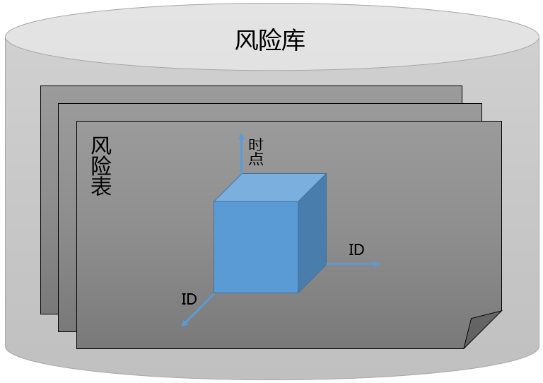

.. _风险数据库:

风险数据库
==========


风险数据模型
------------

我们的风险数据模型采用了三层结构, 最上层是风险库, 每个风险库有多张风险表组成, 每张风险表中的数据是一个三维数组, 第一维是时点, 第二维是证券 ID, 第三维也是证券 ID. 每个时点的切片即是风险矩阵, 风险矩阵是二维数组, 行和列均以证券 ID 索引. 如下图所示: 


    
    风险数据模型

具体到数据在程序里的数据类型, 风险数据以 Python pandas 模块的 Panel 数据类型组织. 我们规定了这三个维度的先后顺序, 对应于 Panel 数据类型, items 是时点, major_axis 是证券 ID, minor_axis 是证券 ID. 在 Quant Studio 的所有 API 中, 凡是涉及到风险数据的地方, 都将遵守此组织原则. 

另外, 对于时间点, 采用 Python 的 datetime 表示, ID 的数据类型为字符串, 例如, "000001.SZ", 因子名称的数据类型也是字符串. 

目前我们考虑的风险模型主要是两类, 一类是无结构的风险模型, 即风险矩阵就是一个以证券 ID 索引的二维矩阵, 比如通过历史收益率数据直接计算的协方差矩阵; 另一类是基于多因子模型得到的结构化的风险矩阵, 该矩阵可以分解为系统性风险和特异性风险两部分. 具体细节可以参考 :ref:`风险模型` 章节.

结构化的风险数据库不只是提供风险矩阵, 而且还要提供构造该风险矩阵的各个组件, 比如因子风险矩阵, 因子暴露以及特异性风险. 因子风险矩阵的形式和证券风险矩阵类似, 只不过索引是因子, 数据类型也是 pandas 的 Panel, items 是时点, major_axis 和 minor_axis 均是证券 ID. 特异性风险的数据类型是 pandas 的 DataFrame, index 是时点, columns 是证券 ID, 而因子暴露就是因子数据, 类型为 Panel, items 是因子, major_axis 是时点, minor_axis 是证券 ID, 可以参考 :ref:`因子数据模型` .


风险数据读取
------------

QuantStudio 中的风险数据来自于各个风险库, 每个风险库对应一个风险库类, 这些类定义在子模块 RiskDB 中:

    * 基于 HDF5 文件的本地风险库: 无结构的风险库 HDF5RDB, 结构化风险库 HDF5FRDB
    * 基于关系型数据库的本地风险库: 无结构的风险库 SQLRDB, 结构化风险库 SQLFRDB

对于本地风险数据库的实现, 主要支持两种方式:

1. :strong:`基于关系型数据库`. 整个数据库对应于我们的风险库, 每张数据库表对应于我们的风险表, 每张数据库表用 DateTime 这个字段作为主键来唯一标识一行记录, 其他的字段对应于风险矩阵及其结构化分解的组件, 这些字段的数据类型为 json 格式.

2. :strong:`基于 HDF5 文件`. 所有风险数据文件存放的总目录对应于我们的风险数据库, 总目录下的每个 HDF5 文件对应于我们的风险表, 文件由多个 Group 组成, 每个 Group 里存储着风险矩阵及其结构化分解的组件.

.. attention::

    本章节的应用需要一些基本的数据, 参见 :ref:`示例数据<示例数据>` 的配置.

下面以结构化的多因子风险数据库为例. 所有的风险数据库都在子模块 RiskDB 中, 首先创建风险数据库对象, 并链接::

    >>>RDB = QS.RiskDB.HDF5FRDB(sys_args={"主目录": "C:\\RiskData"})
    >>>RDB.connect()

每个风险数据库中都包含若干张风险表, 可以查看风险数据库对象的 TableNames 属性获取特定风险库包含的风险表名列表::

    >>>print(RDB.TableNames)
    ['BarraRiskData']

通过调用风险库的 getTable 方法即可获得指定名称的风险表对象::

    >>>RT = RDB.getTable(table_name="BarraRiskData")

通过调用风险表的 readCov 方法读取风险数据, readCov 方法有三个参数: dts, ids, 其中, dts 是待提取的时间点列表, ids 是待提取的 ID 列表, 默认值是 None 表示提取表中所有的 ID::

    >>>Cov = RT.readCov(dts=[dt.datetime(2017,12,29)], ids=None)
    >>>print(Cov)
    <class 'pandas.core.panel.Panel'>
    Dimensions: 1 (items) x 3562 (major_axis) x 3562 (minor_axis)
    Items axis: 2017-12-29 00:00:00 to 2017-12-29 00:00:00
    Major_axis axis: 000001.SZ to T00018.SH
    Minor_axis axis: 000001.SZ to T00018.SH
    
readCov 方法返回的是 pandas 的 Panel 类型, 其 items 是时间序列, major_axis 和 minor_axis 均是 ID 序列, 获取某个时点的风险矩阵::

    >>>print(Cov.iloc[0, :5, :5])
               000001.SZ  000002.SZ  000003.SZ  000004.SZ  000005.SZ
    000001.SZ   0.006828   0.001058        NaN   0.002642   0.001892
    000002.SZ   0.001058   0.011993        NaN   0.002116   0.001523
    000003.SZ        NaN        NaN        NaN        NaN        NaN
    000004.SZ   0.002642   0.002116        NaN   0.024474   0.006281
    000005.SZ   0.001892   0.001523        NaN   0.006281   0.007950

对于风险矩阵为协方差阵的情形, 风险数据库对象还可以通过 readCorr 方法来获取相关系数矩阵, 其参数和返回值同 readCov 类似::
 
    >>>Corr = RT.readCorr(dts=[dt.datetime(2017,12,29)])
    >>>print(Corr)
    <class 'pandas.core.panel.Panel'>
    Dimensions: 1 (items) x 3562 (major_axis) x 3562 (minor_axis)
    Items axis: 2017-12-29 00:00:00 to 2017-12-29 00:00:00
    Major_axis axis: 000001.SZ to T00018.SH
    Minor_axis axis: 000001.SZ to T00018.SH
    >>>print(Corr.iloc[0, :5, :5])
           000001.SZ  000002.SZ  000003.SZ  000004.SZ  000005.SZ
    000001.SZ   1.000000   0.000010        NaN   0.000034   0.000014
    000002.SZ   0.000010   1.000000        NaN   0.000036   0.000015
    000003.SZ        NaN        NaN        NaN        NaN        NaN
    000004.SZ   0.000034   0.000036        NaN   1.000000   0.000088
    000005.SZ   0.000014   0.000015        NaN   0.000088   1.000000

对于风险表的一些维度信息, 可以通过调用方法 getDateTime 和 getID 获得::

    >>>DTs = RT.getDateTime(start_dt=dt.datetime(2017,1,1), end_dt=dt.datetime(2017,12,31))
    >>>IDs = IDs = RT.getID()
    >>>print(DTs[:3])
    [datetime.datetime(2017, 1, 26, 0, 0), datetime.datetime(2017, 2, 28, 0, 0), datetime.datetime(2017, 3, 31, 0, 0)]
    >>>print(IDs[:5])
    ['000001.SZ', '000002.SZ', '000003.SZ', '000004.SZ', '000005.SZ']

对于基于多因子模型的结构化风险数据库, 还有一些额外的信息可以读取, 比如因子协方差矩阵, 特异性风险等等.

方法 readFactorCov 用于读取因子协方差矩阵::

    >>>FactorCov = RT.readFactorCov(dts=[dt.datetime(2017,12,29)])
    >>>print(FactorCov)
    <class 'pandas.core.panel.Panel'>
    Dimensions: 1 (items) x 43 (major_axis) x 43 (minor_axis)
    Items axis: 2017-12-29 00:00:00 to 2017-12-29 00:00:00
    Major_axis axis: Market to Utilities
    Minor_axis axis: Market to Utilities
    >>>print(FactorCov.iloc[0, :5, :5])
                          Market      Size      Beta  Momentum  ResidualVolatility
    Market              0.001311 -0.000189  0.000392 -0.000180            0.000271
    Size               -0.000189  0.000118 -0.000053  0.000045           -0.000060
    Beta                0.000392 -0.000053  0.000173 -0.000073            0.000108
    Momentum           -0.000180  0.000045 -0.000073  0.000072           -0.000055
    ResidualVolatility  0.000271 -0.000060  0.000108 -0.000055            0.000093

方法 readFactorData 用于读取因子暴露::

    >>>FactorData = RT.readFactorData(dts=[dt.datetime(2017,12,29)])
    >>>print(FactorData)
    <class 'pandas.core.panel.Panel'>
    Dimensions: 43 (items) x 1 (major_axis) x 3577 (minor_axis)
    Items axis: Market to Utilities
    Major_axis axis: 2017-12-29 00:00:00 to 2017-12-29 00:00:00
    Minor_axis axis: 000001.SZ to T00018.SH
    >>>print(FactorData.iloc[:5, 0, :5])
               Market      Size      Beta  Momentum  ResidualVolatility
    000001.SZ     1.0  1.232416  1.409380  1.104251           -0.434150
    000002.SZ     1.0  1.670359 -0.111816  1.466253            2.164472
    000003.SZ     1.0       NaN       NaN       NaN                 NaN
    000004.SZ     1.0 -3.437957  0.278855 -1.307221            2.097539
    000005.SZ     1.0 -3.027622  0.476271 -2.344371           -0.912783
    
方法 readSpecificRisk 用于读取特异性风险::

    >>>SpecificRisk = RT.readSpecificRisk(dts=[dt.datetime(2017,12,29)])
    >>>print(SpecificRisk.iloc[:, :4])
                000001.SZ  000002.SZ  000003.SZ  000004.SZ
    2017-12-29    0.06949   0.100747        NaN   0.124567

readSpecificRisk 返回的是 DataFrame 类型, index 为时间序列, columns 为 ID 列表.

方法 readFactorReturn 用于读取因子收益::

    >>>FactorReturn = RT.readFactorReturn(dts=[dt.datetime(2017,12,29)])
    >>>print(FactorReturn.iloc[:, :4])
                  Market      Size     Beta  Momentum
    2017-12-29  0.006256 -0.000317  0.00202  0.000601

readFactorReturn 返回的是 DataFrame 类型, index 为时间序列, columns 为因子名列表.

方法 readSpecificReturn 用于读取特异性收益::

    >>>SpecificReturn = RT.readSpecificReturn(dts=[dt.datetime(2017,12,29)])
    >>>print(SpecificReturn.iloc[:, :4])
                000001.SZ  000002.SZ  000003.SZ  000004.SZ
    2017-12-29   0.001535   0.000279        NaN  -0.001277
    
readSpecificReturn 返回的是 DataFrame 类型, index 为时间序列, columns 为 ID 列表.

QuantStudio 其他模块中需要风险数据时往往需要输入的是风险表对象, 而非直接的风险数据库. 风险表除了以上述的方式进行使用, 还有一种遍历模式, 即在时间序列遍历型的运算中, 风险表可以提供更高效的数据读取. 这里假设 DTs 是一个时间序列, 需要对其进行遍历, 在每个时点取用风险数据进行一些计算, 则比较高效的代码如下::

    RT.start(dts=DTs)
    for iDT in DTs:
        RT.move(idt=iDT)
        # 以下是其他的代码
        pass
    RT.end()


风险数据存储
------------

QuantStudio 提供的本地风险库可以将风险数据存储到本地. 这里以无结构的基于 HDF5 文件的本地风险库为例说明. 首先使用 HDF5RDB 实例化一个风险库对象并连接, HDF5RDB 初始化需要一个额外参数, 指明数据文件存储的主目录, 比如这里打算将数据存储在文件夹 "C:\\RiskData" 下::

    >>>import QuantStudio.api as QS
    >>>RDB = QS.RiskDB.HDF5RDB(sys_args={"主目录":"C:\\RiskData"})
    >>>RDB.connect()
    >>>print(RDB.TableNames)
    []

可以看到, 当前风险库中并无任何数据, 所以风险表列表是空 list. 下面我们随机生成一个风险矩阵作为测试数据::

    >>>iDT = dt.datetime(2018, 11, 27)
    >>>IDs = ["00000"+str(i)+".SH" for i in range(10)]
    >>>Cov = pd.DataFrame(np.random.randn(10, 10), index=IDs, columns=IDs)
    >>>print(Cov)
               000000.SH  000001.SH    ...      000008.SH  000009.SH
    000000.SH   0.228132   0.672808    ...       0.974136   0.410728
    000001.SH   0.445937  -0.829386    ...       1.146415   0.070339
    000002.SH  -0.467006   0.235598    ...      -1.572182  -1.286313
    000003.SH  -0.773463  -0.551204    ...      -0.663734   1.112278
    000004.SH   0.205042  -1.127695    ...      -1.077579  -2.341920
    000005.SH  -0.058862   1.464853    ...      -0.632054   1.863802
    000006.SH   0.680530   2.977303    ...       0.708638  -0.586210
    000007.SH   1.821936  -0.467347    ...       0.697500  -0.433010
    000008.SH  -0.428069   1.076645    ...       0.336864  -1.824612
    000009.SH   0.971749   0.868447    ...       2.107946  -0.550882

    [10 rows x 10 columns]

这里我们生成了一个 10 * 10 的随机矩阵作为风险矩阵, 并打算作为时点 2018-11-27 对应的风险矩阵.

所有的本地风险库都有一个方法 writeData 来实现数据的存储. writeData 方法有三个参数: table_name, idt, icov:
    
    * table_name: 要存入的风险表名称, str; 
    * idt: 风险矩阵对应的时间点, datetime.datetime;
    * icov: 要写入的风险矩阵, 类型为 pandas.DataFrame, 即是上段代码中得到 Cov 类型; 

::

    >>>RDB.writeData("TestTable", iDT, Cov)

这样再打印 RDB 的风险表列表就可以发现多了一张风险表 TestTable::

    >>>print(RDB.TableNames)
    ['TestTable']

我们就可以像上一节一样使用 RDB 风险库中的数据了::

    >>>RT = RDB.getTable("TestTable")
    >>>Cov = RT.readCov(dts=[iDT])
    >>>print(Cov)
    <class 'pandas.core.panel.Panel'>
    Dimensions: 1 (items) x 10 (major_axis) x 10 (minor_axis)
    Items axis: 2018-11-27 00:00:00 to 2018-11-27 00:00:00
    Major_axis axis: 000000.SH to 000009.SH
    Minor_axis axis: 000000.SH to 000009.SH

对于本地风险库可以通过调用方法 renameTable, deleteTable 以及 deleteDateTime 来管理风险表和风险数据(详细参见 API 参考)::

    >>>RDB.renameTable("TestTable", "TestTable1")
    >>>print(RDB.TableNames)
    ['TestTable1']
    >>>RDB.deleteTable(table_name="TestTable1")
    >>>print(RDB.TableNames)
    []


API 参考
--------

风险数据库
``````````

.. py:module:: RiskDB

.. py:class:: RiskDB(sys_args={}, config_file=None, **kwargs)

    风险数据库基类，不能实例化对象，其他风险数据库的实现都继承自此类.
    
    :param dict sys_args: 风险数据库的参数
    :param str config_file: 风险库的配置文件地址
    
    .. py:attribute:: Name
    
    该风险库对象的名称, str
    
    .. py:attribute:: TableNames
    
    该风险库中所有风险表的名称列表, list(str)
    
    .. py:method:: connect()
    
        链接风险数据库
        
        :return: ErrorCode
        :rtype: int
    
    .. py:method:: disconnect()

        断开风险数据库链接
        
        :return: ErrorCode
        :rtype: int
    
    .. py:method:: isDBAvailable()
    
        检查当前风险数据库链接是否有效
        
        :return: ErrorCode
        :rtype: bool

    .. py:method:: getTable(table_name)
    
        获取指定名称的风险表对象
        
        :param str table_name: 风险表名
        :return: 风险表对象
        :rtype: RiskDB.RiskTable

    .. py:method:: renameTable(old_table_name, new_table_name)
    
        重命名表
        
        :param str old_table_name: 旧风险表名
        :param str new_table_name: 新风险表名
        :return: ErrorCode
        :rtype: int
    
    .. py:method:: deleteTable(table_name)

        删除表
        
        :param str table_name: 风险表名
        :return: ErrorCode
        :rtype: int
    
    .. py:method:: setTableMetaData(table_name, key=None, value=None, meta_data=None)
    
        设置表的描述信息
        
        :param str table_name: 风险表名
        :param str key: 键名称
        :param value: 值
        :param dict meta_data: 键值对
        :return: ErrorCode
        :rtype: int
    
    .. py:method:: deleteDateTime(table_name, dts)
    
        删除风险数据表中某些时点的风险数据
        
        
        :param str table_name: 风险表名称
        :param list(datetime.datetime) dts: 待删除的时间序列
        :return: ErrorCode
        :rtype: int
        
    .. py:method:: writeData(table_name, idt, icov)
    
        存储风险数据，每次只能存入某个时点的数据
        
        :param str table_name: 给定的风险表名称
        :param datetime.datetime idt: 待写入的时间点
        :param DataFrame icov: 待写入的协方差矩阵, DataFrame(index=[ID], columns=[ID])
        :return: ErrorCode
        :rtype: int


.. py:class:: FactorRDB(sys_args={}, config_file=None, **kwargs)

    基于多因子模型的结构化风险数据库基类，不能实例化对象，其他结构化风险数据库的实现都继承自此类, 继承自 :py:class:`RiskDB.RiskDB`, 下面只列出新的属性和方法.
    
    .. py:method:: writeData(table_name, idt, factor_data=None, factor_cov=None, specific_risk=None, factor_ret=None, specific_ret=None, **kwargs)
    
        存储风险数据，每次只能存入某个时点的数据
        
        :param str table_name: 风险表名称
        :param datetime.datetime idt: 待存入的时点
        :param DataFrame factor_data: 因子暴露, DataFrame(因子暴露, index=[ID], columns=[因子]), None 表示没有这类数据, 不存储
        :param DataFrame factor_cov: 因子协方差矩阵, DataFrame(因子协方差, index=[因子], columns=[因子]), None 表示没有这类数据, 不存储
        :param Series specific_risk: 特异性风险, Series(特异性风险, index=[ID]), None 表示没有这类数据, 不存储
        :param Series factor_ret: 因子收益率, Series(因子收益率, index=[因子]), None 表示没有这类数据, 不存储
        :param Series specific_ret: 特异性收益率, Series(特异性收益率, index=[ID]), None 表示没有这类数据, 不存储
        :return: ErrorCode
        :rtype: int


风险表
``````

.. py:class:: RiskTable(name, rdb, sys_args={}, config_file=None, **kwargs)

    风险表基类，不能实例化对象，其他风险表的实现都继承自此类.
    
    :param str name: 风险表的名称
    :param RiskDB rdb: 风险表所属的风险库对象
    :param dict sys_args: 风险数据库的参数
    :param str config_file: 风险库的配置文件地址
    
    .. py:attribute:: Name
    
    该风险表对象的名称, str
    
    .. py:attribute:: RiskDB
    
    该风险表所属的风险库对象
    
    .. py:method:: connect()
    
        链接风险数据库
        
        :return: ErrorCode
        :rtype: int

    .. py:method:: getMetaData(key=None)
    
        读取表的描述信息
        
        :param str key: 键名称, 如果为 None 表示返回所有描述信息
        :return: key 不为 None, 表示返回对应键 key 的值, 否则返回所有描述信息集
        :rtype: Series 或者 DataFrame

    .. py:method:: getTableID(idt=None)
    
        读取风险表在给定时点的 ID 序列
        
        :param datetime.datetime idt: 给定时点, 如果为 None 表示读取默认的 ID 序列.
        :return: ID 序列
        :rtype: list(str)

    .. py:method:: getDateTime(start_dt=None, end_dt=None)
    
        读取风险表的时间序列
        
        :param datetime.datetime start_dt: 起始时点, 如果为 None 表示以风险表支持的最早的时点作为起始
        :param datetime.datetime end_dt: 终止时点, 如果为 None 表示以风险表支持的最晚的时点作为终止
        :return: 时间序列
        :rtype: list(datetime.datetime)

    .. py:method:: readCov(dts, ids=None)
    
        读取协方差矩阵
        
        :param list(datetime.datetime) dts: 待读取的时间序列
        :param list(str) ids: 待读取的 ID 序列, None 表示提取所有的 ID
        :return: 协方差数据, Panel(items=dts, major_axis=ids, minor_axis=ids)
        :rtype: Panel

    .. py:method:: readCorr(dts, ids=None)
    
        读取相关系数矩阵
    
        :param list(datetime.datetime) dts: 待读取的时间序列
        :param list(str) ids: 待读取的 ID 序列, None 表示提取所有的 ID
        :return: 相关系数数据, Panel(items=dts, major_axis=ids, minor_axis=ids)
        :rtype: Panel


.. py:class:: FactorRT(name, rdb, sys_args={}, config_file=None, **kwargs)

    基于多因子模型的结构化风险表基类，不能实例化对象，其他结构化风险表的实现都继承自此类, 继承自 :py:class:`RiskDB.RiskTable`, 下面只列出新的属性和方法.
    
    .. py:attribute:: FactorNames
    
        风险表中的风险因子序列, list(str)
        
    .. py:method:: getFactorReturnDateTime(start_dt=None, end_dt=None)
    
        获取风险数据表中的因子收益率的时间序列
        
        :param datetime.datetime start_dt: 限定提取的起始时点, 如果不为 None, 那么返回的时间序列将截取大于等于 start_dt 的时点
        :param datetime.datetime end_dt: 限定提取的终止时点, 如果不为 None, 那么返回的时间序列将截取小于等于 end_dt 的时点
        :return: 时间序列
        :rtype: list(datetime.datetime)

    .. py:method:: getSpecificReturnDateTime(start_dt=None, end_dt=None)
    
        获取风险数据表中的特异性收益率的时间序列
        
        :param datetime.datetime start_dt: 限定提取的起始时点, 如果不为 None, 那么返回的时间序列将截取大于等于 start_dt 的时点
        :param datetime.datetime end_dt: 限定提取的终止时点, 如果不为 None, 那么返回的时间序列将截取小于等于 end_dt 的时点
        :return: 时间序列
        :rtype: list(datetime.datetime)
        
    .. py:method:: readFactorCov(dts)
    
        读取因子协方差矩阵
        
        :param list(datetime.datetime) dts: 待读取的时间序列
        :return: 因子协方差矩阵, Panel(items=dts, major_axis=[因子名], minor_axis=[因子名])
        :rtype: Panel
        
    .. py:method:: readSpecificRisk(dts, ids=None)
    
        读取特异性风险数据
        
        :param list(datetime.datetime) dts: 待读取的时间序列
        :param list(str) ids: 待读取的 ID 序列, None 表示读取所有 ID
        :return: 特异性风险, DataFrame(index=dts, columns=ids)
        :rtype: DataFrame
        
    .. py:method:: readFactorData(dts, ids=None)
    
        读取因子暴露数据
        
        :param list(datetime.datetime) dts: 待读取的时间序列
        :param list(str) ids: 待读取的 ID 序列, None 表示读取所有 ID
        :return: 因子暴露数据, Panel(items=[因子名], major_axis=dts, minor_axis=ids)
        :rtype: Panel
        
    .. py:method:: readFactorReturn(dts)
    
        读取因子收益率数据
        
        :param list(datetime.datetime) dts: 待读取的时间序列
        :return: 因子收益率数据, DataFrame(index=dts, columns=[因子名])
        :rtype: DataFrame

    .. py:method:: readSpecificReturn(dts, ids=None)
    
        读取特异性收益率数据
        
        :param list(datetime.datetime) dts: 待读取的时间序列
        :param list(str) ids: 待读取的 ID 序列, None 表示读取所有 ID
        :return: 特异性收益率, DataFrame(index=dts, columns=ids)
        :rtype: DataFrame


基于 HDF5 文件的风险库
``````````````````````

.. py:module:: HDF5RDB

.. py:class:: HDF5RDB(sys_args={}, config_file=None, **kwargs)

    基于 HDF5 文件的无结构风险数据库, 继承自 :py:class:`RiskDB.RiskDB`, 下面只列出新的属性和方法.
    
    :param dict sys_args: 风险库的参数
    :param str config_file: 风险库的配置文件地址, None 表示使用默认配置文件, 默认文件名为 "HDF5RDBConfig.json", 默认路径为参见: :ref:`配置文件`
    
    .. py:attribute:: Args
    
        参数集:
        
            * 主目录: 存放数据的主目录, str
    

.. py:class:: HDF5FRDB(sys_args={}, config_file=None, **kwargs)

    基于 HDF5 文件的多因子结构化风险数据库, 继承自 :py:class:`RiskDB.FactorRDB`, 下面只列出新的属性和方法.
    
    :param dict sys_args: 风险库的参数
    :param str config_file: 风险库的配置文件地址, None 表示使用默认配置文件, 默认文件名为 "HDF5FRDBConfig.json", 默认路径为参见: :ref:`配置文件`
    
    .. py:attribute:: Args
    
        参数集:
        
            * 主目录: 存放数据的主目录, str


基于关系型数据库的风险库
````````````````````````

.. py:module:: SQLRDB

.. py:class:: SQLRDB(sys_args={}, config_file=None, **kwargs)

    基于关系型数据库的无结构风险数据库, 继承自 :py:class:`RiskDB.RiskDB`, 下面只列出新的属性和方法.
    
    :param dict sys_args: 风险库的参数
    :param str config_file: 风险库的配置文件地址, None 表示使用默认配置文件, 默认文件名为 "SQLRDBConfig.json", 默认路径为参见: :ref:`配置文件`
    
    .. py:attribute:: Args
    
        参数集:
        
            * 数据库类型: 可选 "SQL Server", "Oracle", "MySQL"
            * 数据库名: str
            * IP地址: str
            * 端口: int
            * 用户名: str
            * 密码: str
            * 表名前缀: str
            * 字符集: str
            * 连接器: 可选 "default", "cx_Oracle", "pymssql", "mysql.connector", "pyodbc"
            * 数据源: 当连接器是 pyodbc 时, 如果创建了 ODBC 数据源, 可以将数据源名赋予该参数
    

.. py:class:: SQLFRDB(sys_args={}, config_file=None, **kwargs)

    基于关系型数据库的多因子结构化风险数据库, 继承自 :py:class:`RiskDB.FactorRDB`, 下面只列出新的属性和方法.
    
    :param dict sys_args: 风险库的参数
    :param str config_file: 风险库的配置文件地址, None 表示使用默认配置文件, 默认文件名为 "SQLFRDBConfig.json", 默认路径为参见: :ref:`配置文件`
    
    .. py:attribute:: Args
    
        参数集:
        
            * 数据库类型: 可选 "SQL Server", "Oracle", "MySQL"
            * 数据库名: str
            * IP地址: str
            * 端口: int
            * 用户名: str
            * 密码: str
            * 表名前缀: str
            * 字符集: str
            * 连接器: 可选 "default", "cx_Oracle", "pymssql", "mysql.connector", "pyodbc"
            * 数据源: 当连接器是 pyodbc 时, 如果创建了 ODBC 数据源, 可以将数据源名赋予该参数